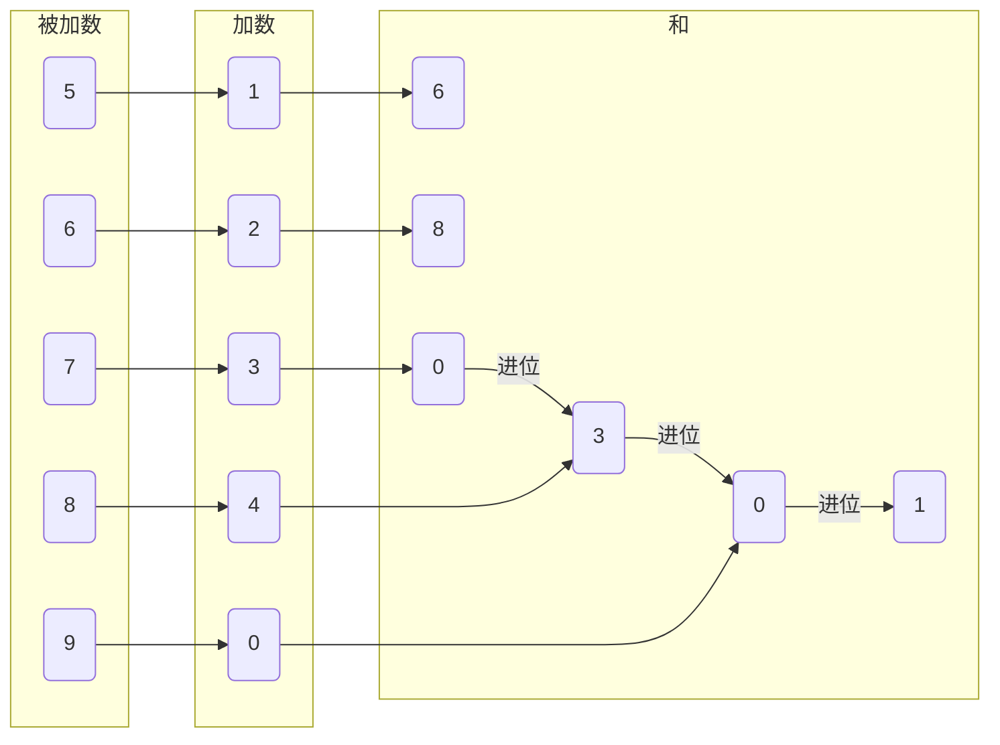

# 高精度

## 加法

将两个数字$a, b$的每一位逆序存储于数组中, 通过数组进行运算

$56789 + 12340 = 680301$



```c++
const std::string AddBigNumber(const std::string& num1, const std::string& num2) {
    int xa[500] = {};
    int xb[500] = {};
    int r[1000] = {};

    int num1Len = num1.size();
    int num2Len = num2.size();

    // 逆序存储a
    for (int i = 0; i < num1Len; i++) {
        xa[i] = num1[num1Len - i - 1] - '0';
    }
    // 逆序存储b
    for (int i = 0; i < num2Len; i++) {
        xb[i] = num2[num2Len - i - 1] - '0';
    }

    int maxLen = num1Len > num2Len ? num1Len : num2Len;
    for (int i = 0; i < maxLen; i++) {
        r[i] += (xa[i] + xb[i]);
        // 进位
        if (r[i] > 9) {
            r[i + 1] += 1;
            r[i] -= 10;
        }
    }

    std::string res = "";
    for (int i = r[maxLen] ? maxLen : maxLen - 1; i >= 0; i--) {
        res += (r[i] + '0');
    }
    return res;
}
```

## 减法

运算时确保被减数大于减数, 最后判断是否为负数

```c++
const std::string SubBigNumber(const std::string& num1, const std::string& num2) {
    int xa[500] = {};
    int xb[500] = {};
    int r[500] = {};

    int lena = num1.size();
    int lenb = num2.size();

    for (int i = 0; i < lena; i++) {
        xa[i] = num1[lena - i - 1] - '0';
    }
    for (int i = 0; i < lenb; i++) {
        xb[i] = num2[lenb - i - 1] - '0';
    }

    int maxLen = lena > lenb ? lena : lenb;
    for (int i = 0; i < maxLen; i++) {
        // 借位
        if (xa[i] < xb[i]) {
            r[i] -= 1;
            xa[i] += 10;
        }
        r[i] += (xa[i] - xb[i]);
    }

    std::string res = "";
    // 找到第一个非0的位置, 消除前导0
    int index = maxLen - 1;
    while (index >= 0 && r[index] == 0) {
        index--;
    }

    // 处理相减结果为0的情况
    if (index < 0) {
        index = 0;
    }

    for (int i = index; i >= 0; i--) {
        res += (r[i] + '0');
    }

    // 处理负数情况
    if (num1.size() < num2.size()) {
        res += '-';
    }
    return res;
}
```
