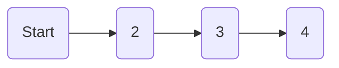
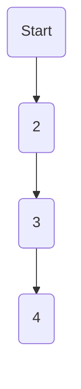

# 路径获取值

平面上有 $n*m$ 个格子, 每个格子中放一定数量的苹果

从左上角开始, 每一步只能向下或向右走, 走到一个格子获得格子内苹果, 走到右下角最多能收集到多少苹果

## 中间状态

$a[i][j]$代表i行j列格子里放的苹果数

$dp[i][j]$代表走到i行j列格子时获得的总苹果数

## 边界值

- 若在第0行, 则只能从左边过来

$dp[0][j] = dp[0][j - 1] + a[0][j]$



- 若在第0列, 则只能从上边过来

$dp[i][0] = dp[i - 1][0] + a[i][0]$



## 状态转移方程

- $dp[i][j] = max(dp[i - 1][j]+ dp[i][j - 1]) + a[i][j]$

```c
dp[0][0] = a[0][0];

for(int i = 0; i <= n; ++i) {
    for(int j = 0; j <= m; ++j){
        if(i == 0 && j == 0){
            dp[0][0] = a[0][0];
        }
        else if(i == 0){
            dp[0][j] = dp[0][j - 1] + a[0][j]
        }
        else if(j == 0){
            dp[i][0] = dp[i - 1][0] + a[i][0]
        }
        else{
            dp[i][j] = max(dp[i - 1][j] + dp[i][j - 1]) + a[i][j]
        }
    }
}
```
