> - [并查集](https://oi-wiki.org/ds/dsu/)

# 并查集与最小生成树

## 并查集

并查集是一种用于管理元素所属集合的数据结构, 实现为一个森林, 其中每棵树表示一个集合, 树中节点表示对应集合中元素

### 设定

对于独立两个节点$A、B$

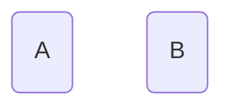

定义 $parent[A] = B$, 表示节点$A$父节点是节点$B$

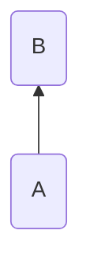

```c++
template<class T, class T>
std::map<T, T> parent;
```

初始时每个元素都位于一个单独集合, 其父节点均为自身

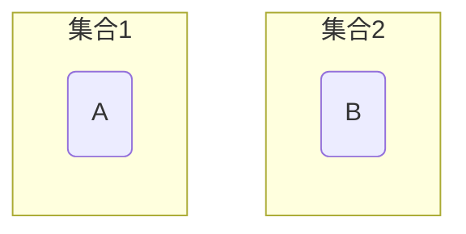

```c++
template<class T>
void Init(T x) {
    parent[x] = x;
}
```

### 查询

查询操作用于查询某个元素所属集合, 即其根节点

用于判断两个元素是否属于同一集合

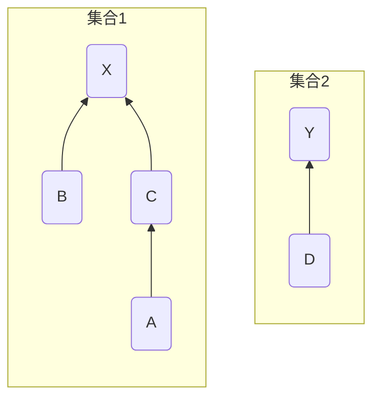

节点$A、B、C$拥有同一个根节点$X$, 故节点$A、B、C$属于同一集合

$D$根节点为节点$Y$, 故节点$A$节点$D$不属于同一集合

```c++
template<class T>
T Find(T x) {
    // 若x父节点非它本身, 则继续查找
    while (parent[x] != x) {
        x = parent[x];
    }
    return x;
}
```

#### 路径压缩

查询过程中经过的每个元素都属于该集合,可将每个元直接连到根节点以加快后续查询

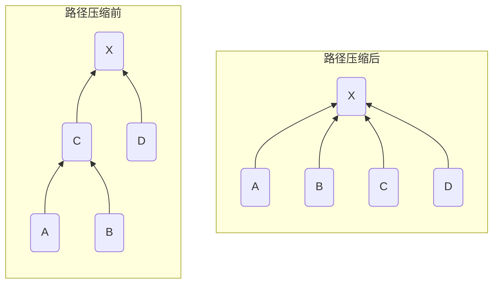

```c++
template<class T>
T Find(T x) {
    if (parent[x] != x) {
        parent[x] = Find(parent[x]);
    }
    return parent[x];
}
```

### 合并

合并两个元素所属集合, 即将一个集合根节点连到另一集合根节点

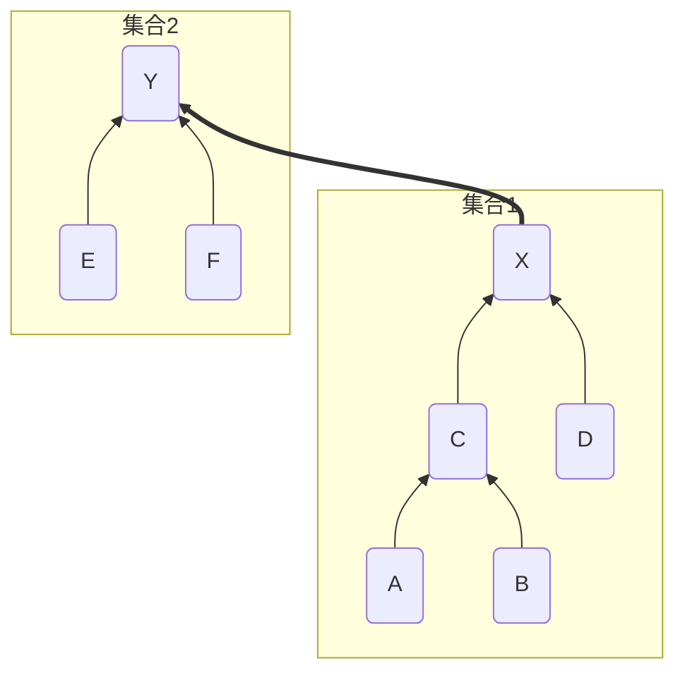

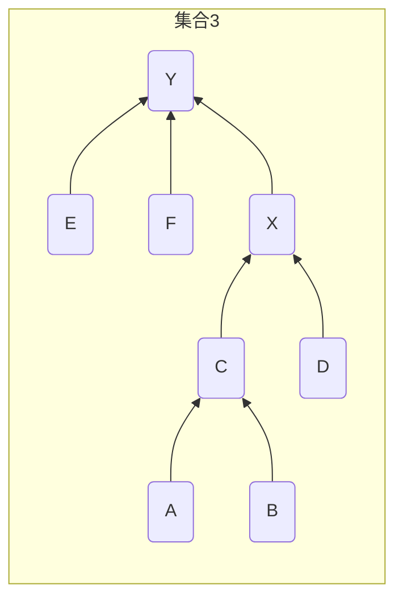

将根节点节点$X$的父节点设为根节点节点$Y$, 合并两个集合

```c++
template<class T>
void Unions(const T x, const T y) {
    T fx = Find(x);
    T fy = Find(y);
    if (fx != fy) {
        parent[fx] = fy;
    }
}
```

#### 按秩合并(Union by Rank)

并查集树结构中, 树高度会影响查找操作效率

秩(rank)通常是树高度估计, 按秩合并时, 将秩小树连接到秩大树上, 从而避免较大树高度增加

若两棵树秩相同, 那么任选其中一个树根节点作为新根节点, 并将其秩加1

```c++
template<class T>
void Unions(const T x, const T y) {
    T fx = Find(x);
    T fy = Find(y);

    if (fx != fy) {
        if (rank[fx] > rank[fy]) {
            parent[fy] = fx;
        }
        else if(rank[fx] > rank[fy]) {
            parent[fx] = fy;
        }
        else {
            parent[fx] = fy;
            rank[fx]++;
        }
    }
}
```


合并节点$X、Y$, 其秩一致, 任选节点$Y$作为新根节点

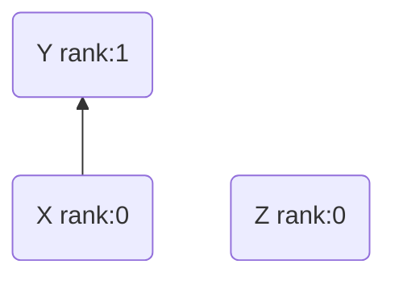

合并节点$Z、Y$, 其节点$Z$秩小于节点$Y$秩, 即将节点$Z$合并到节点$Y$

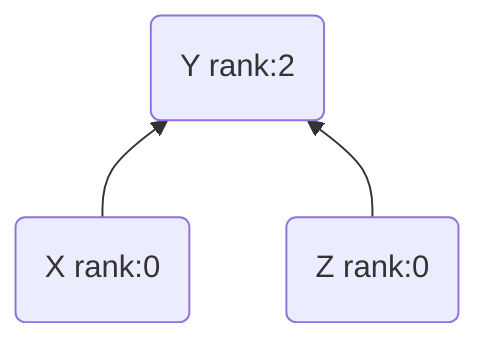

### 代码

```c++
#include <iostream>
#include <algorithm>
#include <utility>
#include <vector>
#include <map>
#include <set>

template<class NodeType = std::string>
struct Line {
    NodeType mStartNode;
    NodeType mEndNode;
    double   mWeight;
    bool     mIsSelect;

    Line(NodeType s, NodeType e, double w) :
        mStartNode(std::move(s)), mEndNode(std::move(e)), mWeight(w), mIsSelect(false) {}
};


template<class NodeType = std::string>
class DisjointSetUnion {
public:
    DisjointSetUnion() = default;

    DisjointSetUnion(std::vector<Line<NodeType>>& lines) {
        for (const auto& line : lines) {
            mNodes.insert(line.mStartNode);
            mNodes.insert(line.mEndNode);
        }

        for (const auto& node : mNodes) {
            mParent[node] = node;
            mRank[node] = 0;
        }
    };

    NodeType Find(NodeType x) {
        if (mParent[x] != x) {
            mParent[x] = Find(mParent[x]);
        }
        return mParent[x];
    }

    void Unions(NodeType x, NodeType y) {
        NodeType fx = Find(x);
        NodeType fy = Find(y);

        if (fx != fy) {
            if (mRank[fx] > mRank[fy]) {
                mParent[fy] = fx;
            }
            else if (mRank[fx] > mRank[fy]) {
                mParent[fx] = fy;
            }
            else {
                mParent[fx] = fy;
                mRank[fx]++;
            }
        }
    }

private:
    std::set<NodeType>           mNodes;
    std::map<NodeType, NodeType> mParent;
    std::map<NodeType, int>      mRank;
};
```

## 最小生成树

### kruskal法

> [完整代码路径](/assets/SelfCode/Example/C&C++/DataStructure/MinimumSpanningTree.cpp)


- 将所有边按权值大小顺序排列

- 对于任意两个节点,若不在同个并查集内(不会形成闭环), 选择该边, 并和合并两个节点

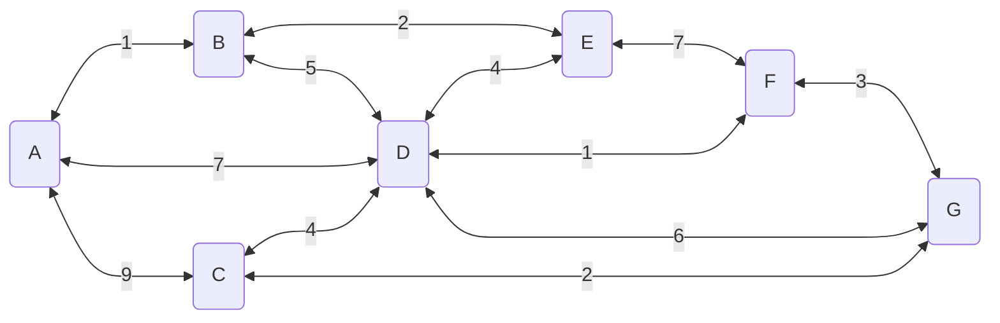

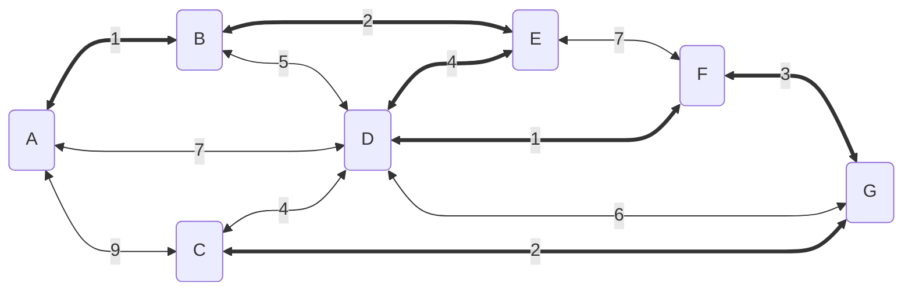

```c++
template<class NodeType = std::string>
class MinimumSpanningTree {
public:
    MinimumSpanningTree(std::vector<Line<NodeType>>& lines) {
        mUnions = DisjointSetUnion<NodeType>(lines);

        std::sort(lines.begin(), lines.end(), [=](const Line<NodeType>& e1, const Line<NodeType>& e2) { return e1.mWeight < e2.mWeight; });
        mLines = std::move(lines);
        mMSTValue = GetKruskal();
    }

    double GetKruskal() {
        double sum = 0;
        for (auto& line : mLines) {
            if (mUnions.Find(line.mStartNode) != mUnions.Find(line.mEndNode)) {
                sum += line.mWeight;
                line.mIsSelect = true;

                mUnions.Unions(line.mStartNode, line.mEndNode);
            }
        }
        return sum;
    }

    void PrintMSTResult() const {
        std::cout << "The minimum spanning tree mWeight = " << mMSTValue << std::endl;

        for (const auto& line : mLines) {
            if (line.mIsSelect) {
                std::cout << "Select Line: " << line.mStartNode << "-" << line.mEndNode << std::endl;
            }
        }
    }

private:
    DisjointSetUnion<NodeType>  mUnions;
    std::vector<Line<NodeType>> mLines;
    double                      mMSTValue;
};
```

```c++
int main() {
    std::vector<Line<>> lines = {
        Line<>("A", "B", 1), Line<>("A", "C", 9), Line<>("A", "D", 7),
        Line<>("B", "D", 5), Line<>("B", "E", 2), Line<>("E", "D", 4),
        Line<>("E", "F", 7), Line<>("F", "D", 1), Line<>("F", "G", 3),
        Line<>("G", "D", 6), Line<>("G", "C", 2), Line<>("C", "D", 4),
    };

    MinimumSpanningTree<> mst(lines);
    
    mst.PrintMSTResult();

    return 0;
}
```

