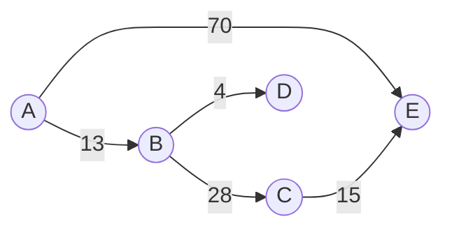
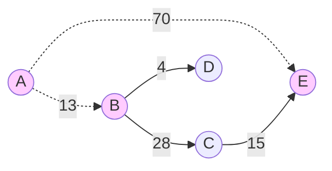
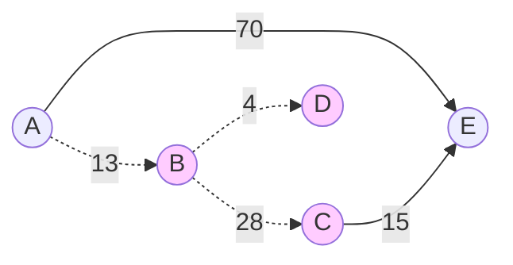
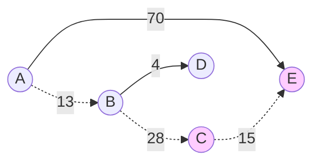

# SPFA



求$A$到其他点的最短路径

## 理论

建立一个队列, 存入开始节点, 队列不为空时:

$(1)$ 取出队头节点 $X$, 出队

$(2)$ 遍历与 $X$ 相通的节点 $Y$, 若 $X$ 到 $Y$ 的距离可缩小(松弛), 且 $Y$ 不在队列中, 将 $Y$ 入队, 继续 $(1)$

$(3)$ 若队列为空则结束

## 过程

设定 $p[i]$为节点$A$到节点$i$的路径

$1)$ 初始状态, 设置节点$A$到其余各点的最短路径为$∞$

|        | A   | B   | C   | D   | E   |
| ------ | --- | --- | --- | --- | --- |
| $p[i]$ | $0$ | $∞$ | $∞$ | $∞$ | $∞$ |

$2)$ 节点$A$进入队列, 队列为$[A,]$, 队列非空

队头节点$A$ 出队, 对以 节点$A$为起点的所有边松弛, 涉及节点$B、E$

节点$A$到节点$B、E$ 的最短路径变小, 且其未在队列中, 故点 $B, E$ 入队, 队列为 $[B, E]$



|        | A   | B    | C   | D   | E    |
| ------ | --- | ---- | --- | --- | ---- |
| $p[i]$ | $0$ | `13` | $∞$ | $∞$ | `70` |


$3)$ 队头 $B$ 出队, 对以 $B$ 为起点的所有边进行松弛, 涉及点 $C, D$

节点$A$到节点$C, D$ 的路径变小, 且点其未在队列中, 故点 $C, D$ 入队, 队列为 $[E, C, D]$



|        | A   | B    | C    | D    | E    |
| ------ | --- | ---- | ---- | ---- | ---- |
| $p[i]$ | $0$ | $13$ | `41`(13 + 28) | `17`(13 + 4) | $70$ |

$4)$ 队头 $E$ 出队, 对以 $E$ 为起点的所有边的终点进行松弛操作

不涉及其他节点, 队列$[C, D]$

$5)$ 队头 $C$ 出队, 对以 $C$ 为起点的所有边的终点进行松弛操作, 涉及点$E$

节点$A$到节点$E$ 的路径变小, 且其未在队列中, 点 $E$ 入队, 队列中结点为 $[D, E]$



|        | A   | B    | C    | D    | E    |
| ------ | --- | ---- | ---- | ---- | ---- |
| $p[i]$ | $0$ | $13$ | $41$ | $17$ | `56`(13 + 28 + 15) |


$6)$ 队头 $D$ 出队, 对以 $D$ 为起点的边进行松弛

不涉及其他节点, 队列为$[E]$

$7)$ 队头 $E$ 出队, 对以 $E$ 为起点的边进行松弛

不涉及其他节点, 队列为空, 结束

节点$A$到其他点的最短路径为

|        | A   | B    | C    | D    | E    |
| ------ | --- | ---- | ---- | ---- | ---- |
| $p[i]$ | `0` | `13` | `41` | `17` | `56` |


## 代码

```c++
#include <iostream>
#include <queue>
#include <map>
#include <set>
#include <utility>
#include <vector>

 // definition of line
template <class T = std::string>
struct Line {
    T      mStartNode;
    T      mEndNode;
    double mWeight;

    Line(T s, T e, double w) : mStartNode(std::move(s)), mEndNode(std::move(e)), mWeight(w) {}
};


template <class T = std::string>
class SPFAAlgorithm {
public:
    explicit SPFAAlgorithm(std::vector<Line<T> > lines) {
        std::set<T> nodes;
        for (const auto& line : lines) {
            nodes.insert(line.mStartNode);
            nodes.insert(line.mEndNode);
        }
        mNode.assign(nodes.begin(), nodes.end());

        mLines = std::move(lines);
        for (const auto& node : mNode) {
            mShortestPath[node] = 0x7FFFFFFF;
            mIsInQueue[node] = false;
        }
    }

    void RunSPFA(T node) {
        std::queue<T> queue;

        queue.push(node);
        mShortestPath[node] = 0;
        mIsInQueue[node] = true;

        T startNode;
        T endNode;
        while (!queue.empty()) {
            startNode = queue.front();
            queue.pop();

            mIsInQueue[startNode] = false;
            for (const auto& line : mLines) {
                if (startNode == line.mStartNode) {
                    endNode = line.mEndNode;
                    // 若从点node经过点x到点end的距离比node直接到end的距离短
                    if (mShortestPath[startNode] + line.mWeight < mShortestPath[endNode]) {
                        // 距离更新为点node到x的距离与x到end的距离之和
                        mShortestPath[endNode] = mShortestPath[startNode] + line.mWeight;
                        if (!mIsInQueue[endNode]) {
                            queue.push(endNode);
                            mIsInQueue[endNode] = true;
                        }
                    }
                }
            }
        }
    }

    void PrintShortestPath() const {
        for (auto it = mShortestPath.begin(); it != mShortestPath.end(); ++it) {
            std::cout << it->first << ": " << it->second << std::endl;
        }
    }

private:
    std::vector<Line<T>> mLines;
    std::vector<T>       mNode;
    std::map<T, double>  mShortestPath;
    std::map<T, bool>    mIsInQueue;
};


int main() {
    using Line = Line<>;

    std::vector<Line> lines = {
        Line("A", "B", 13), Line("A", "E", 70), Line("B", "D", 4),
        Line("B", "C", 28), Line("C", "D", 23), Line("C", "E", 15)
    };

    std::string node = "A";

    SPFAAlgorithm<> spfa = SPFAAlgorithm<std::string>(lines);
    spfa.RunSPFA(node);
    spfa.PrintShortestPath();

    return 0;
}
```

