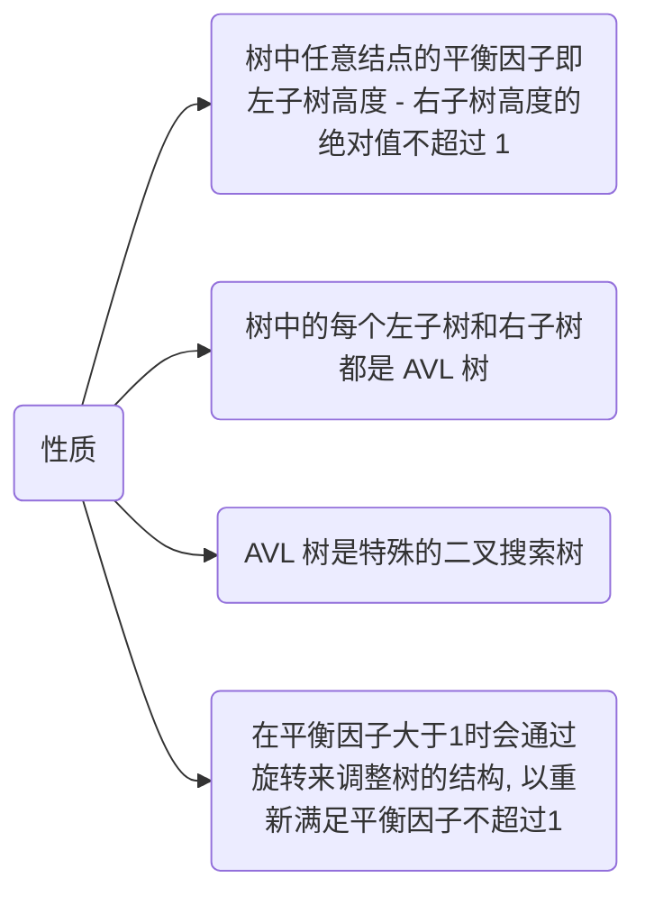
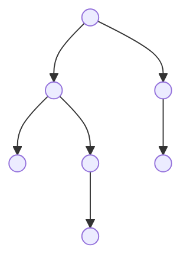
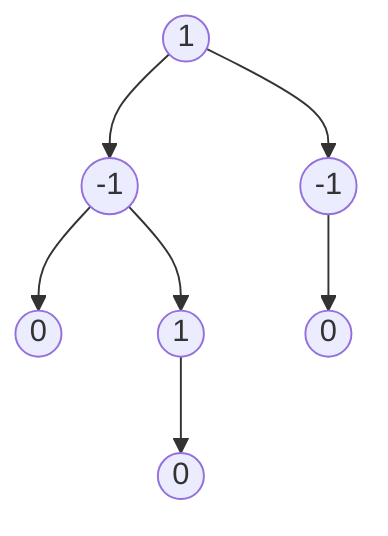

# AVL





标记平衡因子



该树为$AVL$树

## 实现

### 节点定义

```c++
template <class T>
typedef struct AVLNode {
    T value;

    int height;
    AVLNode<T> *leftSon;
    AVLNode<T> *rightSon;
    
    AVLNode(T value, AVLNode<T> *leftSon, AVLNode<T> *rightSon, int height){
        this->value = value;
        this->leftSon = leftSon;
        this->rightSon = rightSon;
        this->height = height;
    }
} AVLNode, AVLNodeList;
```

### 节点信息

#### 获取节点高度

```c++
template <class T>
int GetHeight(AVLNode<T> *node) {
    if(node == nullptr) {
        return 0;
    }
    return node->height;
}
```

#### 获取节点平衡因子

```c++
template <class T>
int GetBalanceFactor(AVLNode<T> *node) {
    if(node == nullptr) {
        return 0;
    }

    return GetHeight(node->leftSon) - GetHeight(node->rightSon);
}
```

#### 判断

```c++
// 判断是否平衡
template <class T>
bool IsBalance(AVLNode<T> *node) {
    if(node == nullptr){
        return true;
    }

    if(abs(GetBalanceFactor(node)) > 1) {
        return false;
    }

    return IsBalance(node->leftSon) && IsBalance(node->rightSon);
}
```

### 左旋

- $AVL$ 树若在`右子树`插入右孩子导致失衡时, 单左旋调整

- 旋转围绕最小失衡子树的根节点进行


原本平衡的$AVL$树插入节点$7$后导致不平衡

最小失衡子树的根节点为节点$5$

```c++
// 左旋, root为最小失衡子树的根节点
template <class T>
AVLNode<T> *LeftRotate(AVLNode<T> *root) {
    AVLNode<T> *p = root->rightSon;

    root->rightSon = p->leftSon;
    p->leftSon = root;

    // 改变指向后, 更新结点对应的高度
    root->height = max(GetHeight(root->leftSon), GetHeight(root->rightSon)) + 1;
    p->height = max(GetHeight(p->leftSon), GetHeight(p->rightSon)) + 1;

    return p;
}
```

### 右旋

- $AVL$ 树若在`左子树`插入`左孩子`导致失衡时, 单右旋调整

- 旋转围绕最小失衡子树的根节点进行


```c++
template <class T>
AVLNode<T>* RightRotate(AVLNode<T> *&root) {
    AVLNode<T> *p = root->leftSon;

    root->leftSon = p->rightSon;
    p->rightSon = root;

    root->height = max(GetHeight(root->leftSon), GetHeight(root->rightSon)) + 1;
    p->height = max(GetHeight(p->leftSon), GetHeight(p->rightSon)) + 1;
    return p;
}
```

### 先右旋后左旋

- $AVL$ 树在 `右子树`上插入`左孩子`导致失衡时, 先右旋后左旋调整

```c++
template <class T>
AVLNode<T>* RightAndLeftRotate(AVLNode<T> *&root) {
    root->rightSon = RightRotate(root->rightSon);
    return LeftRotate(root);
}
```


红色为插入节点;绿色为最小失衡子树的根节点

### 先左旋后右旋

- $AVL$ 树在`左子树`上插入`右孩子`导致失衡时, 先左旋后右旋调整

```c++
template <class T>
AVLNode<T>* LeftAndRightRotate(AVLNode<T> *&root) {
    root->leftSon = LeftRotate(root->leftSon);
    return RightRotate(root);
}
```


红色为插入节点, 绿色为最小失衡子树的根节点
