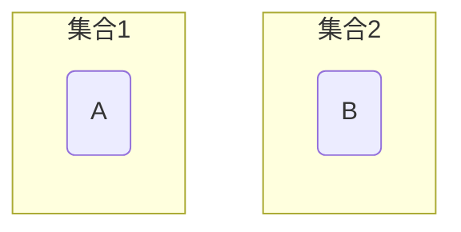
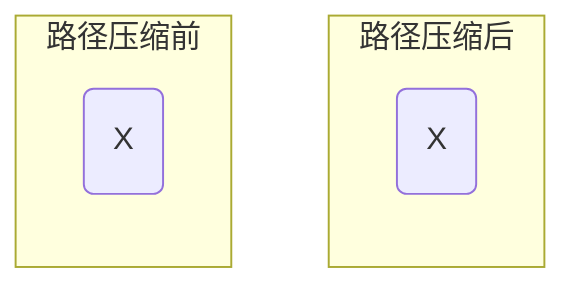
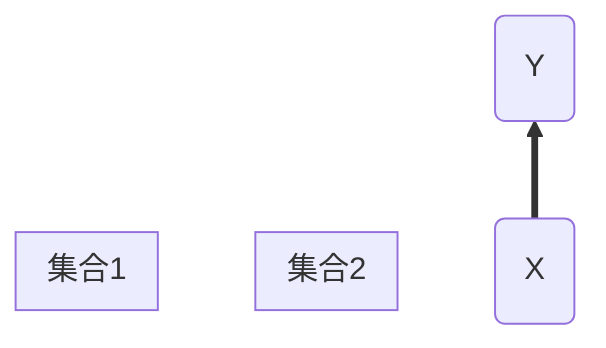
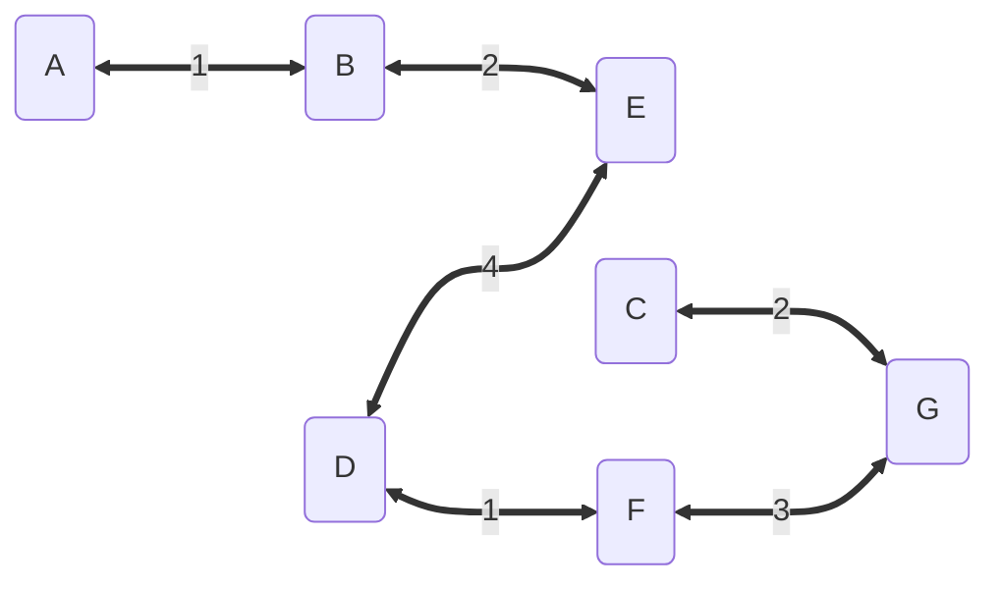

# 并查集与最小生成树

> [并查集](https://oi-wiki.org/ds/dsu/)

## 并查集

并查集是一种用于管理元素所属集合的数据结构, 实现为一个森林, 其中每棵树表示一个集合, 树中节点表示对应集合中元素

### 初始化

定义 $parent[A] = B$, 表示节点$A$的父节点是节点$B$

```c++
template<class T, class T>
std::map<T, T> parent;
```

```mermaid
graph BT;
```

初始时每个元素都位于一个单独集合, 其父节点为自身



```c++
template<class T>
void Init(T x) {
    parent[x] = x;
}
```

### 查询

查询操作用于查询某个元素所属集合, 即其根节点

用于判断两个元素是否属于同一集合


$A、B、C$拥有同一个根节点$X$, 故节点$A、B、C$属于同一集合

$D$的根节点为节点$Y$, 故节点$A$节点$D$不属于同一集合

```c++
template<class T>
T Find(T x) {
    // 若x父节点非它本身, 则继续查找
    while (parent[x] != x) {
        x = parent[x];
    }
    return x;
}
```

#### 路径压缩

查询过程中经过的每个元素都属于该集合,可将每个元直接连到根节点以加快后续查询



```c++
template<class T>
T Find(const T x) {
    if (parent[x] == x) {
        return x;
    }

    T root = x;
    while (parent[root] != root) {
        root = parent[root]
    }

    T f = x;
    while(root != x){
        f = parent[x]
        // 将查询路径上所有节点的父节点设为x
        parent[x] = root;
        x = f;
    }
    return root;
}
```

### 合并

合并两个元素所属集合, 即将一个集合根节点连到另一集合根节点




将节点$X$的父节点设为节点$Y$,合并两个集合

```c
template<class T>
void Merge(const T x, const T y) {
    T fx = Find(x);
    T fy = Find(y);
    if (fx != fy) {
        parent[fx] = fy;
    }
}
```

## 最小生成树

### kruskal法

使用 RunKruskal 法求最小生成树

- 将所有边按权值大小顺序排列

- 对于任意两个节点,若不在同个并查集内(不会形成闭环), 选择该边, 并并合并两个节点

```mermaid
graph LR;


```



```c++
/*
 */

#include <iostream>
#include <algorithm>
#include <vector>
#include <map>
#include <set>

namespace {

template<class T = std::string>
struct Line {
    T      mStartNode;
    T      mEndNode;
    double mWeight;
    bool   mIsSelect;

    Line(T s, T e, double w) : mStartNode(s), mEndNode(e), mWeight(w), mIsSelect(false) {}
};


template<class T = std::string>
class Graph {
public:

    Graph(std::vector<Line<T> > lines) {
        mLines = std::move(lines);

        // count the number of nodes
        std::set<T> nodes;
        for (auto line : mLines) {
            nodes.insert(line.mStartNode);
            nodes.insert(line.mEndNode);
        }

        // parent of each node is itself at initialization time
        for (auto node : nodes) {
            mParent[node] = node;
        }
    };

    T Find(T node) {
        if (mParent[node] == node) {
            return node;
        }

        T root = node;
        while (mParent[root] != root) {
            root = mParent[root];
        }

        T fatherNode = node;
        while (root != node) {
            fatherNode = mParent[node];
            mParent[node] = root;
            node = fatherNode;
        }

        return root;
    }

    void Merge(T node1, T node2) {
        mParent[Find(node1)] = Find(node2);
    }

    const double GetKruskal() {
        std::sort(mLines.begin(), mLines.end(), [=](const Line<T>& e1, const Line<T>& e2) { return e1.mWeight < e2.mWeight; });

        double sum = 0;
        for (auto& line : mLines) {
            if (Find(line.mStartNode) != Find(line.mEndNode)) {
                sum += line.mWeight;
                line.mIsSelect = true;

                Merge(line.mStartNode, line.mEndNode);
            }
        }
        return sum;
    }

    void PrintResult() const {
        for (auto line : mLines) {
            if (line.mIsSelect) {
                std::cout << "select Line: " << line.mStartNode << "-" << line.mEndNode << std::endl;
            }
        }
    }

private:
    std::map<T, T>       mParent;
    std::vector<Line<T>> mLines;
};
}

int main(void) {
    using Line = Line<std::string>;
    using Graph = Graph<std::string>;

    std::vector<Line> lines = {
        Line("A", "B", 1), Line("A", "C", 9), Line("A", "D", 7),
        Line("B", "D", 5), Line("B", "E", 2), Line("E", "D", 4),
        Line("E", "F", 7), Line("F", "D", 1), Line("F", "G", 3),
        Line("G", "D", 6), Line("G", "C", 2), Line("C", "D", 4),
    };

    Graph graph(lines);

    std::cout << "The minimum spanning tree mWeight = " << graph.GetKruskal() << std::endl;
    graph.PrintResult();

    return 0;
}
```