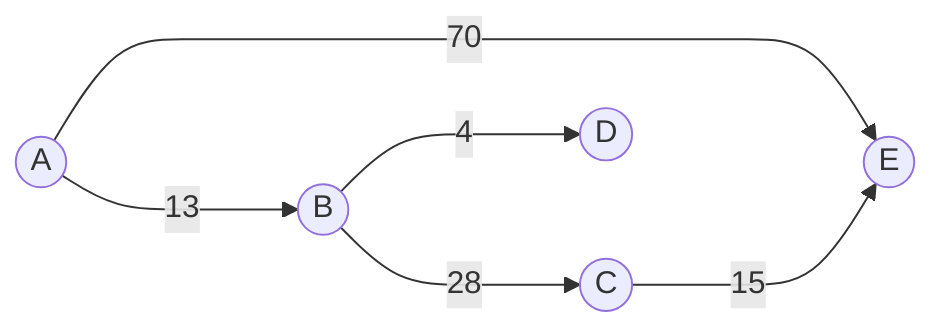
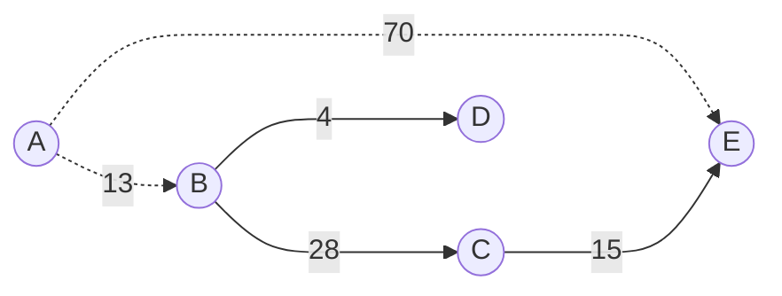
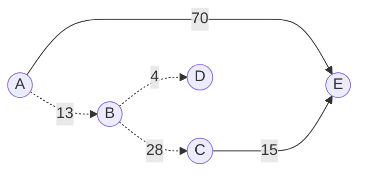
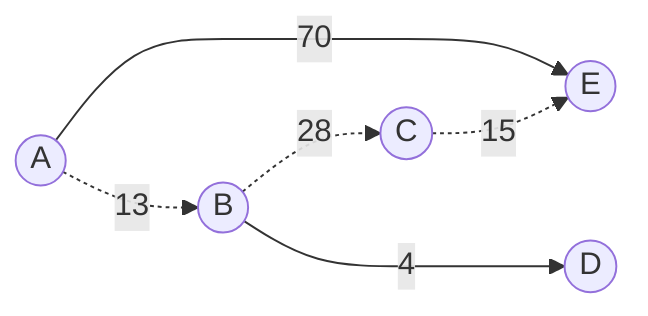

<!--
 * @Brief        : 
 * @Author       : dmjcb
 * @Date         : 2022-02-13 19:00:24
 * @LastEditors  : dmjcb@outlook.com
 * @LastEditTime : 2024-09-28 16:20:26
-->

# SPFA

[详细代码SPFA.cpp](../Code/Graph/SPFA.cpp)

求$A$到其他点的最短路

## 理论

建立一个队列, 存入开始节点, 队列不为空时:

$1)$ 取出队头节点 $X$, 出队

$2)$ 遍历与 $X$ 相通的节点 $Y$, 若 $X$ 到 $Y$ 的距离可缩小(松弛), 且 $Y$ 不在队列中, 将 $Y$ 入队, 继续 $1)$

$3)$ 若队列为空则结束

## 过程

$1)$ 求 $A$ 节点到其余节点的最短路, 设定 $p[i]$为 $A$ 到 $i$ 节点的路径

初始状态, 建立点 $A$ 到其余各点的最短路径设为$∞$

|        | A   | B   | C   | D   | E   |
| ------ | --- | --- | --- | --- | --- |
| $p[i]$ | $0$ | $∞$ | $∞$ | $∞$ | $∞$ |

$2)$ 点 $A$ 进入队列, 队列为$[A]$, 队列非空时, 

队头$A$ 出队, 对以 $A$ 为起点的所有边松弛, 涉及点 $B, E$

|        | A   | B    | C   | D   | E    |
| ------ | --- | ---- | --- | --- | ---- |
| $p[i]$ | $0$ | `13` | $∞$ | $∞$ | `70` |

点 $B, E$ 的最短路径变小, 且其未在队列中, 故点 $B, E$ 入队

队列为 $[B, E]$

$3)$ 队头 $B$ 出队, 对以 $B$ 为起点的所有边进行松弛, 涉及点 $C, D$

|        | A   | B    | C    | D    | E    |
| ------ | --- | ---- | ---- | ---- | ---- |
| $p[i]$ | $0$ | $13$ | `41` | `17` | $70$ |

到点 $C, D$ 的路径变小, 且点其未在队列中, 故点 $C, D$ 入队

队列为 $[E, C, D]$

$4)$ 队头 $E$ 出队, 对以 $E$ 为起点的所有边的终点进行松弛操作

$5)$ 队头 $C$ 出队, 对以 $C$ 为起点的所有边的终点进行松弛操作, 涉及点$D, E$

|        | A   | B    | C    | D    | E    |
| ------ | --- | ---- | ---- | ---- | ---- |
| $p[i]$ | $0$ | $13$ | $41$ | $17$ | `56` |

到点 $E$ 的最短路径改变, 且其未在队列中, 点 $E$ 入队

队列中结点为 $[D, E]$

$6)$ 队头 $D$ 出队, 对以 $D$ 为起点的边进行松弛

队列为$[E]$

$7)$ 队头 $E$ 出队, 对以 $E$ 为起点的边进行松弛

队列为空, 结束

点 $A$ 到其他点的最短路径为

|        | A   | B    | C    | D    | E    |
| ------ | --- | ---- | ---- | ---- | ---- |
| $p[i]$ | `0` | `13` | `41` | `17` | `56` |