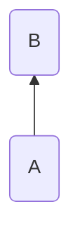
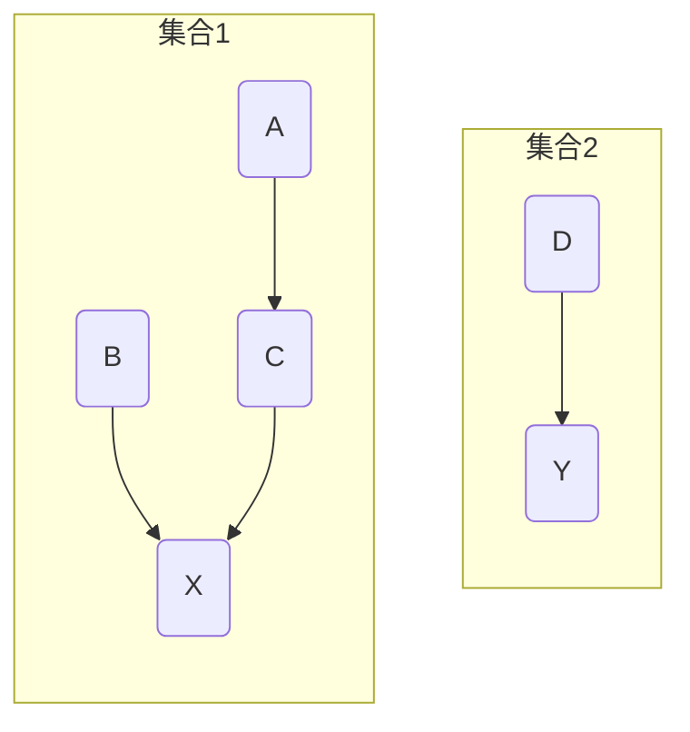
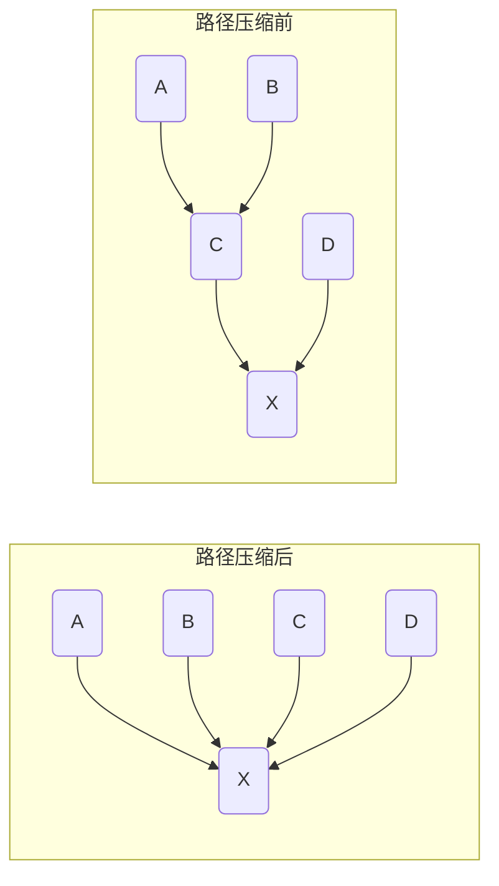
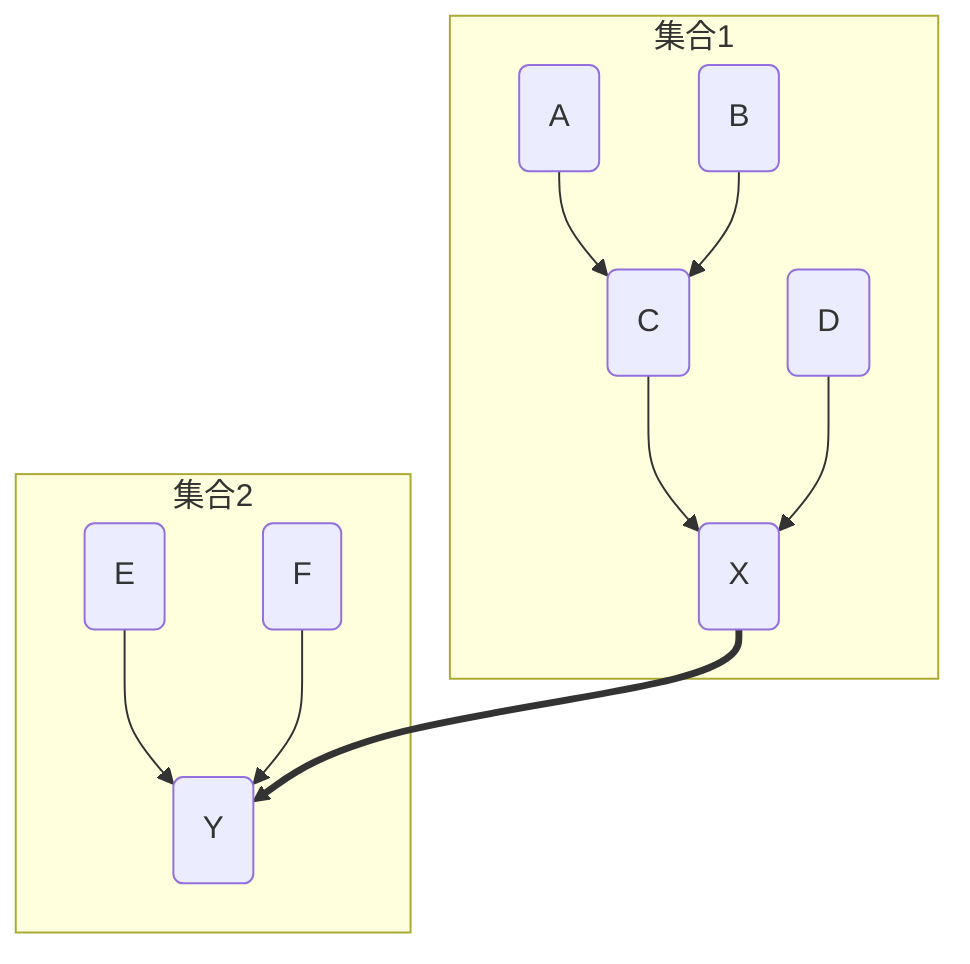
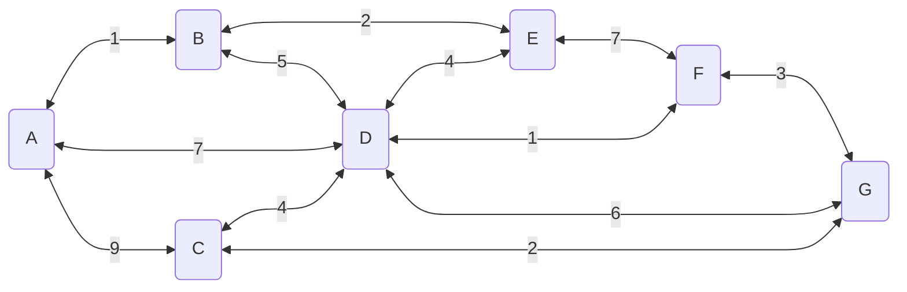
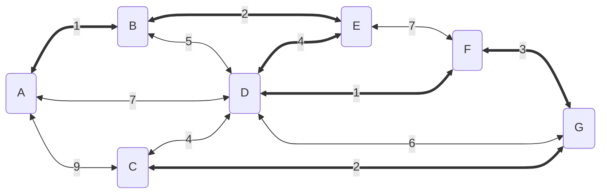

<!--
 * @Brief        : 
 * @Author       : dmjcb
 * @Date         : 2021-10-06 13:11:32
 * @LastEditors  : dmjcb@outlook.com
 * @LastEditTime : 2024-09-27 12:08:07
-->

# 并查集与最小生成树

> [并查集](https://oi-wiki.org/ds/dsu/)

## 并查集

## 定义

并查集是一种用于管理元素所属集合的数据结构,实现为一个森林,其中每棵树表示一个集合,树中的节点表示对应集合中的元素

### 初始化

定义 $parent[A] = B$,表示节点$A$的父节点是节点$B$



初始时,每个元素都位于一个单独的集合,将根节点的父节点设为自己

### 查询

查询某个元素所属集合(对应树的根节点),用于判断两个元素是否属于同一集合



如上图中节点A,节点C,节点B拥有同一个根节点X, 故节点A、B、C属于同一集合

节点D的根节点为节点Y, 故节点A 节点D不属于同一集合

```c++
int Find(int x) {
    // x的父节点不是它本身
    while (parent[x] != x) {
        // 继续向上查找
        x = parent[x];
    }

    return x;
}
```

```c
#include <iostream>
#include <map>

std::map<char, char> parent;

char Find(char node) {
    while (parent[node] != node) {
        node = parent[node];
    }
    return node;
}

int main(void) {
    parent['A'] = 'C';
    parent['C'] = 'X';
    parent['B'] = 'X';
    parent['X'] = 'X';

    parent['D'] = 'Y';
    parent['Y'] = 'Y';

    std::cout << "Node A's father node is " << Find('A') << std::endl;

    return 0;
}
```

#### 路径压缩

查询过程中经过的每个元素都属于该集合,可将其直接连到根节点以加快后续查询



```c++
int Find(const int x) {
    if (parent[x] == x) {
        return x;
    }

    int root = x;
    while (parent[root] != root) {
        root = parent[root]
    }

    int f = x;
    while(root != x){
        f = parent[x]
        // 将查询路径上所有节点的父节点设为x
        parent[x] = root;
        x = f;
    }
    return root;
}
```


```c
#include <iostream>
#include <map>

std::map<char, char> parent;

char Find(char node) {
    if (parent[node] == node) {
        return node;
    }

    char root = node;
    while (parent[root] != root) {
        root = parent[root];
    }

    char f = node;
    while (root != node) {
        f = parent[node];
        parent[node] = root;
        node = f;
    }

    return root;
}

int main(void) {
    parent['A'] = 'B';
    parent['B'] = 'C';
    parent['C'] = 'D';
    parent['D'] = 'E';
    parent['E'] = 'X';
    parent['X'] = 'X';

    char fa = Find('A');

    for (auto it = parent.cbegin(); it != parent.cend(); ++it) {
        std::cout << "Node " << it->first << " 's father node is " << it->second << std::endl;
    }

    return 0;
}
```


### 合并

合并两个元素所属集合, 即合并对应的树, 将一棵树的根节点连到另一棵树的根节点



将$A$节点的父节点设为$B$节点,合并两节点

```c
void Merge(const int x,const int y) {
    int fx = Find(x);
    int fy = Find(y);
    if (fx != fy) {
        parent[fx] = fy;
    }
}
```


```c
#include <iostream>
#include <map>

std::map<char, char> parent;

char Find(char node) {
    if (parent[node] == node) {
        return node;
    }

    char root = node;
    while (parent[root] != root) {
        root = parent[root];
    }

    char f = node;
    while (root != node) {
        f = parent[node];
        parent[node] = root;
        node = f;
    }

    return root;
}


void Merge(const char xNode, const char yNode) {
    char fx = Find(xNode);
    char fy = Find(yNode);
    parent[fx] = fy;
}

int main(void) {
    parent['A'] = 'C';
    parent['B'] = 'C';
    parent['C'] = 'X';
    parent['D'] = 'X';
    parent['X'] = 'X';

    parent['E'] = 'Y';
    parent['F'] = 'Y';
    parent['Y'] = 'Y';

    Merge('X', 'Y');

    for (auto node : { 'A', 'B', 'D' }) {
        char f = Find(node);
        std::cout << "Find Node " << node << " 's father node is " << f << std::endl;
    }

    for (auto _p : parent) {
        std::cout << "Node " << _p.first << " 's father node is " << _p.second << std::endl;
    }

    return 0;
}
```


## 最小生成树

### kruskal法

使用 RunKruskal 法求最小生成树

- 将所有边按权值大小顺序排列

- 对于任意两个节点,若不在同个并查集内(不会形成闭环), 选择该边, 并并合并两个节点





```c++
#include <iostream>
#include <algorithm>
#include <vector>
#include <map>
#include <set>

/**
 * @brief: defintion of Line
 * @return {*}
 */
typedef struct Line
{
    std::string mStartNode = "";
    std::string mEndNode = "";
    double      mWeight;
    bool        mIsSelect;

    Line(std::string startNode, std::string endNode, double weight) {
        this->mStartNode = mStartNode;
        this->mEndNode = mEndNode;
        this->mWeight = weight;
        this->mIsSelect = false;
    }
} Line;


/**
 * @brief: defintion of Graph
 * @return {*}
 */
class Graph {
public:

    Graph(std::vector<Line> lines) {
        mLines = std::move(lines);

        // count the number of nodes
        std::set<std::string> nodes;
        for (auto line : mLines) {
            nodes.insert(line.mStartNode);
            nodes.insert(line.mEndNode);
        }

        // parent of each node is itself at initialization time
        for (auto node : nodes) {
            mParent[node] = node;
        }
    };
        
    std::string Find(std::string node) {
        if (mParent[node] == node) {
            return node;
        }

        std::string root = node;
        while (mParent[root] != root) {
            root = mParent[root];
        }

        std::string fatherNode = node;
        while (root != node) {
            fatherNode = mParent[node];
            mParent[node] = root;
            node = fatherNode;
        }

        return root;
    }

    void Merge(std::string node1, std::string node2) {
        mParent[Find(node1)] = Find(node2);
    }

    const double GetKruskal() {
        std::sort(mLines.begin(), mLines.end(), [=](const Line &e1, const Line &e2) { return e1.mWeight < e2.mWeight; });

        double sum = 0;
        for (auto &line : mLines) {
            if (Find(line.mStartNode) != Find(line.mEndNode)) {
                sum += line.mWeight;
                line.mIsSelect = true;

                Merge(line.mStartNode, line.mEndNode);
            }
        }
        return sum;
    }

    void PrintResult() const {
        for (auto line : mLines) {
            if (line.mIsSelect) {
                std::cout << "select Line: " << line.mStartNode << "-" << line.mEndNode << std::endl;
            }
        }
    }

private:
    std::map<std::string, std::string> mParent;
    std::vector<Line>                  mLines;
};

int main(void) {
    std::vector<Line> lines = {
        Line("A", "B", 1), Line("A", "C", 9), Line("A", "D", 7), Line("B", "D", 5), Line("B", "E", 2), Line("E", "D", 4),
        Line("E", "F", 7), Line("F", "D", 1), Line("F", "G", 3), Line("G", "D", 6), Line("G", "C", 2), Line("C", "D", 4),
    };

    Graph graph(lines);

    std::cout << "The minimum spanning tree mWeight = " << graph.GetKruskal() << std::endl;
    graph.PrintResult();

    return 0;
}
```
