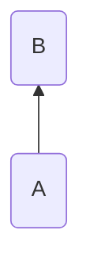
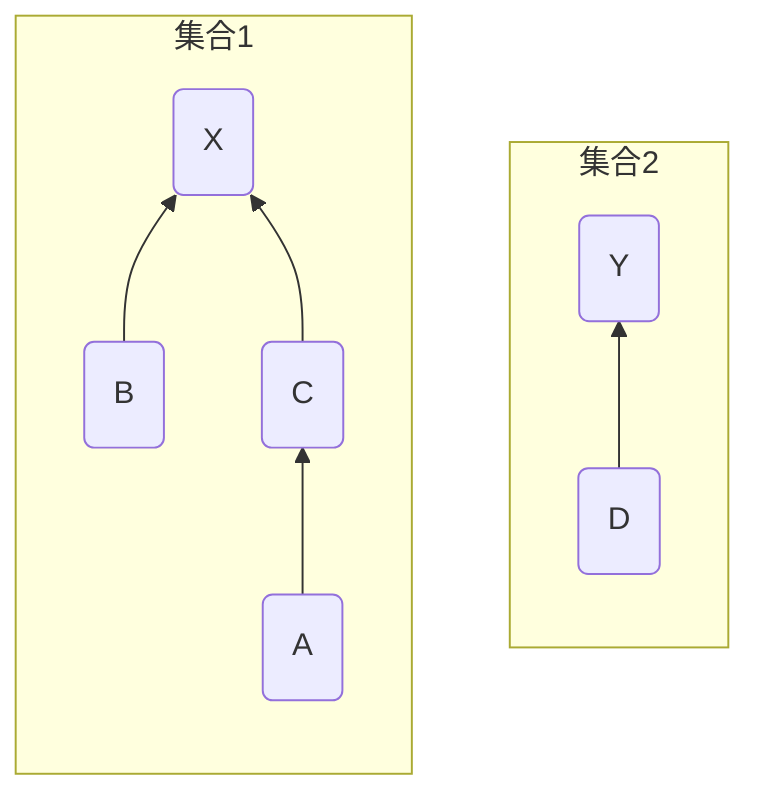
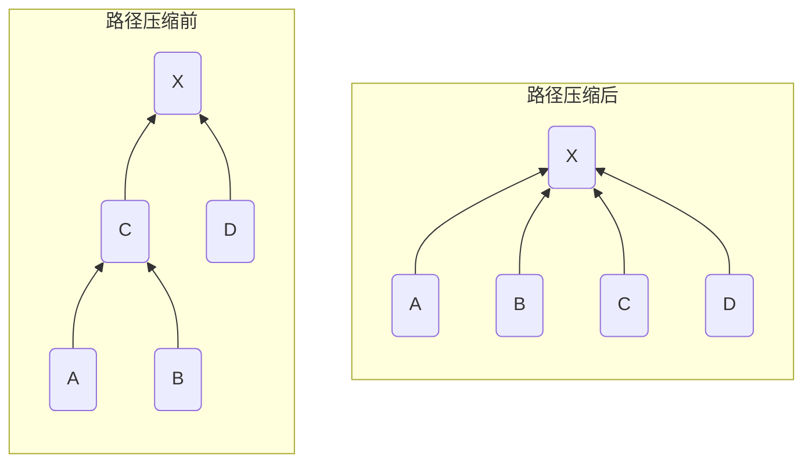
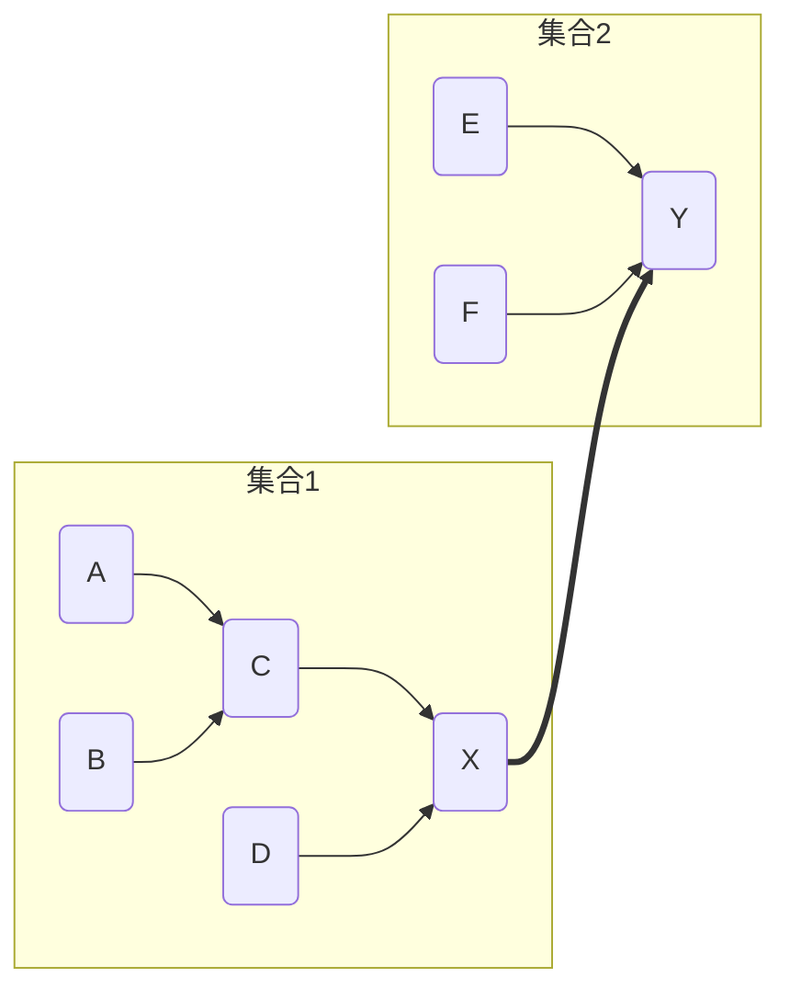
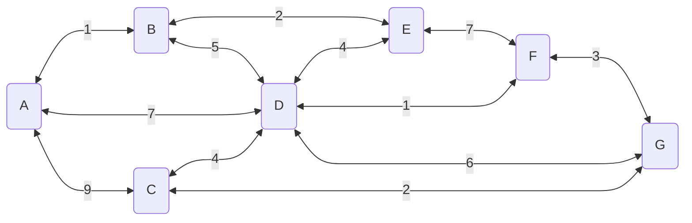
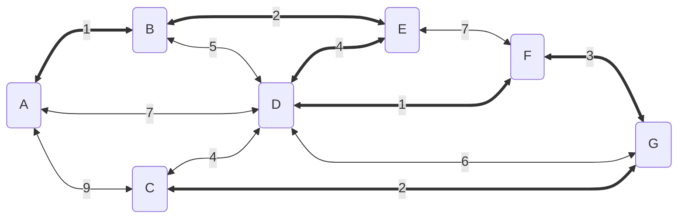

<!--
 * @Brief        : 
 * @Author       : dmjcb
 * @Date         : 2021-10-06 13:11:32
 * @LastEditors  : dmjcb@outlook.com
 * @LastEditTime : 2024-09-28 21:22:45
-->

# 并查集与最小生成树

> [并查集](https://oi-wiki.org/ds/dsu/)

## 并查集

## 定义

并查集是一种用于管理元素所属集合的数据结构, 实现为一个森林, 其中每棵树表示一个集合, 树中节点表示对应集合中元素

### 初始化

定义 $parent[A] = B$,表示节点$A$的父节点是节点$B$



```c++
template<class T, class T>
std::map<T, T> parent;
```

初始时每个元素都位于一个单独集合, 将父节点设为自己

```c++

template<class T>
void Init(T x) {
    parent[x] = x;
}
```

### 查询

查询某个元素所属集合(对应树的根节点), 用于判断两个元素是否属于同一集合



如上图中节点A,节点C,节点B拥有同一个根节点X, 故节点A、B、C属于同一集合

节点D的根节点为节点Y, 故节点A 节点D不属于同一集合

```c++
template<class T>
T Find(T x) {
    // x父节点非它本身, 则继续向上查找
    while (parent[x] != x) {
        x = parent[x];
    }
    return x;
}
```

#### 路径压缩

查询过程中经过的每个元素都属于该集合,可将其直接连到根节点以加快后续查询



```c++
template<class T>
T Find(const T x) {
    if (parent[x] == x) {
        return x;
    }

    T root = x;
    while (parent[root] != root) {
        root = parent[root]
    }

    T f = x;
    while(root != x){
        f = parent[x]
        // 将查询路径上所有节点的父节点设为x
        parent[x] = root;
        x = f;
    }
    return root;
}
```

### 合并

合并两个元素所属集合, 即合并对应的树, 将一棵树的根节点连到另一棵树的根节点



将$A$节点的父节点设为$B$节点,合并两节点

```c
template<class T>
void Merge(const T x, const T y) {
    T fx = Find(x);
    T fy = Find(y);
    if (fx != fy) {
        parent[fx] = fy;
    }
}
```

## 最小生成树

### kruskal法

[详细代码Kruskal.cpp](../Code/Graph/Kruskal.cpp)

使用 RunKruskal 法求最小生成树

- 将所有边按权值大小顺序排列

- 对于任意两个节点,若不在同个并查集内(不会形成闭环), 选择该边, 并并合并两个节点




