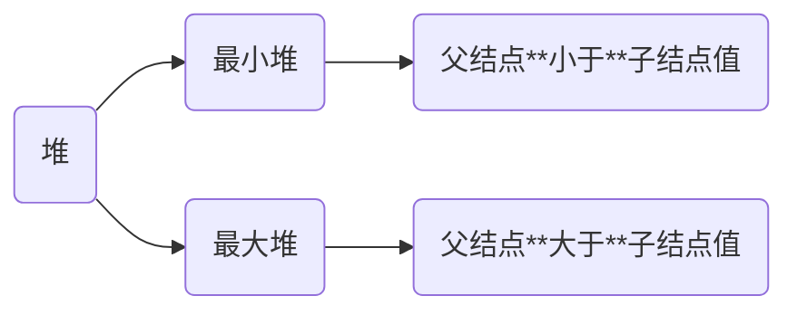
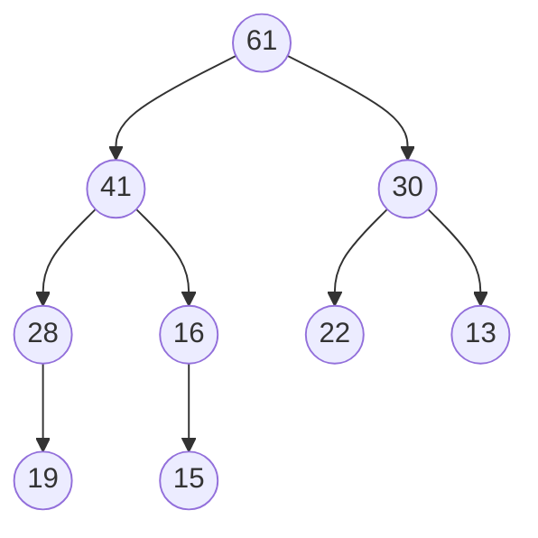

# 堆

堆通常是一个可以被看做一棵树的数组对象, 堆总是一棵完全二叉树[^1]



## 性质

```c
a[] = {61, 41, 30, 28, 16, 22, 13, 19, 17, 15}
```



- 第 $i$ 个父节点下标为 $(i - 1)/2$

- 左儿子下标为 $2 * i + 1$

- 右儿子下标为 $2 * i + 2$

如父节点 $28$, 其下标为 $3$, 左儿子 $19$ 的下标为 $7$, 右儿子 $17$ 下标为 $8$

## 堆排序

```c++
// 调整为最小堆
// start, end表示待建堆区间
template<typename T>
void siftDown(std::vector<T> &v, const int start, const int end) {
    int parent = start;
    int child = 2 * parent + 1;
    // temp暂存子树根节点
    int temp = v[parent];
    // 如果左儿子编号未到终点
    while (child < end) {
        // 如果右儿子比左儿子小
        if (child + 1 < end && v[child] < v[child + 1]) {
            // child变为右儿子
            child++;
        }
        // 如果根节点比儿子节点小, 则不需要调整
        if (temp >= v[child]) {
            break;
        }
        // 否则需调整儿子和双亲的位置
        v[parent] =  v[child];
        // 儿子上移变为双亲
        parent = child;
        child = 2 * child + 1;
    }
    v[parent] = temp;
}

// 堆排序函数
template<typename T>
void heapSort(vector<T> &v) {
    int size = v.size();
    for (int i =  (size - 2) / 2; i >= 0; i-- ) {
        // 建立一个小根堆
        siftDown(v, i, size);
    }
    for (int i = size - 1; i > 0; i--) {
        // 交换根和最后一个元素, 
        std::swap(v[0], v[i]);
        siftDown(v, 0, i);
    }
}
```

[^1]: 如果二叉树中除去最后一层节点为满二叉树, 且最后一层的结点依次从左到右分布, 则此二叉树被称为完全二叉树
