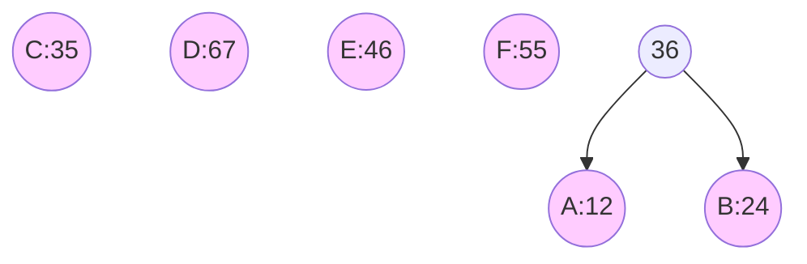
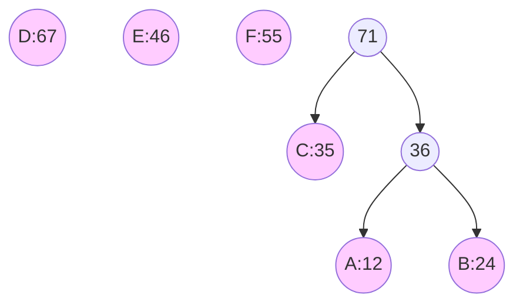
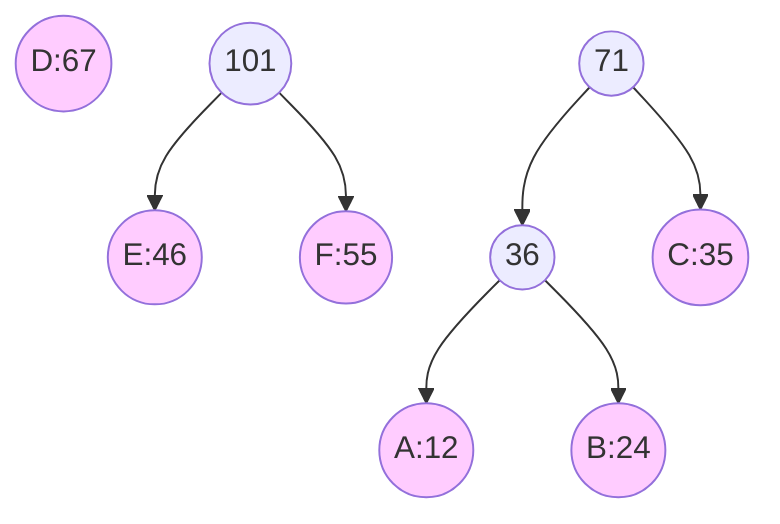
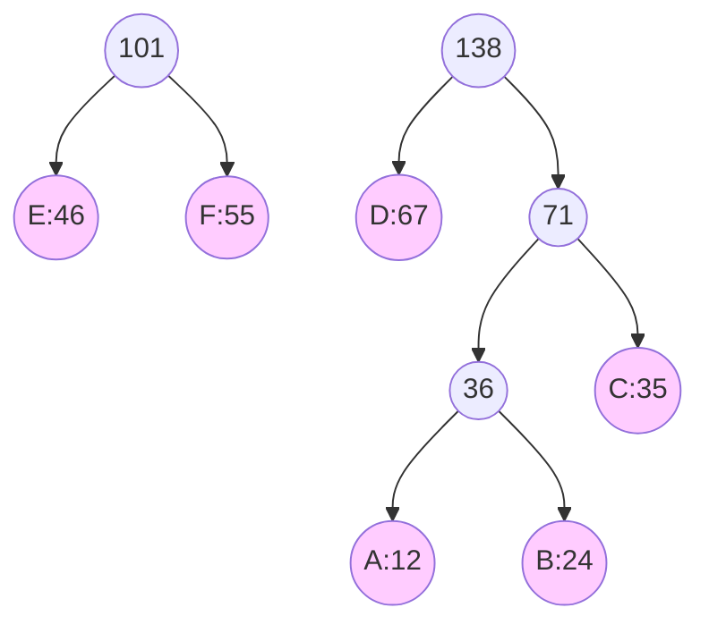
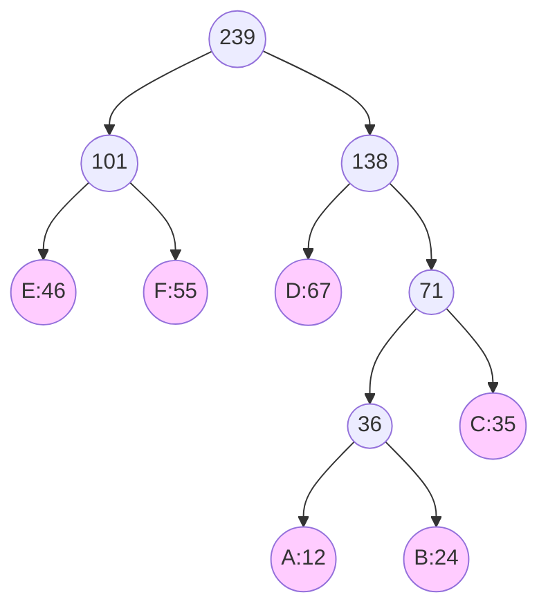
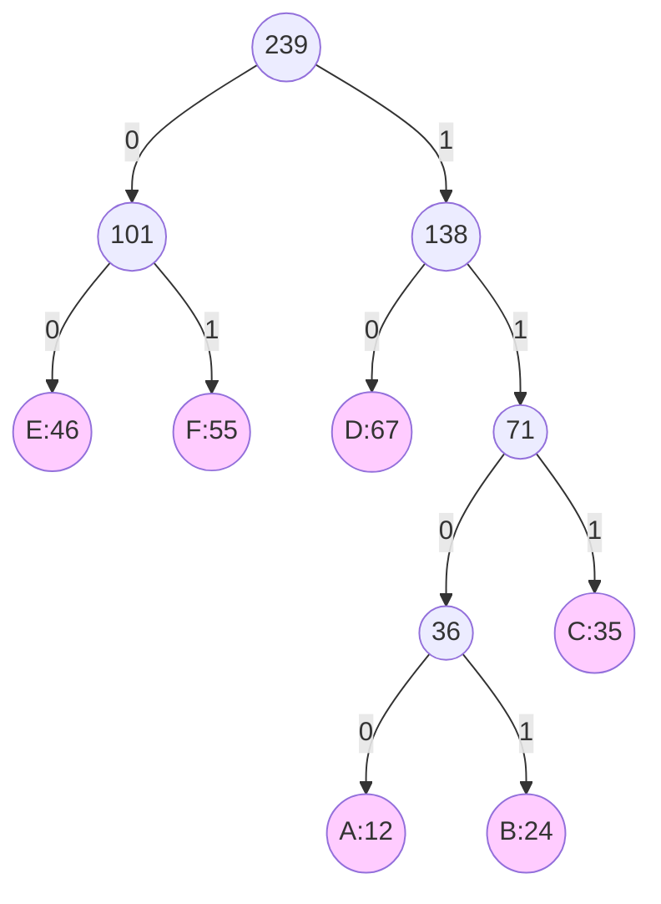

<!--
 * @Brief        : 
 * @Author       : dmjcb
 * @Date         : 2020-01-16 17:59:35
 * @LastEditors  : dmjcb@outlook.com
 * @LastEditTime : 2024-10-13 13:39:33
-->

# 哈夫曼树

给定 $N$ 个权值作为 $N$ 个叶子结点, 构造一棵二叉树, 若该树的带权路径长度达到最小, 称这样的二叉树为哈夫曼树

哈夫曼树是带权路径长度最短的树, 权值较大的结点离根较近

## 构建

| 节点 | 权值 |
| ---- | ---- |
| A    | 12   |
| B    | 24   |
| C    | 35   |
| D    | 67   |
| E    | 46   |
| F    | 55   |


每次从所有节点中选出最小权值节点与次小权值节点合并为新节点, 重复操作至所有节点合并为一棵树

1. 选择A、B节点合并, 产生新节点36



2. 选择C与节点36合并, 产生新节点71



3. 选择E, F节点合并, 产生节点101



4. 选择D与节点71合并, 产生节点138



5. 合并节点101与138, 完成构建



对建立好的哈夫曼树, 所有节点左儿子编为 $0$, 右儿子编为 $1$, 实现对各节点的编码




## 实现

### 节点定义

```c++
template<typename NodeType, typename WeightType>
struct  Node {
    NodeType              mName;
    WeightType            mFrequency;
    std::shared_ptr<Node> mLeftChild;
    std::shared_ptr<Node> mRightChild;

    Node(NodeType name, WeightType freq):
        mName(name), mFrequency(freq), mLeftChild(nullptr), mRightChild(nullptr) {}

    Node(NodeType name, WeightType freq, std::shared_ptr<Node> left, std::shared_ptr<Node> right):
        mName(name), mFrequency(freq), mLeftChild(std::move(left)), mRightChild(std::move(right)) {}
};
```
### 算法

```c++
template<typename NodeType, typename WeightType>
class HuffmanTree {
public:
    using Node    = Node<NodeType, WeightType>;
    using NodePtr = std::shared_ptr<Node>;

    explicit HuffmanTree(std::map<NodeType, WeightType> &table) {
        auto Compare = [](NodePtr node1, NodePtr node2) {return node1->mFrequency > node2->mFrequency;};
        std::priority_queue<NodePtr, std::vector<NodePtr>, decltype(Compare)> minHeap(Compare);

        for (const auto&[k, v] : table) {
            minHeap.push(std::make_shared<Node>(k, v));
        }

        while (minHeap.size() > 1) {
            NodePtr left = minHeap.top();
            minHeap.pop();
            NodePtr right = minHeap.top();
            minHeap.pop();

            minHeap.push(std::make_shared<Node>('\0', left->mFrequency + right->mFrequency, left, right));
        }

        NodePtr root = minHeap.top();
        BuildCodes(root, "");
    }

    ~HuffmanTree() = default;

    void BuildCodes(const NodePtr& node, const std::string& code) {
        if (!node) {
            return;
        }

        if (node->mLeftChild == nullptr && node->mRightChild == nullptr) {
            mCodeTable[node->mName] = code;
        }

        BuildCodes(node->mLeftChild, code + "0");
        BuildCodes(node->mRightChild, code + "1");
    }

    void PrintCodeTable() const {
        for (const auto& [k, v] : mCodeTable) {
            std::cout << k << ": " << v << std::endl;
        }
    }

private:
    std::map<NodeType, std::string> mCodeTable;
};
```