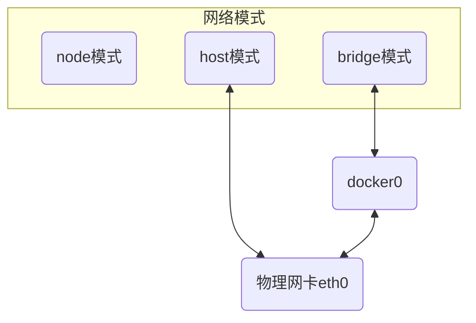

# Docker网络

Docker进程启动时会在主机上创建虚拟网桥 $docker0$, 处于七层网络模型的数据链路层

启动容器时若不指定网络模式, 则容器网络默认连接到它上

虚拟网桥的工作方式和物理交换机类似, 此时所有容器就通过交换机连在一个二层网络中




## bridge

docker默认的网络模式, 为容器创建独立的网络命名空间, 容器具有独立的网卡等所有单独的网络栈

桥接模式下创建容器, $docker0$ 会创建一组对等虚拟设备接口 $veth$ 与 容器内部虚拟网卡$eth0$


### 创建

#### 默认

```sh
docker network create --driver [类型] [网络名]
```

- 创建一个 docker 网络, 命名MyBridge

```sh
docker network create --driver bridge MyBridge
```


创建好自定义网络后docker会自定义为其分配IP网段和网关


#### 自定义IP网关

```sh
docker network create --driver [类型] --subnet [网段] --gateway [网关] [网络名]
```

- 创建网段172.20.0.0/24, 网关172.20.0.1的网络


#### 使用

- 创建容器ubuntu1, 使用MyBridge网络与默认IP

```sh
docker run -itd --name ubuntu1 --network=MyBridge busybox
```


- 创建容器busybox2, 使用SelfBridge网络并指定IP

```sh
docker run -itd --name busybox2 --network=SelfBridge --ip=172.20.0.100 busybox
```


#### 互联

```sh
docker network connect [网络名] [容器名]
```

- 将容器busybox2 与容器ubuntu1的网络进行连接

```sh
docker network connect MyBridge busybox2
```

在容器busybox2内ping 容器ubuntu1, 实现使用自定义网络实现容器间的通信


此时可发现busybox2内新增属于MyBridge网络的IP


### 运行时指定

```sh
docker run -itd --net=bridge [容器名]
```

## host

直接使用容器宿主机的网络命名空间, 此时容器不会拥有独立网络命名空间, 而与宿主机共用

容器除了网络,其他比如文件系统、进程等依然隔离

### 运行时指定

```sh
docker run -itd --net=host [容器名]
``` 

## none

没有任何的网络资源, 不能和容器和宿主机之间进行正常的访问互动
