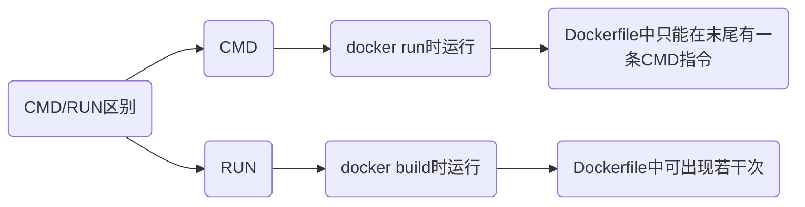

# Dockerfile

## 指令

### RUN

执行指令

```sh
RUN [指令]
```

### COPY

拷贝文件

```sh
COPY [源路径] [目标路径]
```

`COPY` 将从构建上下文目录中的源路径的文件/目录复制到新的一层的镜像内的目标路径/位置

### ADD

复制文件

```sh
ADD [源路径] [目标路径]
```

若源路径为tar压缩文件且压缩格式为 gzip, bzip2, xz, ADD 指令将会自动解压缩文件到目标路径

### CMD

#### shell格式

```sh
CMD [命令]
```

- 执行Python指令

```sh
CMD python3 manage.py runserver 0.0.0.0:8000
```

#### exec格式

```sh
CMD ["可执行文件", "参数1", "参数2", ...]
```

- 执行Python指令

```sh
CMD ["python3", "manage.py", "runserver 0.0.0.0: 8000"]
```



## 构建

### 多阶段构建

#### 连续构建

```sh
from 镜像名1 as 阶段名1

...

from 镜像名2 as 阶段名2
```

```go
package main

import "fmt"

func main(){
    fmt.Printf("Hello World!");
}
```

```docker
# 第一阶段
FROM golang:1.9-alpine as builder

RUN apk --no-cache add git

WORKDIR /go/src/github.com/go/helloworld/

RUN go get -d -v github.com/go-sql-driver/mysql

COPY app.go .

RUN CGO_ENABLED=0 GOOS=linux go build -a -installsuffix cgo -o app .

# 第二阶段
FROM alpine:latest as prod

RUN apk --no-cache add ca-certificates

WORKDIR /root/

# 从第一阶段中拷贝文件
COPY --from=builder /go/src/github.com/go/helloworld/app .

CMD ["./app"]
```

#### 仅单阶段构建

```sh
FROM [镜像名] AS [阶段名]
```

- 仅构建 builder 阶段的镜像, 可用 `--target=builder`

```sh
FROM golang:1.9-alpine AS builder
```

```sh
docker build --target 阶段名 -t 新镜像名:tag .
```

#### 构建时从其他镜像复制文件

```sh
COPY --from=[镜像名] [源路径] [当前路径]
```

- 复制nginx:latest镜像中的nginx.conf文件

```sh
COPY --from=nginx:latest /etc/nginx/nginx.conf /nginx.conf
```

### 示例

- 搭建g++编译环境

```dockerfile
from alpine as builder

label dmjcb <>

workdir /

run sed -i 's/dl-cdn.alpinelinux.org/mirrors.aliyun.com/g' /etc/apk/repositories && apk add g++
```

构建

```sh
docker build -t gpp:v1 .
```


- 拉取qemu

```sh
docker run --rm --privileged multiarch/qemu-user-static --reset --persistent yes
```

```sh
docker pull arm32v7/gcc:9
```