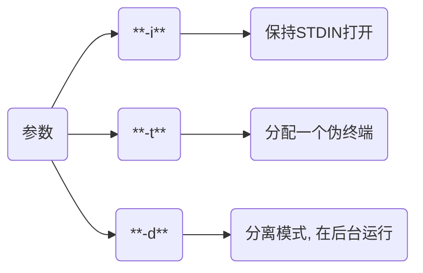
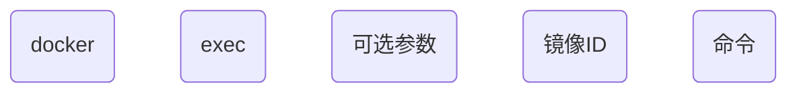

# Docker指令

## 启动

- 新建启动

```sh
docker run ...
```

- 启动已终止容器

```sh
docker start ...
```

### 参数

#### -itd

| 参数 | 含义                         |
| ---- | --------------------------- |
| `-i` | 以交互模式运行容器            |
| `-t` | 为容器重新分配一个伪输入终端   |
| `-d` | 后台运行并返回容器ID          |

#### -p

指定端口映射

````sh
-p 主机端口:容器端口
````

- 将本机7890端口映射到容器80端口

```sh
docker run -itd --name=nginx_test -p 7890:80 nginx
```


#### -e

设置容器环境变量

```sh
-e 变量名=值
```

- 设置root用户密码为123

```sh
docker run -itd -e MYSQL_ROOT_PASSWORD=123 mysql:5.6
```

- 设置环境变量STR_VEN=abcdefg

```sh
docker run -itd --name=box -e STR_VEN=abcdefg busybox
```


#### --env-file=[]

从指定文件读入环境变量

#### --mount

挂载本地目录(必须是绝对路径)到容器中, 若目录不存在会报错

```sh
--mount type=bind, source=[本地路径], target=[容器路径](权限)
```

- 将本地/src/app挂载到容器/root/app

```sh
docker run -itd --mount type=bind, source=/src/app, target=/root/app nginx:alpine
```

- 挂载主机目录的默认权限是`读写`, 可增加 `readonly` 指定为只读

```sh
--mount type=bind, source=/src/app, target=/root/app, readonly
```

#### -v

挂载本地目录到容器中, 若本地目录不存在, 会自动创建文件夹

- 配置时区

```sh
-v /etc/localtime:/etc/localtime:ro
```

#### --net

指定容器网络连接类型

```sh
--net="类型"
```

支持 bridge, host, none, container四种类型

#### --link

链接到另一个容器

```sh
--link=[]
```

- 从 Ubuntu 容器中访问 MySQL容器中的mysql服务

```sh
docker run -itd --name mysql_server -e MYSQL_ROOT_PASSWORD=123 mysql:5.7

# 链接 MySQL 容器, db为别名
docker run -itd --name ubuntu_test --link mysql_server:db ubuntu:18.04 
```

- 验证是否能够登录

```sh
docker exec -it ubuntu_test bash -c 'apt-get update && apt-get install -y mysql-client'

mysql -h db -u root -p123
```

### 问题

- 执行命令后容器停止

```sh
docke run -itd --name=box busybox mkdir test
```

此处本意为run时创建test目录, 实际发现执行命令后即容器停止运行

原因为基于Docker原理, 当run时执行的命令结束时, 容器也会停止

运行下面命令是run执行sh解释权, 容器会在后台一直运行

```sh
docker run -itd --name=box busybox sh
```

## 操作

### exec

容器执行命令

```shell
docker exec [参数] 镜像ID {命令}
```



#### 单指令



- busybox容器创建目录test

```sh
docker run -itd --name=box busybox 

docker exec -it box mkdir test
```


#### 多指令

```sh
docker exec 容器ID [shell解释器] -c '命令1 && 命令2'
```

- ubuntu安装mysql-clinet

```sh
docker run -itd --name=ubuntu_test ubuntu:18.04

docker exec -it ubuntu_test bash -c 'apt-get update && apt-get install -y mysql-client'
```

### cp

用于宿主机与容器内文件拷贝


```sh
docker cp 宿主机文件路径 容器ID:容器目标路径
```


```sh
docker cp 容器ID:容器文件路径 宿主机目标路径
```

### export/import

- 打包

```sh
docker export 容器ID > 压缩包.tar
```

- 加载

```sh
docker import 压缩包.tar 容器:tag
```

### inspect

#### 容器信息

- IP地址

```sh
docker inspect 容器ID | grep IPAddress
```


#### 获取容器ID

```sh
$(docker ps | grep "容器名" | awk '{print $1}') 或

$(docker ps -aqf "name=容器名")
```

| 参数 | 说明                    |
| ---- | ---------------------- |
| a    | 即使容器没运行也能获取   |
| q    | 仅输出容器ID            |
| f    | filter                 |

#### 判断容器是否存在

```sh
name=""

docker images | grep ${name} &> /dev/null

# 若不存在
if $? -ne 0;then
    ...
fi
```

### save

打包镜像

```sh
docker save -o 压缩包.jar 镜像名/镜像ID
```

### load

解压镜像

```sh
docker load -i 压缩包
```

### tag

重命名镜像

```sh
docker tag 镜像ID 仓库:TAG
```

## 停止

### stop

```
docker stop ...
```

### rm

#### 强制删除

```sh
docker rm -f 容器ID
```

#### 删除所有容器

```sh
docker rm $(docker ps -aq)
```

#### 先停用删除

```sh
docker stop $(docker ps -aq) && docker rm $(docker ps -aq)
```

#### 删除none镜像

```sh
docker rmi -f  `docker images | grep '<none>' | awk '{print $3}'` 
```

#### 删除异常容器

```sh
docker rm `{docker ps -a | grep Exited | awk '{print $1}'`
```