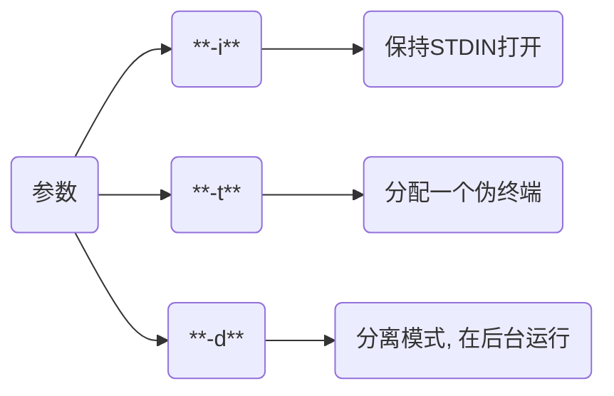

# 操作

## exec

容器执行命令

```shell
docker exec [参数] 镜像ID {命令}
```



### 单指令


- busybox容器创建目录test

```sh
docker run -itd --name=box busybox 

docker exec -it box mkdir test
```


### 多指令

```sh
docker exec 容器ID [shell解释器] -c '命令1 && 命令2'
```

- ubuntu安装mysql-clinet

```sh
docker run -itd --name=ubuntu_test ubuntu:18.04

docker exec -it ubuntu_test bash -c 'apt-get update && apt-get install -y mysql-client'
```

## cp

用于宿主机与容器内文件拷贝


```sh
docker cp 宿主机文件路径 容器ID:容器目标路径
```


```sh
docker cp 容器ID:容器文件路径 宿主机目标路径
```

## export/import

- 打包

```sh
docker export 容器ID > 压缩包.tar
```

- 加载

```sh
docker import 压缩包.tar 容器:tag
```

## inspect

### 容器信息

- IP地址

```sh
docker inspect 容器ID | grep IPAddress
```


### 获取容器ID

```sh
$(docker ps | grep "容器名" | awk '{print $1}') 或

$(docker ps -aqf "name=容器名")
```

| 参数 | 说明                    |
| ---- | ---------------------- |
| a    | 即使容器没运行也能获取   |
| q    | 仅输出容器ID            |
| f    | filter                 |

### 判断容器是否存在

```sh
name=""

docker images | grep ${name} &> /dev/null

# 若不存在
if $? -ne 0;then
    ...
fi
```

## save

打包镜像

```sh
docker save -o 压缩包.jar 镜像名/镜像ID
```

## load

解压镜像

```sh
docker load -i 压缩包
```

## tag

重命名镜像

```sh
docker tag 镜像ID 仓库:TAG
```
