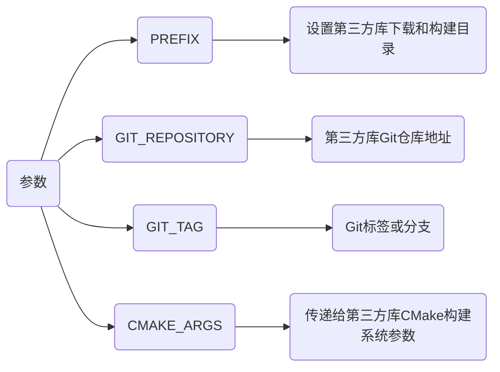

> - [CMake学习笔记05--ExternalProject_Add模块](https://blog.csdn.net/zym326975/article/details/106118063)

# CMake移植三方库

## 源代码编译

若第三方库没有CMake配置文件, 且可以访问其源代码, 可以将库源代码直接添加到项目中, 并使用add_subdirectory编译:

```cmake
add_subdirectory(SomeLibrary)

target_link_libraries(MyExecutable PRIVATE SomeLibrary)
```

## find_package

若第三方库支持CMake配置文件, 可以直接通过find_package使用

```cmake
# 查找第三方库SomeLibrary
find_package(SomeLibrary REQUIRED)

target_link_libraries(MyExecutable PRIVATE SomeLibrary::SomeLibrary) 
```

该方式通常需要第三方库在系统上已安装, 或者设置CMAKE_PREFIX_PATH来指定库安装路径

## FetchContent

CMake 3.11及以上版本引入FetchContent模块, 可直接下载第三方库编译

```cmake
include(FetchContent)

FetchContent_Declare(
  googletest
  URL https://github.com/google/googletest/archive/release-1.10.0.tar.gz
)

FetchContent_MakeAvailable(googletest)

target_link_libraries(MyExecutable PRIVATE gtest gtest_main)
```

## ExternalProject

ExternalProject是CMake原生模块, 适合下载、配置、构建和安装外部项目

```cmake
include(ExternalProject)
ExternalProject_Add(
    MyLibrary
    PREFIX ${CMAKE_BINARY_DIR}/my_library
    GIT_REPOSITORY https://github.com/user/my_library.git
    GIT_TAG master
    CMAKE_ARGS -DCMAKE_INSTALL_PREFIX=<INSTALL_DIR> -DCMAKE_BUILD_TYPE=Release
)
```



### 链接生成库

ExternalProject通常会将外部项目安装到指定目录。在主项目中使用生成库时，需手动添加安装路径

```cmake
ExternalProject_Add(
    MyLibrary
    PREFIX ${CMAKE_BINARY_DIR}/my_library
    GIT_REPOSITORY https://github.com/user/my_library.git
    GIT_TAG master
    CMAKE_ARGS -DCMAKE_INSTALL_PREFIX=${CMAKE_BINARY_DIR}/my_library/install
)

add_library(MyLibrary STATIC IMPORTED)

set_target_properties(MyLibrary PROPERTIES
    IMPORTED_LOCATION             ${CMAKE_BINARY_DIR}/libMyLibrary.a
    INTERFACE_INCLUDE_DIRECTORIES ${CMAKE_BINARY_DIR}/include
)

target_link_libraries(MyExecutable PRIVATE MyLibrary)
```

### 示例

- 创建CMake/gflag-2.2.2.cmake

```cmake
include(ExternalProject)

set(GFLAG_ROOT          ${CMAKE_BINARY_DIR}/thirdparty/gflag-2.2.2)
set(GFLAG_LIB_DIR       ${GFLAG_ROOT}/lib)
set(GFLAG_INCLUDE_DIR   ${GFLAG_ROOT}/include)
 
set(GFLAG_URL           https://github.com/gflags/gflags/archive/v2.2.2.zip)
set(GFLAG_CONFIGURE     cd ${GFLAG_ROOT}/src/gflag-2.2.2 && cmake -D CMAKE_INSTALL_PREFIX=${GFLAG_ROOT} .)
set(GFLAG_MAKE          cd ${GFLAG_ROOT}/src/gflag-2.2.2 && make)
set(GFLAG_INSTALL       cd ${GFLAG_ROOT}/src/gflag-2.2.2 && make install)

ExternalProject_Add(gflag-2.2.2
    URL                   ${GFLAG_URL}
    DOWNLOAD_NAME         gflag-2.2.2.zip
    PREFIX                ${GFLAG_ROOT}
    CONFIGURE_COMMAND     ${GFLAG_CONFIGURE}
    BUILD_COMMAND         ${GFLAG_MAKE}
    INSTALL_COMMAND       ${GFLAG_INSTALL}
)
```

- 在项目根目录下CMakeLists.txt中使用include调用

```cmake
include(cmake/gflag-2.2.2.cmake)
include(cmake/hwloc-1.11.cmake)
include(cmake/protobuf-2.6.1.cmake)
include(cmake/protobuf-2.6.1-compile.cmake)
```