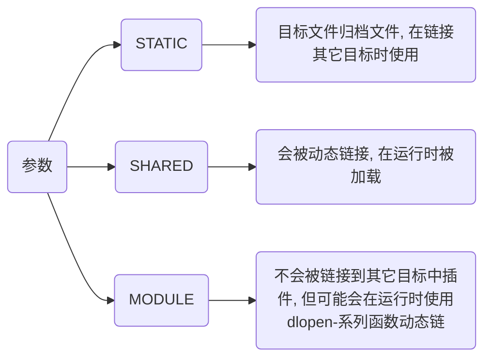

> - [CMAKE手册](https://www.zybuluo.com/khan-lau/note/254724)
> - [用CMake构建工程时 cmake -G "Unix Makefiles" 的使用](https://blog.csdn.net/yangjia_cheng/article/details/111408753)
> - [卸载 make install 编译安装的软件](https://blog.csdn.net/reasonyuanrobot/article/details/106732047)
> - [【CMake install 命令】精通CMake安装：灵活、高效的构建和部署](https://developer.aliyun.com/article/1468544)
> - [CSDN【CMake】cmake的install指令](https://blog.csdn.net/qq_38410730/article/details/102837401)

# CMake流程

CMake是C/C++构建文件生成工具, 用于生成项目构建文件

## 流程


### 编写CMakeListst.txt

Main.cpp

```c
#include <iostream>
 
int main() {
    std::cout << "Hello World" << std::endl;
    return 0;
}
```

CMakeList.txt

```cmake
# 设置CMake的最低版本要求
cmake_minimum_required(VERSION 3.10)

# 设置项目名称
project(Hello)

# 设置C++标准(C++11)
set(CMAKE_CXX_STANDARD 11) 

set(SRC_LIST Main.cpp)

# 定义可执行文件
add_executable(Main ${SRC_LIST})
```

### 生成构建文件

CMake 读取并解析 CMakeLists.txt, 检查系统环境、依赖库、编译器设置等, 将变量(如 CMAKE_CXX_STANDARD、CMAKE_BUILD_TYPE)等赋值, 生成对应平台构建文件, 例如在 Unix 系统上会生成 Makefile

- 使用当前目录CMakeList.txt, 当目录生成构建文件

```sh
cmake .
```


此时会在当前目录下产生大量中间文件, 故不推荐此种用法

- 使用当前目录CMakeList.txt, 在Build目录生成构建文件

```sh
cmake -B Build
```


- 指定Source目录下CMakeList.txt, 在Build目录生成构建文件

```sh
cmake -S Source -B Build
```

### 构建

该阶段构建文件将被构建工具(如make)调用, 开始实际编译和链接

- 当前目录构建

```sh
cmake --build .
```

- 在Build目录下构建

```sh
cmake --build Build
```


#### 编译源文件

构建系统会调用指定编译器(如 g++ 或 clang++)来编译项目中源代码文件(如 .cpp 文件)

CMake 会自动处理依赖关系, 若某个源文件未修改, 则不会重新编译

#### 链接生成目标文件

编译器会将编译好的目标文件链接成最终可执行文件或库文件(动态库或静态库)

链接器会根据 CMake 配置将依赖库文件正确地链接到目标文件中

#### 输出可执行文件或库

最终可执行文件或库文件会出现在 CMake 配置输出目录(通常是 Build/ 目录)中

### 后处理

- 在Build目录下安装

```sh
cmake --install Build
```

## 语法

### 设置

#### cmake_minimum_required

设置一个工程所需最低CMake版本

```cmake
cmake_minimum_required(VERSION major[.minor[.patch[.tweak]]] [FATAL_ERROR])
```

- 设置该工程最低CMake版本为3.10

```cmake
cmake_minimum_required(VERSION 3.10)
```

#### project

设置项目名与版本

```cmake
project(Test VERSION 1.0)
```

#### set

将一个CMAKE变量设置为给定值

```cmake
set(<variable> <value> [[CACHE <type> <docstring> [FORCE]] | PARENT_SCOPE])
```

- 设置为C++版本为C++11

```cmake
set(CMAKE_CXX_STANDARD 11)
```

- 设置Main.cpp、Test.cpp名称为SRC_LIST

```cmake
set(SRC_LIST Main.cpp Test.cpp)
```

### 添加

#### include_directories

为构建树添加包含路径, 作用域为全局

```cmake
include_directories([AFTER|BEFORE] [SYSTEM] dir1 dir2 ...)
```

#### target_link_libraries

将库链接到可执行文件

```cmake
target_link_libraries(MyExecutable PRIVATE MyLibrary)
```

#### add_subdirectory

为构建添加一个子路径

```cmake
add_subdirectory([source_dir] [binary_dir] [EXCLUDE_FROM_ALL])
```

source_dir选项指定CMakeLists.txt源文件和代码文件位置, 若是相对路径会被解释为相对于当前目录, 也可以是绝对路径

binary_dir选项指定了输出文件路径, 若是相对路径会被解释为相对于当前输出路径, 也可以是绝对路径

若没有指定binary_dir, 其值将会是没有做任何相对路径展开source_dir值

### 生成

#### add_library

根据调用命令里源文件来创建库文件

```cmake
add_library(<name> [STATIC | SHARED | MODULE] [EXCLUDE_FROM_ALL] source1 source2 ... sourceN)
```

name 对应于逻辑目标名称, 在工程全局域内必须唯一

待构建库文件实际文件名根据对应平台命名约定来构造(比如lib<name>.a或者<name>.lib)



#### add_executable

生成可执行文件

```cmake
add_executable([可执行文件名] [源文件])
```

### 安装

#### 可执行文件

```sh
install(TARGETS <可执行文件名> RUNTIME DESTINATION <安装路径>)
```

```cmake
# 安装可执行文件到bin目录
install(TARGETS MyExecutable RUNTIME DESTINATION bin) 
```

#### 库文件

- 动态库

```cmake
install(TARGETS <库名> LIBRARY DESTINATION <安装路径>)
```

- 静态库

```cmake
install(TARGETS <库名> ARCHIVE DESTINATION <安装路径>)
```

#### 目录

```cmake
install(DIRECTORY <源路径> DESTINATION <目标路径>)
```

- 文件匹配过滤

```cmake
install(DIRECTORY <源路径> DESTINATION <目标路径> FILES_MATCHING PATTERN <匹配规则>)
```

```cmake
# 仅安装 .h 和 .hpp 文件
install(DIRECTORY ${CMAKE_SOURCE_DIR}/Src DESTINATION Shared FILES_MATCHING PATTERN "*.h" PATTERN "*.hpp")
```

### 常量

TODO

