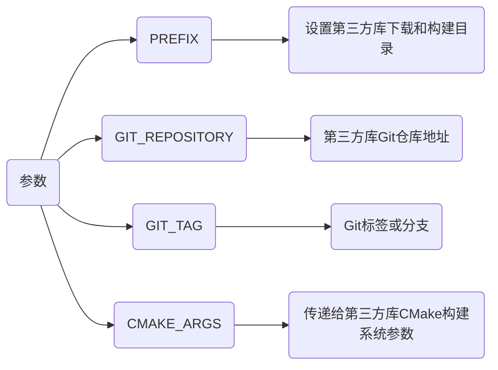

> - [cmake使用详细教程（日常使用这一篇就足够了）](https://blog.csdn.net/iuu77/article/details/129229361)
> - [CMake学习笔记05--ExternalProject_Add模块](https://blog.csdn.net/zym326975/article/details/106118063)

# CMake使用

## 单CMakeLists.txt

### 单文件

Main.cpp

```c
#include <iostream>
 
int main() {
    std::cout << "Hello World" << std::endl;
    return 0;
}
```

CMakeLists.txt

```cmake 
cmake_minimum_required(VERSION 3.30)
 
project(Main)
 
add_executable(Main Main.cpp)
```


### 多目录


Include_1/TestFunc_1.hpp

```c++
#include <iostream>
void Hello_1();
```

Include_2/TestFunc_2.hpp

```c
#include <iostream>
void Hello_2();
```

Source_1/TestFunc_1.cpp

```c
#include "TestFunc_1.hpp"
void Hello_1() {
    std::cout << "Hello_1" << std::endl;
}
```

Source_2/TestFunc_2.cpp

```c
#include "TestFunc_2.hpp"
void Hello_12() {
    std::cout << "Hello_2" << std::endl;
}
```

Main.cpp

```c
#include "TestFunc_1.hpp"
#include "TestFunc_2.hpp"

int main() {
    Hello_1();
    Hello_2();
    return 0;
}
```

CMakeLists.txt

```cmake
cmake_minimum_required(VERSION 3.16)
 
project(Main)

add_executable(${PROJECT_NAME} "")

target_include_directories(${PROJECT_NAME} PRIVATE
    ${CMAKE_SOURCE_DIR}/Include_1
    ${CMAKE_SOURCE_DIR}/Include_2
)

target_sources(${PROJECT_NAME} PRIVATE
    ${CMAKE_SOURCE_DIR}/Source_1/TestFunc_1.cpp
    ${CMAKE_SOURCE_DIR}/Source_2/TestFunc_2.cpp
    ${CMAKE_SOURCE_DIR}/Main.cpp
)
```


### 生成库


Include/API.hpp

```c++
#ifndef __INCLUDE_API_HPP__
#define __INCLUDE_API_HPP__

#include <iostream>

#ifdef _WIN32
    #define API_EXPORT __declspec(dllexport)
    #define API_IMPORT __declspec(dllimport)
#else
    #define API_EXPORT __attribute__((visibility("default")))
    #define API_IMPORT
#endif

#ifdef __cplusplus
extern "C" {
#endif

void Display();

int Add(int x, int y);

#ifdef __cplusplus
}
#endif

#endif
```

Source/API.cpp

```c
#include "API.hpp"
void Display() {
    std::cout << "Print API success!" << std::endl;
}

int Add(int x, int y) {
    return x + y;
}
```

CMakeLists.txt

```cmake
cmake_minimum_required(VERSION 3.16)
 
project(API)

# 设置库生成目录
set(LIBRARY_OUTPUT_PATH ${PROJECT_SOURCE_DIR}/Library)

add_library(${PROJECT_NAME}_Shared SHARED "")
add_library(${PROJECT_NAME}_Static STATIC "")

foreach(LIB_NAME ${PROJECT_NAME}_Shared ${PROJECT_NAME}_Static)
    target_include_directories(${LIB_NAME} PRIVATE
        ${CMAKE_SOURCE_DIR}/Include
    )

    target_sources(${LIB_NAME} PRIVATE
        ${CMAKE_SOURCE_DIR}/Source/API.cpp
    )

    set_target_properties(${LIB_NAME} PROPERTIES OUTPUT_NAME ${PROJECT_NAME})
endforeach()
```


### 链接库


Main.cpp

```c
#include "API.hpp"

int main(void) {
    int res = Add(1, 2);
    std::cout << "res = " << res << std::endl;

    Display();

    return 0;
}
```

CMakeLists.txt

```cmake
cmake_minimum_required(VERSION 3.16)
 
project(Main)

# 设置可执行文件生成目录
set(EXECUTABLE_OUTPUT_PATH ${PROJECT_SOURCE_DIR}/Bin)

# 将从Library目录中寻找的API库路径与名称值存储于FUNC_LIB
find_library(FUNC_LIB API ${PROJECT_SOURCE_DIR}/Library)

add_executable(${PROJECT_NAME} "")

target_include_directories(${PROJECT_NAME} PRIVATE
    ${CMAKE_SOURCE_DIR}/Include
)

target_sources(${PROJECT_NAME} PRIVATE
    ${CMAKE_SOURCE_DIR}/Main.cpp
)

target_link_libraries(${PROJECT_NAME} PRIVATE 
    ${FUNC_LIB}
)
```


## 多CMakeLists.txt

### 生成库链接


在Hello目录中生成libAPI.so库,并链接

Hello/CMakeLists.txt

```cmake
cmake_minimum_required(VERSION 3.16)
 
project(API)

set(LIBRARY_OUTPUT_PATH ${CMAKE_SOURCE_DIR}/Library)

# 添加动态库libAPI.so
add_library(${PROJECT_NAME} SHARED "")

# 添加目标文件引用的头文件
target_include_directories(${PROJECT_NAME} PRIVATE
    ${PROJECT_SOURCE_DIR}/Include
)

# 添加目标文件引用的源文件
target_sources(${PROJECT_NAME} PRIVATE
    ${PROJECT_SOURCE_DIR}/Source/API.cpp
)
```

根目录CMakeLists.txt

```cmake
cmake_minimum_required(VERSION 3.16)
 
project(Main)

# 设置可执行文件输出路径
set(EXECUTABLE_OUTPUT_PATH ${PROJECT_SOURCE_DIR}/Bin)

# 设置预链接库名称
set(EXTRA_LIBS ${EXTRA_LIBS} API)

# 添加子目录执行
add_subdirectory(API)

# 生成可执行文件
add_executable(${PROJECT_NAME} "")

# 添加目标文件引用的头文件
target_include_directories(${PROJECT_NAME} PRIVATE
    ${CMAKE_SOURCE_DIR}/API/Include
)

# 添加目标文件引用的源文件
target_sources(${PROJECT_NAME} PRIVATE
    ${CMAKE_SOURCE_DIR}/Main.cpp
)

# 添加目标文件链接库
target_link_libraries(${PROJECT_NAME} ${EXTRA_LIBS})
```


## 三方库

### 源码编译

若第三方库没有CMake配置文件, 且能访问源码, 则可将库源代码直接添加到项目中, 并使用add_subdirectory编译

```cmake
add_subdirectory(SomeLibrary)

target_link_libraries(MyExecutable PRIVATE SomeLibrary)
```

### FetchContent

CMake 3.11及以上版本引入FetchContent模块, 可直接下载第三方库编译

- 编译fmt


CMakeLists.txt

```cmake
cmake_minimum_required(VERSION 3.17)
project(Main)

set(CMAKE_CXX_STANDARD 14)

add_executable(${PROJECT_NAME} "")

# 引入FetchContent
include(FetchContent)

FetchContent_Declare(fmt
    # git仓库地址
    GIT_REPOSITORY https://github.com/fmtlib/fmt.git
    # 代码版本
    GIT_TAG 9.1.0
    # 安装位置
    SOURCE_DIR ${CMAKE_SOURCE_DIR}/ThirdPartyLibrary/fmt
)

# 构建库
FetchContent_MakeAvailable(fmt)

# 添加三方库头文件目录
target_include_directories(${PROJECT_NAME} PRIVATE 
    ${CMAKE_SOURCE_DIR}/ThirdPartyLibrary/fmt/include
)

target_sources(${PROJECT_NAME} PUBLIC
    Main.cpp
)

target_link_libraries(${PROJECT_NAME} PRIVATE fmt::fmt)
```

Main.cpp

```c++
#include "fmt/core.h"
#include <string>

int main(){
    std::string world = fmt::format("Hello {0}", "World");
    fmt::print("{}\n", world);
}
```


此时可发现第三方库已经下载


### ExternalProject

ExternalProject是CMake原生模块, 适合下载、配置、构建和安装外部项目

```cmake
include(ExternalProject)
ExternalProject_Add(
    MyLibrary
    PREFIX ${CMAKE_BINARY_DIR}/my_library
    GIT_REPOSITORY https://github.com/user/my_library.git
    GIT_TAG master
    CMAKE_ARGS -DCMAKE_INSTALL_PREFIX=<INSTALL_DIR> -DCMAKE_BUILD_TYPE=Release
)
```



#### 链接生成库

ExternalProject通常会将外部项目安装到指定目录。在主项目中使用生成库时，需手动添加安装路径

```cmake
ExternalProject_Add(
    MyLibrary
    PREFIX ${CMAKE_BINARY_DIR}/my_library
    GIT_REPOSITORY https://github.com/user/my_library.git
    GIT_TAG master
    CMAKE_ARGS -DCMAKE_INSTALL_PREFIX=${CMAKE_BINARY_DIR}/my_library/install
)

add_library(MyLibrary STATIC IMPORTED)

set_target_properties(MyLibrary PROPERTIES
    IMPORTED_LOCATION             ${CMAKE_BINARY_DIR}/libMyLibrary.a
    INTERFACE_INCLUDE_DIRECTORIES ${CMAKE_BINARY_DIR}/include
)

target_link_libraries(MyExecutable PRIVATE MyLibrary)
```

- 创建CMake/gflag-2.2.2.cmake

```cmake
include(ExternalProject)

set(GFLAG_ROOT          ${CMAKE_BINARY_DIR}/thirdparty/gflag-2.2.2)
set(GFLAG_LIB_DIR       ${GFLAG_ROOT}/lib)
set(GFLAG_INCLUDE_DIR   ${GFLAG_ROOT}/include)
 
set(GFLAG_URL           https://github.com/gflags/gflags/archive/v2.2.2.zip)
set(GFLAG_CONFIGURE     cd ${GFLAG_ROOT}/src/gflag-2.2.2 && cmake -D CMAKE_INSTALL_PREFIX=${GFLAG_ROOT} .)
set(GFLAG_MAKE          cd ${GFLAG_ROOT}/src/gflag-2.2.2 && make)
set(GFLAG_INSTALL       cd ${GFLAG_ROOT}/src/gflag-2.2.2 && make install)

ExternalProject_Add(gflag-2.2.2
    URL                   ${GFLAG_URL}
    DOWNLOAD_NAME         gflag-2.2.2.zip
    PREFIX                ${GFLAG_ROOT}
    CONFIGURE_COMMAND     ${GFLAG_CONFIGURE}
    BUILD_COMMAND         ${GFLAG_MAKE}
    INSTALL_COMMAND       ${GFLAG_INSTALL}
)
```

- 在项目根目录下CMakeLists.txt中使用include调用

```cmake
include(cmake/gflag-2.2.2.cmake)
include(cmake/hwloc-1.11.cmake)
include(cmake/protobuf-2.6.1.cmake)
include(cmake/protobuf-2.6.1-compile.cmake)
```