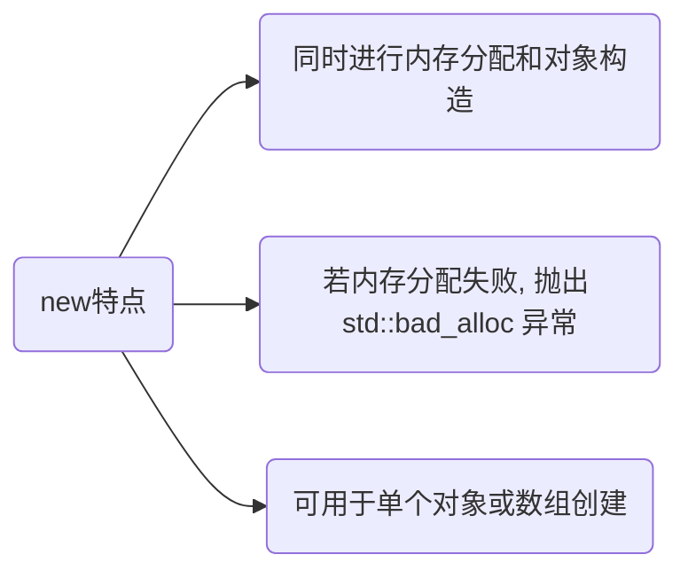
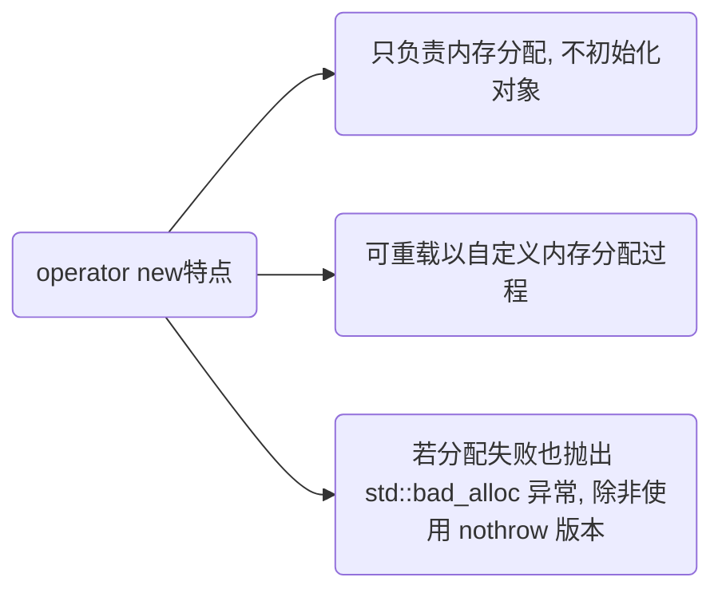

> - [C++ 中 malloc 和 new 区别](https://murphypei.github.io/blog/2021/03/malloc-new-diff.html)

# new

## 概念

new 是 C++ 中关键字, 用来分配内存并构造对象, new 是高层次操作, 隐藏了底层内存分配细节

```c++
T *p = new T();
```



### operator new

operator new 是可重载函数, 只负责内存分配(类似于malloc 函数), 不调用构造函数

```c++
void* operator new(std::size_t size) {
    std::cout << "Custom operator new called!" << std::endl;
    // 调用全局的 operator new 分配内存
    return ::operator new(size);  
}
```

operator new 只负责从自由存储区(堆)中分配足够内存, 不关心内存中存储数据, 也不调用构造函数



#### 重载

重载 operator new 可让在内存分配时添加额外逻辑 

- 内存池管理: 通过自定义 operator new, 可实现内存池来减少动态内存分配时开销

- 调试: 可在 operator new 中记录日志, 跟踪每次内存分配调用

- 性能优化: 对于特定类型对象, 可以通过自定义 operator new 来优化内存分配策略

- 异常处理: 可自定义 operator new 来处理分配失败时异常, 甚至返回 nullptr 而不是抛出异常

### ::operator new

全局 operator new, 用于分配内存

- 与 operator new 区别

(1) ::operator new 强制调用全局作用域 operator new, 即标准库提供的默认版本

(2) operator new 则可能是全局, 也可能是在某个类中定义重载版本

### 区别

操作符/函数	|作用|是否调用构造函数|是否抛出异常
| --------------------------- | ---------------- |---------|-----------|
new|	分配内存并构造对象|是|是(若内存分配失败)
operator new |只分配内存, 不构造对象, 允许类自定义内存分配策略	|否|	是(若内存分配失败)
::operator new	|全局 operator new, 只分配内存, 调用默认内存分配实现|	否	|是(若内存分配失败)

## 流程


### 分配内存

new 关键字调用 operator new 默认从堆(自由存储区)中分配内存来存储对象

(1) operator new 若内存分配失败, 会抛出 std::bad_alloc 异常(而不像 malloc 返回 NULL)

(2) 若有自定义 operator new 则会优先调用, 否则调用全局::operator new

```c++
void* operator new(std::size_t size) {
    // 分配 size 大小内存
    void* p = ::malloc(size);
    // 内存分配失败时抛出异常
    if (!p) {
        throw std::bad_alloc();
    }
    return p;
}
```

### 初始化

分配内存后 new 操作符会在刚分配的内存上调用对象构造函数初始化

(1) 定位 new (placement new) 构造函数会使用定位 new, 即在已经分配内存位置上构造对象

(2) 对象构造函数会根据传入参数初始化对象成员变量和状态

```c++
// 在已经分配好的内存 ptr 上调用构造函数
T* obj = new(ptr) T();  
```

这个操作本质上是通过"定位 new"机制, 确保构造函数在分配的内存地址上正确执行

### 处理异常

在内存分配和对象构造过程中, 可能会发生异常

尤其是在构造函数中, 若某些资源(如文件、网络连接等)无法正确初始化时会抛出异常

new 操作符需要处理确保内存泄漏不发生

(1) 若内存分配失败:operator new 会抛出 std::bad_alloc 异常

(2) 若构造函数抛出异常:会释放已经分配的内存, 并传播异常, C++ 通过 RAII异常处理机制, 确保不会泄漏资源

```c++
// 1. 分配内存
T* obj = static_cast<T*>(operator new(sizeof(T)));

try {
    // 2. 定位 new, 调用构造函数
    new (obj) T();  
} catch (...) {
    // 3. 构造失败, 释放内存
    operator delete(obj);
    // 4. 重新抛出异常  
    throw; 
}
```

### 返回指针

最后若内存分配和对象构造都成功, new 操作符返回指向已初始化对象的指针, 此时对象已完全初始化, 可正常使用

```c++
#include <iostream>

class ExampleUseNew {
public:
    ExampleUseNew() {
        std::cout << "Constructor called" << std::endl;
    }
    ~ExampleUseNew() {
        std::cout << "Destructor called" << std::endl;
    }
    // 重载 operator new
    void* operator new(std::size_t size) {
        std::cout << "Custom operator new called, size: " << size << std::endl;
        // 调用全局 operator new
        return ::operator new(size);  
    }

    // 重载 operator delete
    void operator delete(void* p) {
        std::cout << "Custom operator delete called" << std::endl;
        // 调用全局 operator delete
        ::operator delete(p); 
    }
};

int main() {
    ExampleUseNew* obj = new ExampleUseNew();
    delete obj;
    return 0;
}
```

运行结果

```sh
Custom operator new called, size: 1
Constructor called
Destructor called
Custom operator delete called
```

## 与malloc区别

### 申请位置不同

- malloc

从堆上动态分配内存

- new

操作符从自由存储区($free store$)上为对象动态分配内存空间

自由存储区是 C++ 基于 new 操作符的一个抽象概念, 凡是通过 new 操作符进行内存申请,该内存即为自由存储区

自由存储区不仅可以是堆, 还可以是静态存储区, 取决于 operator new 在哪里为对象分配内存


### 返回类型安全性

- new 

操作符内存分配成功时, 返回对象类型指针

类型严格与对象匹配, 无须进行类型转换, 故 new 是符合类型安全性操作符

- malloc

内存分配成功则是返回 void 指针, 需要通过强制类型转换将 void 指针转换成指定类型

### 内存分配失败时返回值

- new

内存分配失败时, 会抛出 bac_alloc 异常, 不会返回 NULL

- malloc

分配失败时返回 NULL

### 分配内存大小

- new

操作符申请内存分配时无须指定内存块大小, 编译器会根据类型信息自行计算

- malloc

则需要明确指出所需内存尺寸

### 是否调用构造/析构函数

- new

操作符来分配对象内存时会经历三个步骤

(1) 调用 operator new 函数(对于数组是 operator new[])分配一块足够大原始, 未命名内存空间, 存储特定类型对象

(2) 编译器运行相应构造函数以构造对象,并为其传入初值

(3) 对象构造完成后,返回一个指向该对象指针

delete 操作符来释放对象内存时会经历两个步骤

(1) 调用对象析构函数

(2) 编译器调用operator delete(或operator delete[])函数释放内存空间

- malloc

不会调用构造函数, free也不会调用析构函数

### 对于数组处理

- new 对数组会分别调用构造函数函数初始化每一个数组元素

C++ 提供new[] 与 delete[] 来专门处理数组类型分配

释放对象时为每个对象调用析构函数

delete[] 要与 new[] 配套使用,不然会找出数组对象部分释放现象, 造成内存泄漏

- malloc

只提供开辟出内存地址

若动态分配一个数组内存,还需要手动自定数组大小

### 是否支持内存扩充

- new

不支持内存扩充

- malloc

在分配内存后若内存不足, 可使用 realloc 进行内存重新分配, 实现扩充