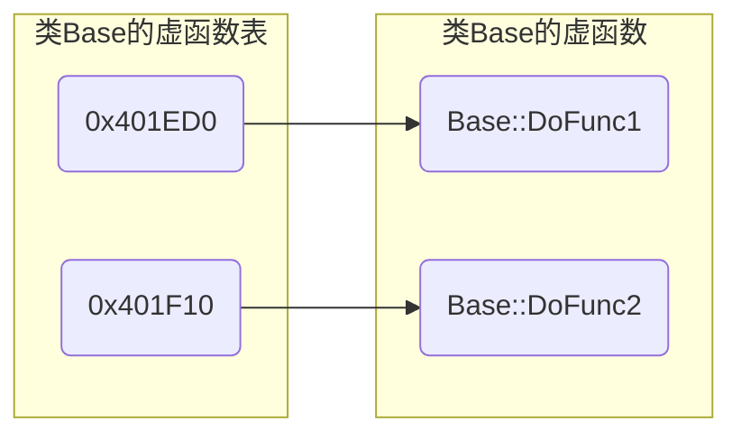
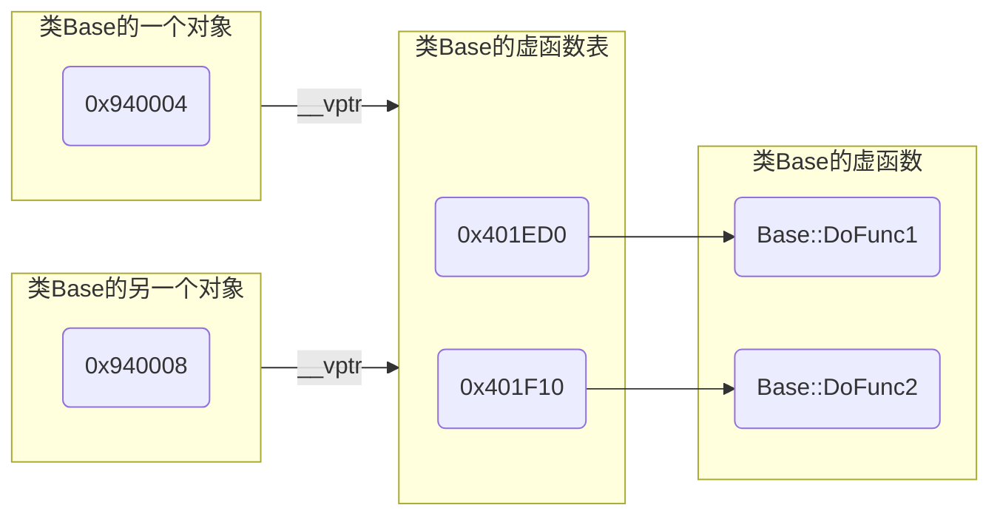

> [C++虚函数表剖析](https://leehao.me/C-%E8%99%9A%E5%87%BD%E6%95%B0%E8%A1%A8%E5%89%96%E6%9E%90/)

# 虚函数

虚函数是在基类中使用 $virtual$ 关键字修饰的函数

虚函数可有自己的实现, 子类可选择使用基类的实现, 也可在派生类中被重写(覆盖)

```c++
#include <iostream>

class Base {
public:
    Base() {}
    // 定义虚函数
    virtual void DoShow() override {
        std::cout << "Show Base" << std::endl;
    }
};

class SubA : public Base {
public:
    SubA(){}
    // 派生类对虚函数进行具体实现
    void DoShow() override {
        std::cout << "Show SubA" << std::endl;
    }
};

class SubB : public Base {
public:
    SubB(){}
    // 派生类中使用基类的实现
};

int main() {
    Base *p = new SubA;
    // DoShow B
    p->DoShow();
    
    p = new SubB;
    // DoShow Base
    p->DoShow();
}
```

- 纯虚函数

纯虚函数是在基类中没有实现的虚函数, 使用 = 0 来表示

纯虚函数强制派生类必须实现该函数, 拥有纯虚函数的类是抽象类, 不能直接实例化

```c++
virtual void DoFunc() = 0;
```

## 实现

### 虚函数表

每个拥有虚函数的类都由编译器在编译阶段生成一个虚函数表(vtable), 其是一个指针数组, 存放每个虚函数的指针

虚函数表中存储了所有虚函数的入口地址, 按声明顺序排列

若派生类重写虚函数, 虚函数表中对应的条目会被更新为派生类中重写后的函数地址

```c++
class Base {
public:
    virtual void DoFunc1();
    virtual void DoFunc2();
}
```



### 虚表指针

每个包含虚函数的类生成对象时, 编译器会隐式添加一个指向虚函数表的指针`vptr`, 保证运行时能够通该指针找到相应虚函数表, 从而调用正确的虚函数



## 调用

通过基类指针或引用调用虚函数时, C++会在运行时根据指针或引用指向的实际对象类型来决定调用哪个版本的虚函数

(1) 编译器根据基类指针或引用在内存中的对象查找到该对象的虚函数指针(vptr)

(2) 通过虚函数指针(vptr), 找到该对象实际类型对应的虚函数表(vtable)

(3) 从虚函数表中查找到与虚函数对应的函数指针

(4) 最后调用函数指针指向的虚函数实现

```c++
#include <iostream>

class Base {
public:
    virtual void DoShow() {
        std::cout << "Base class DoShow function" << std::endl;
    }
};

class Derived : public Base {
public:
    void DoShow() override {
        std::cout << "Derived class DoShow function" << std::endl;
    }
};

int main() {
    // 1. 对象创建
    // 编译器为 Derived 类的对象创建并初始化 vptr, 使其指向 Derived 类的虚函数表
    Base* basePtr = new Derived();

    // 2. 函数调用
    // 编译器通过 basePtr 查找其指向的对象的 vptr, 发现它指向 Derived 类的虚函数表
    // 通过虚函数表查找 DoShow() 函数的实际实现, 发现 Derived 类重写DoShow()函数, 因此调用 Derived::DoShow
    basePtr->DoShow();  
    
    delete basePtr;
    return 0;
}
```


