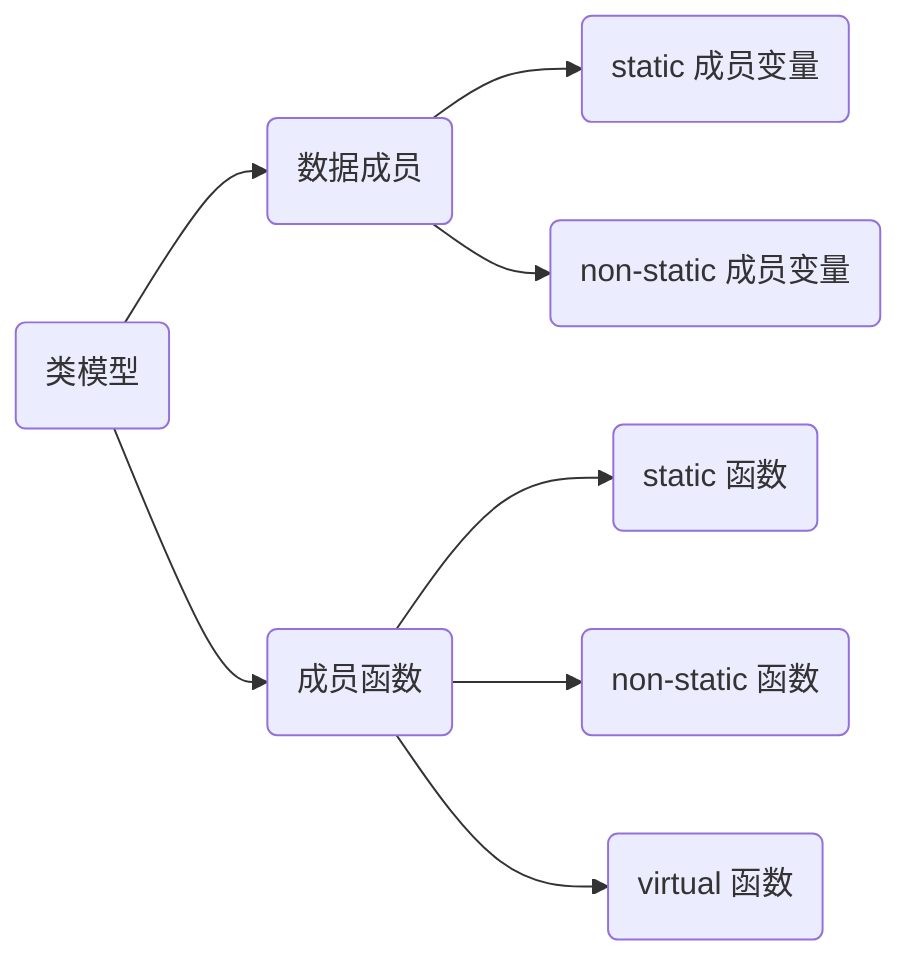

# 类

## 模型



```c++
class Base {
public:
    static int GetCount();

    void Print();

    virtual void DoFunc();

    static int sCount; 
private:
    int mValue;
};
```

### 数据成员

#### static 成员变量

```c++
class Test {
public:
    static int value;
};

int Test::value = 1;
```

- 归属

静态成员变量不属于对象, 存放在全局区

- 初始化

不能再构造函数中被定义和初始化, 需要在类外部单独定义及初始化    发大打发手动阀手动阀手动阀回到法国航空记

- 访问

可通过类名直接访问, 也可通过对象访问

使用受到访问控制属性约束

#### non-static 成员变量

被置于每一个**对象中**

### 成员函数

#### 静态成员函数

- 访问函数

可以通过类名直接访问,也可以通过对象访问

- 访问成员变量

在静态成员函数中只能访问静态成员

在非静态成员函数既可以访问静态成员,也可以访问非静态成员

- 约束

静态成员函数没有this指针,因此也没有const属性

和普通成员函数一样受访问控制限定符约束

### 虚函数

每个类生成虚函数表(virtual table)

虚表中存放着一堆指针, 指向该类每一个虚函数

虚表中函数地址将按声明时顺序排列(虚析构函数永远是第一个),当子类有多个重载函数时例外

每个对象都拥有一个虚表指针($vtptr$), 由编译器为其生成

虚表指针设定与重置皆由类复制控制(构造函数、析构函数、赋值操作符)来完成vtptr位置为编译器决定, 传统上它被放在所有显示声明成员之后, 不过现在许多编译器把 $vtptr$ 放在对象在内存中最前端

虚函数表前面设置了一个指向 type_info 指针,用以支持 $RTTI$ ($Run$ $Time$ $Type$ $Identification$) 运行时类型识别

$RTTI$ 是为多态而生成的信息,包括对象继承关系, 对象本身描述等, 只有具有虚函数对象在会生成, 因为是放在虚函数表前面

## this

this 是 C++ 中一个关键字, 是 const 指针

### 指向

this 指针指向当前对象, 只能用在类内部

this 可以访问类所有private、protected、public 属性成员

### 赋值

对象被创建后编译器自动给 this 赋值, 用户不能显式赋值

```c++
#include <iostream>

class Person {
public:
    Person(std::string name) {
        this->mName = name;
    };

    void PrintThis() {
        std::cout << "this pointer = " << std::hex << this << std::endl;
    };

private:
    std::string mName;
};

int main(void) {
    Person p{"Casper"};

    p.PrintThis();

    std::cout << "p address = " << std::hex << &p << std::endl;
}
```


## 重载运算符

运算符重载允许定义运算符的行为

通过重载, 类对象可以像基本数据类型一样使用运算符

```c++
#include<iostream>

class Complex {
   public:
        Complex() = default;

        Complex(double read, double imag) : mReal(read), mImag(imag) {}

        friend istream & operator >> (istream &, Complex &) {
            std:: >> c.mReal >> c.mImag;
        }
        friend ostream & operator << (ostream &, Complex &) {
            std:: << c.mReal << " + " << c.mImag << "i" <<std::endl;
        }

        Complex operator + (Complex &) {
            return Complex(this->mReal + c.mReal, this->mImag + c.mImag);
        }
        Complex operator - (Complex &) {
            return Complex(this->mReal - c.mReal, this->mImag - c.mImag);
        }
    private:
        double mReal;
        double mImag;
};

int main() {
    Complex c1(1.0, 2.0);
    Complex c2(3.0, 4.0);
    Complex c3 = c1 + c2;
    return 0;
}
```
