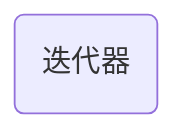

# 迭代器

迭代器类似于指针类型, 提供了对对象的间接访问



## iterator

### 修改

```c
std::vector<int> v {1, 2, 3, 4, 5};

std::vector<T>::iterator it = v.begin() + 1;

*it = 100;

// v = {1, 100, 3, 4, 5}
```

### 遍历

```c
for(vector<T>::iterator it = v.begin(); it != v.end(); it++){
    // *it
}
```

```c
for(auto it = v.begin(); it != v.end(); it++){
    // *it
}
```

## const_iterator

与iterator功能相同, 但迭代器为const类型

## ostream_iterator

```c++
#include <iostream>
#include <iterator>
#include <vector>

int main(){
    std::vector<int> v {1, 2, 3, 4, 5};

    copy(v.begin(), v.end(), std::ostream_iterator<int>(std::cout, " "));
}
```
