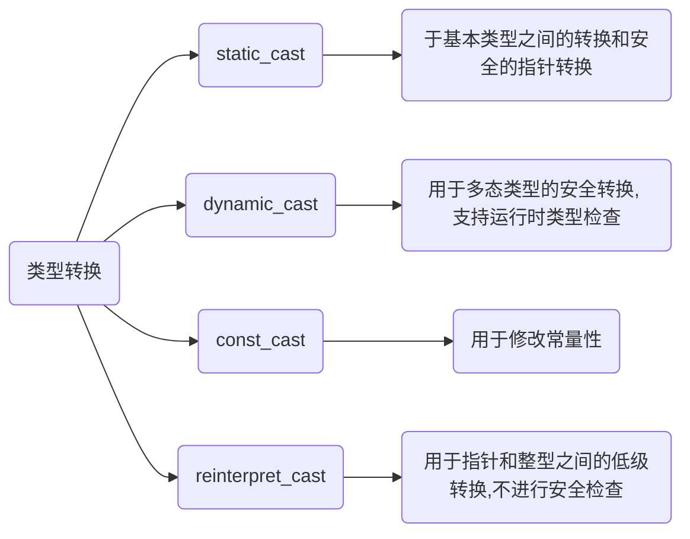

<!--
 * @Brief        : 
 * @Author       : dmjcb
 * @Date         : 2024-09-28 20:42:10
 * @LastEditors  : dmjcb@outlook.com
 * @LastEditTime : 2024-09-28 21:00:26
-->

# 类型转换




## static_cast

static_cast用于在类型之间进行显式转换, 适用于非多态类型的转换

static_cast在编译时检查类型安全性, 主要用于基本数据类型之间的转换、指针和引用之间的转换

```c++
int a = 10;

// int转为double
double b = static_cast<double>(a); 

class Base {};
class Derived : public Base {};

Base* base = new Derived();

// 向下转换
Derived* derived = static_cast<Derived*>(base); 
```

## dynamic_cast

dynamic_cast用于进行安全的多态类型转换, 主要在有虚函数的类之间使用

dynamic_cast在运行时检查类型, 如果转换不成功, 对于指针类型将返回nullptr, 对于引用类型抛出异常

```c++
class Base {
public:
    virtual void foo() {}
};
class Derived : public Base {};

Base* base = new Derived();

// 安全地向下转换
Derived* derived = dynamic_cast<Derived*>(base); 
if (derived) {
    // 转换成功
} else {
    // 转换失败
}
```

## const_cast

const_cast用于修改对象的常量性, 可添加或去除对象const或volatile属性

```c++
const int x = 5;

// 去掉const修饰符
int* y = const_cast<int*>(&x); 

// 如果x原本是常量, 修改它会导致未定义行为
*y = 10; 
```

## reinterpret_cast

reinterpret_cast用于在指针类型之间进行低级别的强制转换, 通常用于指针的转换, 例如将一个类型的指针转换为另一个不相关类型的指针, 此转换不进行类型安全检查