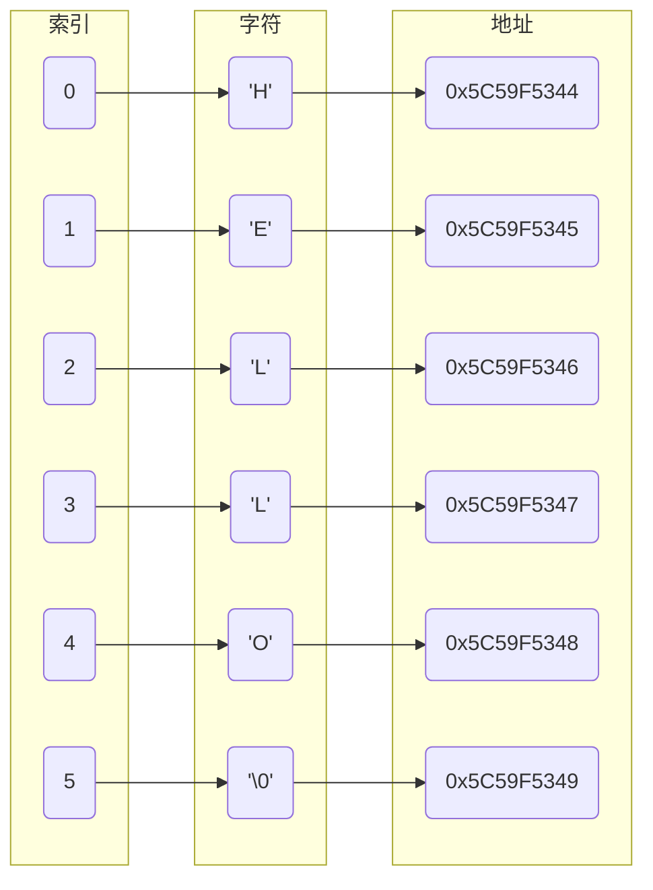
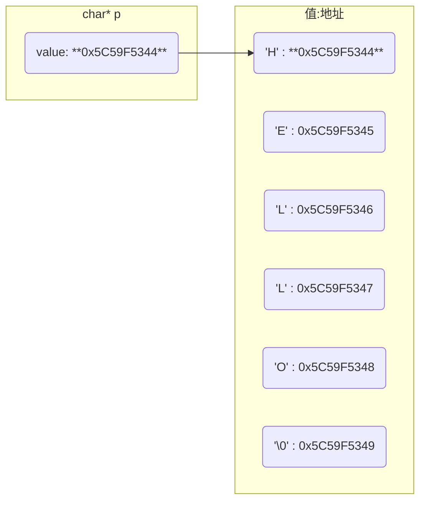
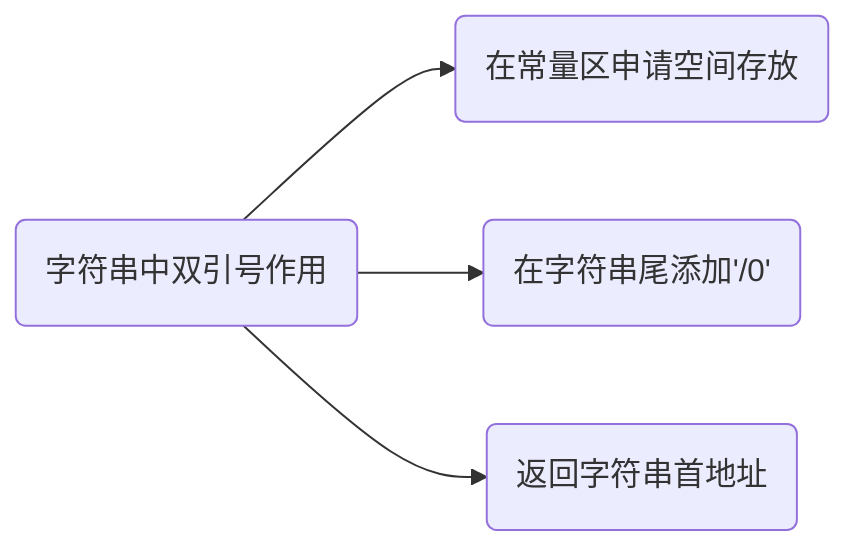

# 字符

`char` 类型实际上存储是整数

```c
char a = 'A';
```

变量a存储了整数65, 即 'A' 的 ASCII 码值

## 字符数组

```c
char a[] = "HELLO";
```

字符数组是用来存储字符的数组, 通常用来表示字符串

C语言中字符串实际上是用 null 字符 `'\0'` 终止的一维字符数组

- `'\0'`

`'\0'`是 ASCII 码表中的第 0 个字符, 它不能显示也无控制功能, 唯一作用是作为字符数组结束标志

'a'为字符, 单引号只能定义一个字符

"a" 为字符串, 双引号可以定义多个字符, 由`" "`包围的字符串会自动在末尾添加`'\0'`

```c
#include <stdio.h>

int main() {
    char a[] = "HELLO";

    for (int i = 0; i < 5; i++) {
        printf("a[%d] = %c\n", i, a[i]);
    }

    return 0;
}
```



### 长度

字符数组长度是其包含的字符数, 不含结束符`'\0'`, 例如 "abc" 的长度是 3

$sizeof$ 获取字符数组所占内存空间大小

$strlen$ 获取字符数组到'\0'的长度大小


```c
#include <stdio.h>
#include <string.h>

int main() {
    char a[] = "HELLO";

    // sizeof(a) = 6
    // strlen(a) = 5
    printf("sizeof(a) = %d\nstrlen(a) = %d\n", sizeof(a), strlen(a));
    return 0;
}
```

## char \*

字符指针是指向字符型数据变量的指针变量

其可以指向字符数组的首元素, 也可以指向字符串常量

字符指针本身不分配内存用于存储字符

```c
// 将保存与常量存储区的字符串首地址赋值给p
char *p = "Hello";

// 与上面代码等价, 注意此处不能理解为将字符串赋值给p
char *p;
p = "Hello";
```



将字符串"Hello"的`首地址`赋给了 *p



定义字符指针后不能对其指向的字符串进行下标操作, 因为指针只知道所指向的内存单元地址, 而并不知道内存单元多大

```c
char *s = "hello";

// 错误
s[0] = 'a'
```

### 显示

显示时系统先输出字符指针p所指向字符串的首字符, 然后会自动执行p++, 使p指向下个字符, 再次输出直至结束标志'\0'为止

输出字符指针指向的字符串时, 不可使用取值符`*`, 否则只会输出字符串首字符值

```c
char *p = "abcdef";

// a
printf("*p = %c\n", *p);

// abcdef
printf("p = %s\n", p);
```

### 输入

输入时, 字符指针必须指向一段存在的地址, 否则就是野指针

若字符指针未初始化就调用, 运行时会报错 `Segmentation fault`

```c
char *p = (char *) malloc(sizeof(char) * 10);

scanf("%s", p);
```

### 修改

- 指针在栈区, 分配的N个字节在堆区, 则字符串可以修改

```c
char *p = (char *) malloc(sizeof(char) * N);

scanf("%s", p);

// 可以
*(p + 2) = 'X';
```

- 指针在栈区, 字符串在常量区, 则字符串不可修改

```c
char *p = "aaaaa";

// 报错
*(p + 2) = 'X';
```

## 区别

- 与char[]

`char []`可以修改其中的字符, `char *`不能修改其中的字符

`char *`可以通过加减、自加减改变其值, `char []`不可以

- 与std::string

`char *`是指针, 由用户管理内存

`std::string` 是STL容器, 由系统管理内存
