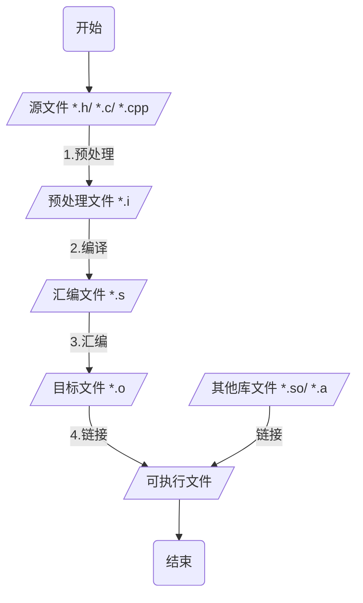
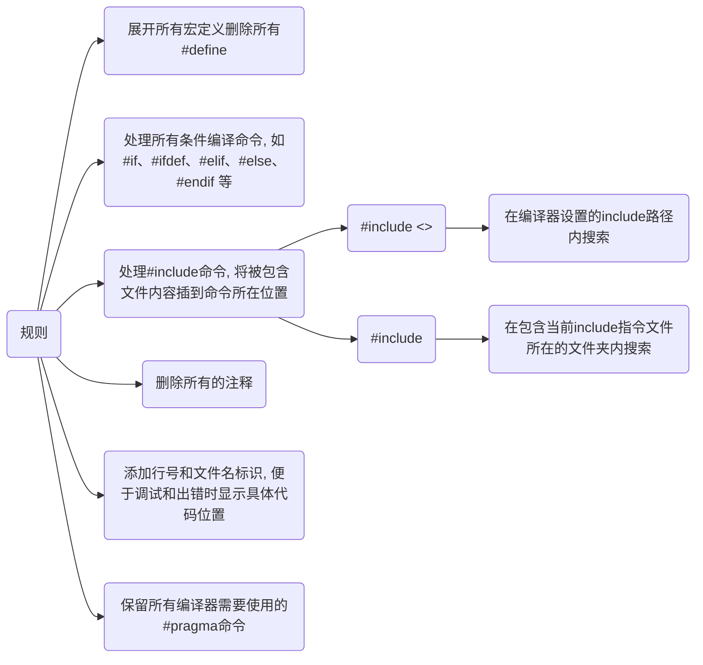

# C/C++ 编译过程

## 流程



一步生成可执行文件main

```c++
// main.c
#include <stdio.h>

int main(void) {
    printf("Hello World\n");
    return 0;
}
```

```sh
# -o 指定输出文件名
gcc main.c -o main
```

## 预处理 Preprocessing

预处理器**cpp**将源文件中所有引用的头文件以及宏定义替换成真正的内容, 并删除注释, 生成后缀为`.i`的预处理文件

```sh
# 编译器在预处理之后退出, 不进行后续编译过程
gcc -E main.c -o main.i
```

预处理器会读C库中stdio.h的内容并插入到main.c中, 生成新文件main.i


经过预处理之后代码体积会增加



## 编译 Compilation

编译器**ccl**将预处理完的`.i`文件进行系列词法分析、语法分析、语义分析以及优化后生成相应后缀为`.s`的汇编文件

```sh
# -S 表示只激活到编译过程
gcc -S main.c -o main.s
```

其中的main作为一个函数给出了机器语言的输出指令

```c
    .file    "main.c"
    .section    .rodata
.LC0:
    .string    "hello, world"
    .text
    .globl    main
    .type    main, @function
main:
.LFB0:
    .cfi_startproc
    pushq    %rbp
    .cfi_def_cfa_offset 16
    .cfi_offset 6, -16
    movq    %rsp, %rbp
    .cfi_def_cfa_register 6
    movl    $.LC0, %edi
    call    puts
    movl    $0, %eax
    popq    %rbp
    .cfi_def_cfa 7, 8
    ret
    .cfi_endproc
.LFE0:
    .size    main, .-main
    .ident    "GCC: (GNU) 4.8.5 20150623 (Red Hat 4.8.5-44)"
    .section    .note.GNU-stack, "", @progbits
```

## 汇编 Assemble

汇编器**as**将汇编代码转换为为机器语言, 保存为后缀`.o`的二进制目标文件

```sh
# -C 表示只激活到汇编过程
gcc -C main.s -o main.o
```

## 链接 Linking

链接器**ld**将多个目标文件以及所需的库文件(如`.so`)组织成可执行文件(executable file)

```sh
g++ -o main.o main
```

### 静态链接

函数的代码将从其所在静态链接库中被拷贝到最终的可执行程序中

该程序被执行时这些代码将被装入到该进程的虚拟地址空间中

静态链接库实际上是一个目标文件的集合, 其中的每个文件含有库中的一个或者一组相关函数的代码

### 动态链接

函数的代码被放到称作是动态链接库或共享对象的某个目标文件中

链接程序此时所作的只是在最终的可执行程序中记录下共享对象的名字以及其它少量的登记信息

在此可执行文件被执行时, 动态链接库的全部内容将被映射到运行时相应进程的虚地址空间

动态链接程序将根据可执行程序中记录的信息找到相应的函数代码
