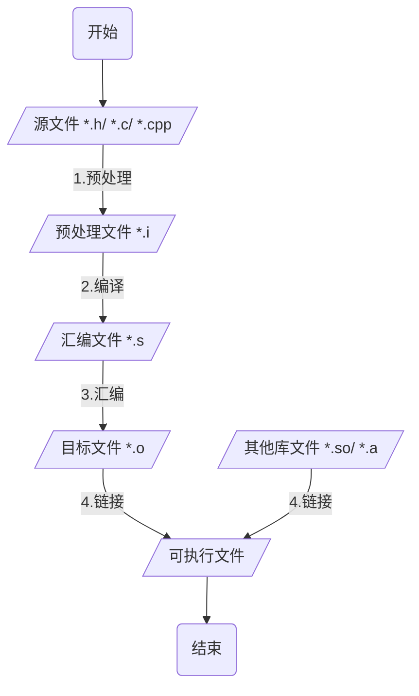
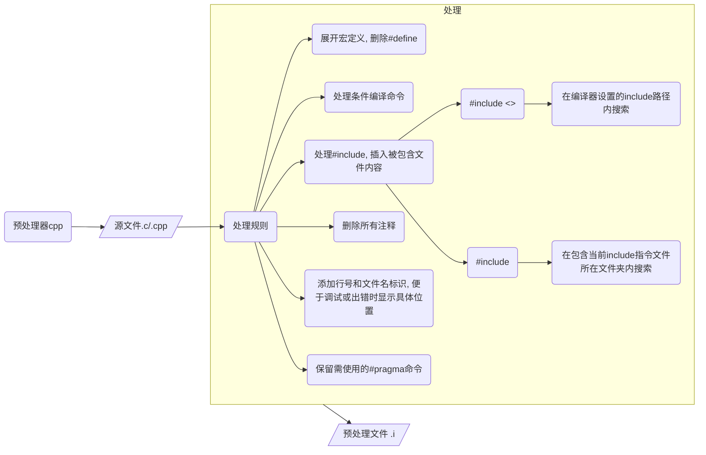

# C/C++编译过程



## 预处理 Preprocessing



预处理器`cpp`将源文件中所有引用头文件及宏定义替换成实际内容, 删除注释, 生成`.i`预处理文件

```sh
# 编译器在预处理之后退出, 不进行后续编译过程
gcc -E Main.c -o Main.i
```

预处理器会读C库中stdio.h里内容并插入main.c中, 生成新文件main.i


经过预处理之后代码体积会增加

## 编译 Compilation

编译器ccl将预处理后`.i`文件进行系列词法分析、语法分析、语义分析以及优化后生成`.s`汇编文件

```sh
# -S 表示只激活到编译过程
gcc -S Main.c -o Main.s
```

其中Main作为函数给出了机器语言输出指令

```c
	.file	"Main.c"
	.text
	.section	.rodata
.LC0:
	.string	"Hello World"
	.text
	.globl	main
	.type	main, @function
main:
.LFB0:
	.cfi_startproc
	endbr64
	pushq	%rbp
	.cfi_def_cfa_offset 16
	.cfi_offset 6, -16
	movq	%rsp, %rbp
	.cfi_def_cfa_register 6
	leaq	.LC0(%rip), %rdi
	call	puts@PLT
	movl	$0, %eax
	popq	%rbp
	.cfi_def_cfa 7, 8
	ret
	.cfi_endproc
.LFE0:
	.size	main, .-main
	.ident	"GCC: (Ubuntu 9.4.0-1ubuntu1~20.04.2) 9.4.0"
	.section	.note.GNU-stack,"",@progbits
	.section	.note.gnu.property,"a"
	.align 8
	.long	 1f - 0f
	.long	 4f - 1f
	.long	 5
0:
	.string	 "GNU"
1:
	.align 8
	.long	 0xc0000002
	.long	 3f - 2f
2:
	.long	 0x3
3:
	.align 8
4:
```

## 汇编 Assemble

汇编器as将汇编代码转换为为机器语言, 产生`.o`二进制目标文件

```sh
# -C 表示只激活到汇编过程
gcc -C Main.s -o Main.o
```

## 链接 Linking

链接器ld将多个目标文件以及所需库文件(如`.so`)组织成可执行文件(executable file)

```sh
g++ -o Main.o Main
```

### 静态链接

函数代码将从其所在静态链接库中被拷贝到最终可执行程序中, 该程序被执行时这些代码将被装入到该进程虚拟地址空间中

静态链接库实际上是一个目标文件集合, 其中每个文件含有库中一个或者一组相关函数代码

### 动态链接

函数代码被放到称作是动态链接库或共享对象的某个目标文件中

链接程序此时只是在最终可执行程序中记录下共享对象名字以及其它少量登记信息

在此可执行文件被执行时, 动态链接库全部内容将被映射到运行时相应进程虚地址空间

动态链接程序将根据可执行程序中记录信息找到相应函数代码
