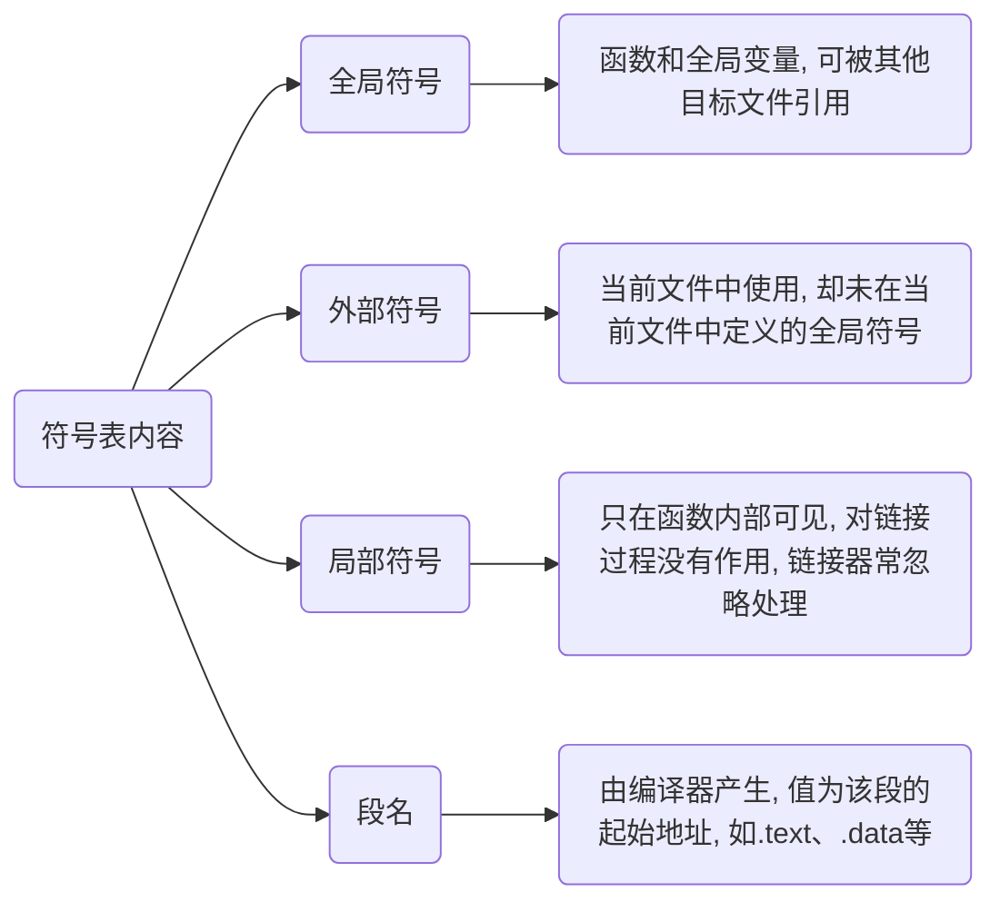

# 链接

链接($Linking$)通过`符号`处理各模块之间相互引用部分, 使得各模块能够正确衔接, 最终组合成独立程序

## 链接器

假设某程序有两个模块 Main.c 和 Module.c, 在 Module.c 中定义函数 Func(), 并在 Main.c中调用

所有模块被编译成可执行文件后, 每处 Func() 函数调用都会被替换为一个绝对地址

### 修正

由于各模块单独编译, 编译器在处理 Main.c 时并不知道 Func() 地址, 需要到最后链接时再修正

- 手动修正

若无链接器, 则必须手工修正 Func() 地址

当 Module.c 被修改并重新编译时, Func() 地址极有可能改变, 则在 Main.c 中所有使用Func() 函数处都需重新调整地址

- 链接器修正

链接器会根据符号 Func 自动去 Module.c 模块查找 Func() 地址, 然后将 Main.c 中所有使用 Func 指令重新修正, 让其目标地址成为真正 Func() 函数地址

### 静态链接

在程序运行之前确定符号地址为静态链接(Static Linking)

### 动态链接

要等到程序运行期间再确定符号地址为动态链接(Dynamic Linking)

Windows 下 .dll 或 Linux 下 .so 库文件必须要嵌入到可执行程序, 作为可执行程序一部分运行

库文件所内符号地址是在程序运行期间确定, 所以称为动态链接库(Dynamic Linking Library)

## 符号

函数和变量在本质上都是地址助记符, 在链接过程中称为`符号`(Symbol)

符号信息, 包括当前符号在字符串表中偏移、符号在段中偏移、符号所占用字节数、符号类型等

### 符号表

目标文件中符号表(Symbol Value), 段名为`.symtab`, 记录文件中用到的所有符号, 包括



### 重定位

链接器原理是找到`符号`地址, 或者把指令中使用到地址加以修正, 此过程称为符号决议(Symbol Resolution)或者重定位(Relocation)

例如在 a.c 中有一个 int 类型全局变量 var, 在 b.c 中对它赋值 42

```c
int32_t var = 42;
```

对应汇编代码

```c
mov 0x2a, var
```

mov 用来将一份数据移动到一个存储位置, 这里表示将 0x2a 移动到 var 符号代表位置, 也就是对 var 变量赋值

当被编译成目标文件后, 得到机器指令

```c
c705  00000000  0000002a
```

由于编译时不知道变量 var 地址, 编译器将这条 mov 指令目标地址设置为 0, 等到将目标文件 a.o 和 b.o 链接时, 再由链接器修正

假设生成可执行文件后变量 var 地址为 0x1100, 则机器指令变为

```c
c705  00001100  0000002a
```

这种地址修正过程就是重定位, 每个需被修正地方叫做一个重定位入口(Relocation Entry)

重定位所做工作就是修正程序中每个绝对地址引用位置, 使它们指向正确地址

### 符号决议(Symbol Resolution)

链接时, 链接器首先扫描所有目标文件, 获得各个段长度、属性、位置等信息, 并将目标文件中所有(符号表中)符号收集起来, 统一放到一个全局符号表

在这一步中, 链接器会将目标文件中各个段合并到可执行文件, 并计算出合并后各个段长度、位置、虚拟地址等

在目标文件符号表中, 保存了各个符号在段内偏移, 生成可执行文件后, 原来各个段(Section)起始位置虚拟地址就确定了下来, 这样使用起始地址加上偏移量就能够得到符号地址(在进程中虚拟地址)

这种计算符号地址过程被称为**符号决议**(Symbol Resolution)

重定位表.rel.text和.rel.data中保存了需要重定位全局符号以及重定位入口, 完成了符号决议, 链接器会根据重定位表调整代码中地址, 使它指向正确内存位置

至此, 可执行文件就生成

### 全局变量和局部变量

当程序被加载到内存后, 全局变量要在数据区(全局数据区)分配内存, 局部变量要在栈上分配内存

数据区在程序运行期间一直存在, 全局变量位置不会改变, 地址也固定, 所以在链接时就能够计算出全局变量地址

而栈区内存会随着函数调用不断被分配和释放, 局部变量地址不能预先计算, 必须等到发生函数调用时才能确定, 所以链接过程会忽略局部变量

关于局部变量定位, 就是 ebp 加上偏移量, 这在编译阶段就能给出计算公式(一条简单语句), 程序运行后, 只要执行这条语句, 就能够得到局部变量地址

链接一项重要任务就是确定函数和全局变量地址, 并对每一个重定位入口进行修正
