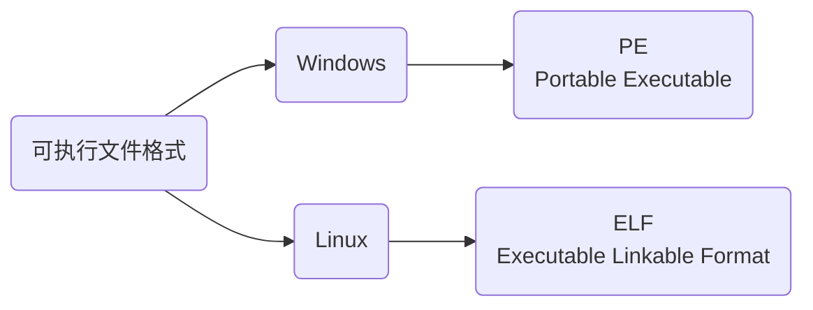
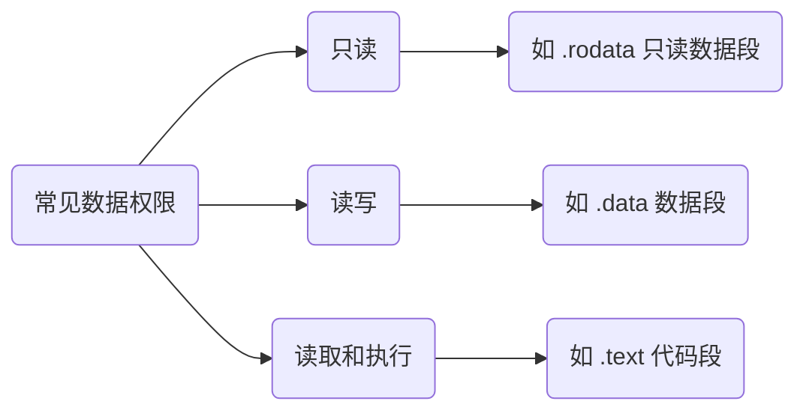

# 可执行文件

包含可以直接执行的程序, 如Linux下的.out, Windows下的.exe



## 结构

可执行文件的组织形式和目标文件非常类似, 也被划分成多个部分


带阴影的是可执行文件增加的段, 另外删除了可重定位段(.rel.text,.rel.data)以及 Section Table

目标文件包含了10个左右的段, 而可执行文件包含了将近30个左右的段, 上面的两张图只列出了一些关键段, 剩下的段都隐藏在Other Data(其他数据)

不同颜色的箭头表明了可执行文件应该被加载到地址空间的哪一个区域, 操作系统并不是为每个段都分配一个区域, 而是将多个具有相同权限的段合并在一起, 加载到同一个区域

站在文件结构的角度, 可执行文件包含了众多Section [ˈseɡmənt], 每个Section都有不同的作用

站在加载和执行的角度, 所有的段都是数据, 操作系统只关心数据的权限, 只要把相同权限的数据加载到同一个内存区域, 程序就能正确执行

常见数据权限



将一块连续的、具有相同权限的数据称为一个 Segment, 其由多个权限相同的 Section 构成

### Segment 错误

Linux 出现过Segment fault(段错误)的错误, 这种错误发生在程序执行期间, 在编译和链接时无法检测, 一般因代码的权限不足导致

```c
#include <stdio.h>

char *str = "www.baidu.com";

int main() {
    str[1] = '@';
    return 0;
}
```

程序执行到 6 行时就会出现 Segment fault

因为字符串 str 保存在地址空间的常量区, 只能读取不能写入, 修改字符串显然是越权操作

### 比较

目标文件中, 段表(Section Table)用来描述各个 Section 的信息, 包括它的名字、长度、在文件中的偏移、读写权限等, 通过段表可以详细地了解目标文件的结构

可执行文件中,段表被删除, 取代它的是程序头表(Program Header Table)

程序头表用来描述各个 Segment 的信息, 包括它的类型、偏移、在进程虚拟地址空间中的起始地址、物理装载地址、长度、权限等

操作系统就是根据程序头表将可执行文件加载到内存, 并为各个 Segment 分配内存空间、确定起止地址

可执行文件不再关注具体的文件结构, 而是关注程序的加载和执行过程

由于可执行文件在加载时实际上是被映射的虚拟地址空间, 所以可执行文件很多时候又被叫做映像文件(Image)

### Section的合并

链接(Linking)的作用就是将多个目标文件合并成一个可执行文件

在链接过程中, 链接器会将多个目标文件中的代码段、数据段、调试信息等合并成可执行文件中的一个段

段的合并仅仅是一个简单的叠加过程

- 合并有用的段(例如代码段、数据段等)

- 链接器还会删除多余的段(例如重定位段、段表等)

- 增加其他段(例如程序头表等)
