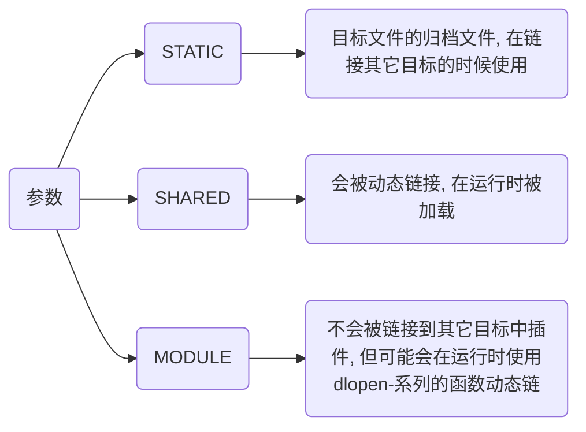

> - [CMAKE手册](https://www.zybuluo.com/khan-lau/note/254724)
> 
> - [用CMake构建工程时 cmake -G "Unix Makefiles" 的使用](https://blog.csdn.net/yangjia_cheng/article/details/111408753)

# CMake语法

## 设置

### cmake_minimum_required

设置一个工程所需要的最低CMake版本

```cmake
cmake_minimum_required(VERSION major[.minor[.patch[.tweak]]] [FATAL_ERROR])
```

- 设置该工程最低CMake版本为3.10

```sh
cmake_minimum_required(VERSION 3.10)
```

### project

设置项目名与版本

```sh
project(Test VERSION 1.0)
```

### set

将一个CMAKE变量设置为给定值

```sh
set(<variable> <value> [[CACHE <type> <docstring> [FORCE]] | PARENT_SCOPE])
```

- 设置为C++版本为C++11

```sh
set(CMAKE_CXX_STANDARD 11)
```

## 添加

### include_directories

为构建树添加包含路径

```sh
include_directories([AFTER|BEFORE] [SYSTEM] dir1 dir2 ...)
```

### add_library

根据调用的命令里列出的源文件来创建库文件

```cmake
add_library(<name> [STATIC | SHARED | MODULE] [EXCLUDE_FROM_ALL] source1 source2 ... sourceN)
```

name 对应于逻辑目标名称, 在一个工程的全局域内必须唯一

待构建的库文件的实际文件名根据对应平台的命名约定来构造(比如lib<name>.a或者<name>.lib)



### target_link_libraries

将库链接到可执行文件

```sh
target_link_libraries(MyExecutable PRIVATE MyLibrary)
```

### add_subdirectory

为构建添加一个子路径

```sh
add_subdirectory(source_dir [binary_dir] [EXCLUDE_FROM_ALL])
```

source_dir选项指定了CMakeLists.txt源文件和代码文件的位置, 如果是相对路径会被解释为相对于当前的目录, 也可以是绝对路径

binary_dir选项指定了输出文件的路径, 如果是相对路径, 会被解释为相对于当前输出路径, 也可以是绝对路径. 

如果没有指定binary_dir, binary_dir的值将会是没有做任何相对路径展开的source_dir

## 生成

### add_executable

生成可执行文件

```sh
add_executable([可执行文件名] [源文件])
```

## 安装

安装可执行文件到bin目录

```sh
install(TARGETS MyExecutable DESTINATION bin)
```

