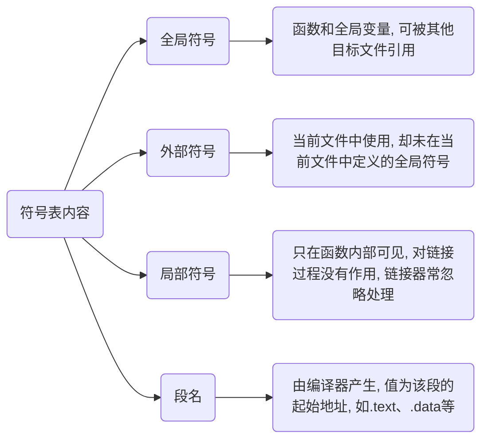

<!--
 * @Brief        : 
 * @Author       : dmjcb
 * @Date         : 2022-10-03 21:04:57
 * @LastEditors  : dmjcb@outlook.com
 * @LastEditTime : 2024-09-28 13:25:28
-->

# 链接

链接($Linking$)是通过`符号`将各个模块组合成一个独立的程序的过程

链接处理各个模块之间的相互引用部分, 使得各个模块能够正确地衔接

## 链接器

假设一个程序有两个模块 main.c 和 module.c

在 module.c 中定义了函数 func(), 并在 main.c中进行了调用

所有模块被编译成一个可执行文件后, 每一处对 func() 函数的调用都会被替换为一个绝对地址

### 修正

由于各模块单独编译, 编译器在处理 main.c 时并不知道 func() 的地址, 所以需要到最后链接时再对这些地址修正

- 手动修正

若没有链接器, 则必须手工修正 func() 的地址, 当 module.c 被修改并重新编译时, func() 的地址极有可能改变, 那么在 main.c 中所有使用到 func() 函数的地方, 都要全部重新调整地址, 工作相当繁琐

- 链接器修正

链接器会根据符号 func 自动去 module.c 模块查找 func() 的地址, 然后将 main.c 模块中所有使用到 func 的指令重新修正, 让它们的目标地址成为真正的 func() 函数的地址

### 静态链接

在程序运行之前确定符号地址的过程为静态链接(Static Linking)

### 动态链接

要等到程序运行期间再确定符号地址的过程为动态链接(Dynamic Linking)

Windows 下的 .dll 或 Linux 下的 .so 必须要嵌入到可执行程序, 作为可执行程序的一部分运行

它们所包含的符号的地址就是在程序运行期间确定的, 所以称为动态链接库(Dynamic Linking Library)

## 符号

函数和变量在本质上都是地址的助记符, 在链接过程中称为`符号`(Symbol)

符号的信息, 包括当前符号在字符串表中的偏移、符号在段中的偏移、符号所占用的字节数、符号类型等

### 符号表

目标文件中符号表(Symbol Value), 段名为`.symtab`, 记录文件中用到的所有符号, 包括

符号表记录了当前目标文件用到的所有符号



### 重定位

链接器的原理是找到`符号`的地址, 或者把指令中使用到的地址加以修正, 此过程称为符号决议(Symbol Resolution)或者重定位(Relocation)

例如在 a.c 中有一个 int 类型的全局变量 var, 在 b.c 中对它赋值 42

```c
int32_t var = 42;
```

对应的汇编代码

```c
mov 0x2a, var
```

mov 用来将一份数据移动到一个存储位置, 这里表示将 0x2a 移动到 var 符号所代表的位置, 也就是对 var 变量赋值

当被编译成目标文件后, 得到机器指令

```c
c705  00000000  0000002a
```

由于编译时不知道变量 var 的地址, 编译器将这条 mov 指令的目标地址设置为 0, 等到将目标文件 a.o 和 b.o 链接时, 再由链接器修正

假设生成可执行文件后变量 var 的地址为 0x1100, 则机器指令变为

```c
c705  00001100  0000002a
```

这种地址修正的过程就是重定位, 每个需要被修正的地方叫做一个重定位入口(Relocation Entry)

重定位所做的工作就是给程序中每个这样的绝对地址引用的位置修正, 使它们指向正确的地址

### 符号决议(Symbol Resolution)

进行链接时, 链接器首先扫描所有的目标文件, 获得各个段的长度、属性、位置等信息, 并将目标文件中的所有(符号表中的)符号收集起来, 统一放到一个全局符号表

在这一步中, 链接器会将目标文件中的各个段合并到可执行文件, 并计算出合并后的各个段的长度、位置、虚拟地址等

在目标文件的符号表中, 保存了各个符号在段内的偏移, 生成可执行文件后, 原来各个段(Section)起始位置的虚拟地址就确定了下来, 这样, 使用起始地址加上偏移量就能够得到符号的地址(在进程中的虚拟地址)

这种计算符号地址的过程被称为**符号决议**(Symbol Resolution)

重定位表.rel.text和.rel.data中保存了需要重定位的全局符号以及重定位入口, 完成了符号决议, 链接器会根据重定位表调整代码中的地址, 使它指向正确的内存位置
至此, 可执行文件就生成

### 全局变量和局部变量

当程序被加载到内存后, 全局变量要在数据区(全局数据区)分配内存, 局部变量要在栈上分配内存

数据区在程序运行期间一直存在, 全局变量的位置不会改变, 地址也是固定的, 所以在链接时就能够计算出全局变量的地址

而栈区内存会随着函数的调用不断被分配和释放, 局部变量的地址不能预先计算, 必须等到发生函数调用时才能确定, 所以链接过程会忽略局部变量

关于局部变量的定位, 就是 ebp 加上偏移量, 这在编译阶段就能给出计算公式(一条简单的语句), 程序运行后, 只要执行这条语句, 就能够得到局部变量的地址

链接的一项重要任务就是确定函数和全局变量的地址, 并对每一个重定位入口进行修正
