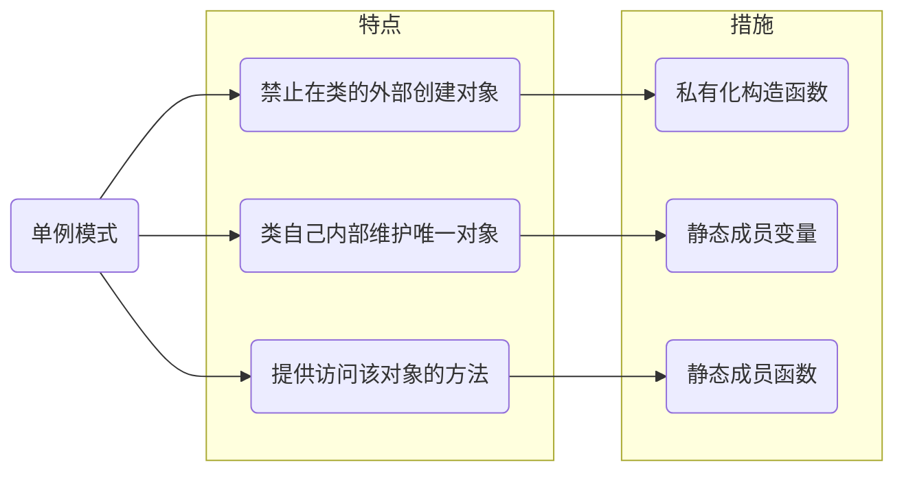

# 单例模式

## 概念

只允许存在唯一的对象实例



## 分类

- 饿汉式

无论用不用单例对象, 程序启动即创建

- 懒汉式

单例对象用时再创建, 不用即销毁

## 实现

### C

静态变量, instance是一个静态指针, 确保在多个调用中保持相同的内存地址

懒惰初始化, 只有在第一次调用getInstance时才会分配内存

内存管理, 记得在适当的时候释放内存, 以防内存泄漏

```c
#include <stdio.h>
#include <stdlib.h>

typedef struct {
    int value;
} Singleton;

Singleton* GetInstance() {
    static Singleton* s = NULL;
    if (s == NULL) {
        s = (Singleton*)malloc(sizeof(Singleton));
        s->value = 0;
    }
    return s;
}

int main() {
    Singleton* s1 = GetInstance();
    Singleton* s2 = GetInstance();

    printf("s1 address: %x\n", s1);
    printf("s2 address: %x\n", s2);

    return 0;
}
```

### C++

```c++
#include<iostream>

class Singleton {
public:
    // 返回单例, C++11 以上线程安全
    static Singleton& GetInstance() {
        static Singleton s;
        return s;
    }

    // 禁用拷贝构造函数
    Singleton(Singleton const&) = delete;

    // 禁用赋值构造函数
    Singleton& operator=(Singleton const&) = delete;
private:
    // 构造与析构函数设置为私有类型
    Singleton() = default;
    ~Singleton() = default;
};

int main(void) {
    Singleton& s1 = Singleton::GetInstance();
    Singleton& s2 = Singleton::GetInstance();
    Singleton& s3 = Singleton::GetInstance();

    std::cout << &s1 << std::endl;
    std::cout << &s2 << std::endl;
    std::cout << &s3 << std::endl;
    return 0;
}
```

可发现仅执行了一次构造与析构函数, 并且创建出的对象地址均一致, 说明为同个对象

#### 单例模板

```c++
#include<iostream>

template <typename T>
class Singleton {
public:
    static T& GetInstance() {
        static T s;
        return s;
    }

    Singleton(const Singleton&) = delete;

    Singleton& operator=(const Singleton&) = delete;

protected:
    Singleton() = default;

    virtual ~Singleton() = default;
};

// 派生类
class Log : public Singleton<Log> {
    // 为使父类能访问派生类构造与析构函数
    friend class Singleton<Log>;
public:
    Log(const Log&) = delete;

    Log& operator=(const Log&) = delete;

private:
    Log() = default;
    ~Log() = default;
};


int main(void) {
    Log& s1 = Singleton<Log>::GetInstance();
    Log& s2 = Singleton<Log>::GetInstance();
    Log& s3 = Singleton<Log>::GetInstance();

    std::cout << &s1 << std::endl;
    std::cout << &s2 << std::endl;
    std::cout << &s3 << std::endl;
    return 0;
}
```
