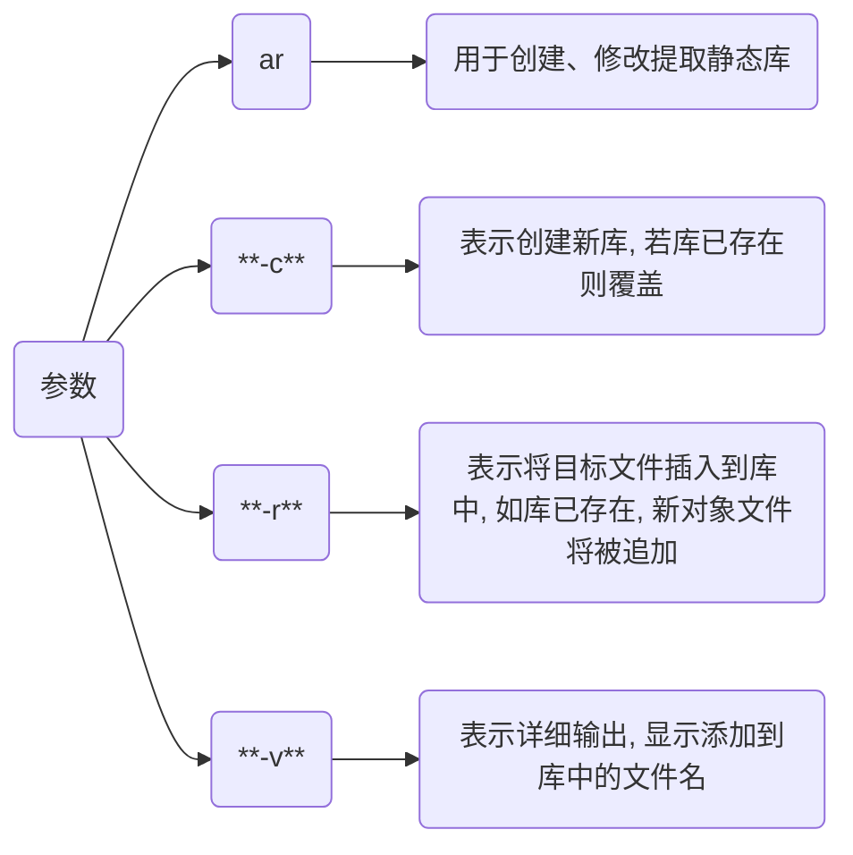

# 静态库

Linux下为`.o`/`.a`

Windows下为`.obj` 和 `.lib`

## 创建

```c++
// hello.h
#ifndef HELLO_H
#define HELLO_H

#include <stdio.h>

void hello();

#endif
```

```c
// hello.c
#include "hello.h"

void hello() {
    printf("Hello World!\n");
}
```

```c
// main.c
#include "hello.h"

int main(void) {
    hello();
    return 0;
}
```

`-c` 只激活预处理, 编译, 和汇编, 仅生成.o 目标文件

```c
gcc hello.c -c -o hello.o
```

### Linux

```sh
ar hello.o -crv libhello.a 
```



## 链接

```c
gcc main.c -c -o main.o

gcc main.o libhello.a -o main
```

## 测试

链接完成后, 删除静态库, 对程序无影响

```c
sudo rm libhello.a

./main
```
