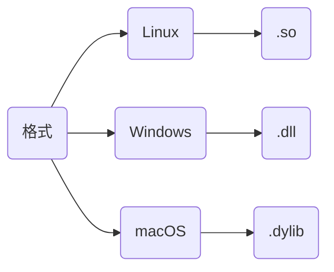
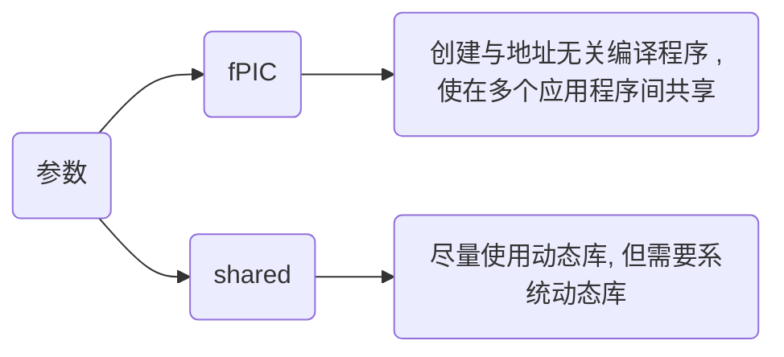

# 动态库

动态库(Dynamic Library), 又称动态链接库(Dynamic Link Library, DLL), 是一种在程序运行时加载的库文件

它与静态库主要区别在于动态库代码并不在程序编译时直接包含, 而是在程序执行时根据需要动态加载

## 特点

- 运行时加载

动态库代码在程序运行时被加载到内存, 而不是在编译时就包含在可执行文件中, 使得程序可在需要时才使用特定库功能, 从而节省内存。

- 共享性

多个程序可以共享同一个动态库实例, 意味若多应用程序使用相同库, 则可共享内存中相同代码, 减少资源占用

- 版本控制

动态库可以单独更新, 不需要重新编译依赖于它的应用程序, 若功能更改, 用户只需替换库文件, 而不必重新编译所有相关程序

- 支持多语言

动态库通常可以被多种编程语言调用, 使得在不同开发环境中非常灵活



## 编译

### 指令

- Linux

```sh
g++ [*.cpp] -fPIC -shared -o [*.so]
```

若报找不到库文件错误, 移动动态库到/usr/lib目录

```sh
sudo mv [*.so] /usr/lib
```

- Windows

指令与Linux下类似, 生成动态库名称后缀为.dll

```sh
g++ [*.cpp] -fPIC -shared -o [*.dll]
```



在创建动态库时, C和C++有一些关键差异, 主要体现在名称修饰(Name Mangling)、导出符号、以及链接方式上

### 特征

#### 名称修饰(Name Mangling)

C++支持函数重载, 这导致C++编译器对函数名称进行称为名称修饰特殊编码, 以区分不同函数签名

而C语言不支持函数重载, 因此C编译器不会对函数名进行修饰

若在C++中需要导出C风格接口(即无名称修饰), 可用 extern "C" 来告知编译器按C语言规则导出符号

```c++
#ifdef __cplusplus
extern "C" {
#endif

// 具体函数.....

#ifdef __cplusplus
}
#endif
```

#### 导出符号(Symbol Export)

在C和C++中, 为了将函数从动态库中导出, 使其能够被其他程序使用, 需要导出函数符号

- Windows

使用__declspec(dllexport) 和 __declspec(dllimport) 来导出导入符号

```c++
#ifdef _WIN32
    #define API_EXPORT __declspec(dllexport)
    #define API_IMPORT __declspec(dllimport)
#endif
```

- Linux/Unix

使用 \_\_attribute__((visibility("default"))) 来导出符号

```c
#define API_EXPORT __attribute__((visibility("default")))
```

### 类别

#### 源文件不含类

不含类时生成动态库可直接调用

API.hpp

```c++
#include <iostream>

#ifndef __INCLUDE_API_HPP__
#define __INCLUDE_API_HPP__

#ifdef _WIN32
    #define API_EXPORT __declspec(dllexport)
    #define API_IMPORT __declspec(dllimport)
#else
    #define API_EXPORT __attribute__((visibility("default")))
    #define API_IMPORT
#endif

#ifdef __cplusplus
extern "C" {
#endif

void Display();

int Add(int x, int y);

#ifdef __cplusplus
}
#endif

#endif
```

API.cpp

```c
#include "API.h"

void Display() {
    std::cout << "Print API success!" << std::endl;
}

int Add(int x, int y) {
    return x + y;
}
```

#### 源文件含类

>[示例代码地址](https://github.com/dmjcb/SelfBlog/tree/main/Language/C%26C%2B%2B/Code/MyClass)

含类时需要在进行一层封装进行调用

MyClass.hpp

```c++ 
#include <iostream>

class MyClass {
public:
    MyClass() = default;

    ~MyClass() = default;

    void SetValue(const int val);

    void Print() const;
private:
    int mValue;
};
```

MyClass.cpp

```c++ 
#include "MyClass.hpp"

void MyClass::SetValue(const int val) {
    this->mValue = val;
}

void MyClass::Print() const {
    std::cout << "mValue = " << mValue << std::endl;
}
```

MyClassDLL.hpp

```c
#include "MyClass.hpp"

#ifdef _WIN32
    #define API_EXPORT __declspec(dllexport)
    #define API_IMPORT __declspec(dllimport)
#else
    #define API_EXPORT __attribute__((visibility("default")))
    #define API_IMPORT
#endif

#ifdef __cplusplus
extern "C" {
#endif
    API_EXPORT void* MyClassCreate();
    API_EXPORT void  MyClassDestroy(void* handle);
    API_EXPORT void  MyClassSetValue(void* handle, int val);
    API_EXPORT void  MyClassPrint(void* handle);
#ifdef __cplusplus
}
#endif
```

MyClassDLL.cpp

```c++
#include "MyClassDLL.hpp"

#ifdef __cplusplus
extern "C" {
#endif

API_EXPORT void* MyClassCreate() {
    return new MyClass();
}

API_EXPORT void MyClassDestroy(void* handle) {
    delete static_cast<MyClass*>(handle);
}

API_EXPORT void MyClassSetValue(void* handle, int val) {
    MyClass* obj = static_cast<MyClass*>(handle);
    obj->SetValue(val);
}

API_EXPORT void MyClassPrint(void* handle) {
    MyClass* obj = static_cast<MyClass*>(handle);
    obj->Print();
}

#ifdef __cplusplus
}
#endif
```

#### 模板

- 模板类

>[示例代码地址](https://github.com/dmjcb/SelfBlog/tree/main/Language/C%26C%2B%2B/Code/TemplateClass)

TemplateClass.hpp

```c++
#ifndef __INCLUDE_TEMPLATE_CLASS_HPP__
#define __INCLUDE_TEMPLATE_CLASS_HPP__

#include <iostream>

#ifdef _WIN32
    #define API_EXPORT __declspec(dllexport)
    #define API_IMPORT __declspec(dllimport)
#else
    #define API_EXPORT __attribute__((visibility("default")))
    #define API_IMPORT
#endif

template<typename T>
class  TemplateClass {
public:
    TemplateClass() = default;

    ~TemplateClass() = default;

    T Add(T a, T b);
};

#endif
```

TemplateClass.cpp

```c++
#include "TemplateClass.hpp"

// 模板实例化
template class API_EXPORT TemplateClass<double>;

template<typename T>
T TemplateClass<T>::Add(T a, T b) {
	std::cout << "TemplateClass::Add" << std::endl;
	
    return T(a + b);
}
```

- 模板函数

TemplateFunction.hpp

```c++
#ifndef __INCLUDE_TEMPLATE_FUNTCION_HPP__
#define __INCLUDE_TEMPLATE_FUNTCION_HPP__

#include <iostream>

#ifdef _WIN32
    #define API_EXPORT __declspec(dllexport)
    #define API_IMPORT __declspec(dllimport)
#else
    #define API_EXPORT __attribute__((visibility("default")))
    #define API_IMPORT
#endif

template<typename T>
T Add(T a, T b);

#endif
```

TemplateFunction.cpp

```c++
#include "TemplateFunction.hpp"

// 模板实例化
template API_EXPORT Add<int>(int, int);
template API_EXPORT Add<double>(double, double);
template API_EXPORT Add<std::string>(std::string, std::string);

template<typename T>
T Add(T a, T b) {
    std::cout << "TemplateFunction::Add" << std::endl;
	
    return T(a + b);
}
```

## 调用

### 头文件引用

若有生成动态库.h/.hpp文件, 可直接引用头文件调用

```c++
// Main.cpp
#include "API.hpp"

int main(void) {
    Display();

    std::cout << "Add = " << Add(1, 2) << std::endl;
}
```

```sh
g++ API.cpp -fPIC -shared -o API.so

g++ Main.cpp API.so -o Main
```

### 函数读取

```c
// Main.cpp
#include <stdio.h>
#include <stdlib.h>
#include <dlfcn.h>

typedef void(*VoidFunc)();

typedef int(*IntFunc)(int, int);

int main(void) {
    const char *soPath = "./API.so";

    void *handle = dlopen(soPath, RTLD_LAZY | RTLD_LOCAL);

    if (!handle) {
        fprintf(stderr, "[%s](%d) dlopen get error: %s\n", __FILE__, __LINE__, dlerror());
        exit(EXIT_FAILURE);
    }

    VoidFunc Display = (VoidFunc)dlsym(handle, "Display");
    Display();

    IntFunc Add = (IntFunc)dlsym(handle, "Add");
    printf("Result = %d\n", Add(1, 2));

    dlclose(handle);

    return 0;
}
```

编译时需链接动态链接库加载器库`dl`

```sh
g++ -o Main Main.cpp -ldl
```

### Python调用

```py
from ctypes import *

cdll = CDLL("./API.so")

print(cdll.Add(1, 3))

cdll.Display()
```


## IDE开发

### VS2022

#### 开发


pch.h 

```c++
#include <iostream>

#define DLLEXPORT extern "C" __declspec(dllexport)

DLLEXPORT void PrintInfo();

DLLEXPORT int Add(int x, int y);
```

pch.cpp

```c++
void PrintInfo() {
    std::cout << "Hello World" << std::endl;
}

int Add(int x, int y) {
    return x + y;
}
```


#### 使用

新建项目DLLTest

将上步生成DLL1.dll与DLL1.lib文件拷贝到新项目目录下


建立头文件DLL1.h

```c++
#include <iostream>

#define DLLEXPORT extern "C" __declspec(dllexport)

DLLEXPORT void PrintInfo();

DLLEXPORT int Add(int x, int y);
```

- 添加.lib路径, 用于导入动态库


#### 运行

cpp文件写入

```c++
#include "DLLTest.h"

int main() {
    PrintInfo();

    std::cout << Add(1, 2) << std::endl;
}
```

运行结果

```sh
Hello World
3
```