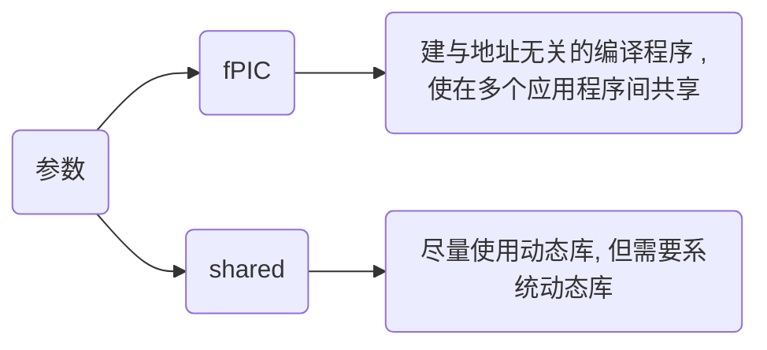

<!--
 * @Brief        : 
 * @Author       : dmjcb
 * @Date         : 2023-02-28 22:32:19
 * @LastEditors  : dmjcb@outlook.com
 * @LastEditTime : 2024-10-11 23:30:00
-->

# 动态库

Linxu下为 `.so`格式, Windows下为 `.dll`格式

## 生成

```shell
g++ [*.cpp/*.c] -fPIC -shared -o [*.so]
```



在创建动态库(Dynamic Library)时, C和C++有一些关键的差异, 主要体现在名称修饰（Name Mangling）、导出符号、以及链接方式上

### 名称修饰(Name Mangling)

C++支持函数重载, 这导致C++编译器对函数名称进行称为名称修饰特殊编码, 以区分不同的函数签名

而C语言不支持函数重载, 因此C编译器不会对函数名进行修饰

如果在C++中需要导出C风格的接口(即无名称修饰), 可用 extern "C" 来告知编译器按C语言规则导出符号

```c++
#ifdef __cplusplus
extern "C" {
#endif

// 具体函数.....

#ifdef __cplusplus
}
#endif
```

### 导出符号(Symbol Export)

在C和C++中, 为了将函数从动态库中导出, 使其能够被其他程序使用, 需要导出函数符号

- Windows

__declspec(dllexport) 和 __declspec(dllimport)

```c++
#ifdef _WIN32
    #define API_EXPORT __declspec(dllexport)
    #define API_IMPORT __declspec(dllimport)
#endif
```

- Linux/Unix

通常使用 \__attribute__((visibility("default"))) 来导出符号

```c
#define API_EXPORT __attribute__((visibility("default")))
```

### 编译链接

- Linux

```sh
g++ [*.cpp] -fPIC -shared -o [*.so]
```

若报找不到库文件错误, 移动动态库到/usr/lib目录

```sh
sudo mv [*.so] /usr/lib
```

- Windows


指令与Linux下类似, 生成动态库名称后缀为.dll

```sh
g++ [*.cpp] -fPIC -shared -o [*.dll]
```


```c++
// API.hpp
#include <iostream>

#ifndef __INCLUDE_API_HPP__
#define __INCLUDE_API_HPP__

#ifdef _WIN32
    #define API_EXPORT __declspec(dllexport)
    #define API_IMPORT __declspec(dllimport)
#else
    #define API_EXPORT __attribute__((visibility("default")))
    #define API_IMPORT
#endif

#ifdef __cplusplus
extern "C" {
#endif

void Display();

int Add(int x, int y);

#ifdef __cplusplus
}
#endif

#endif
```

```c
// API.cpp
#include "API.h"

void Display() {
    std::cout << "Print API success!" << std::endl;
}

int Add(int x, int y) {
    return x + y;
}
```

## 调用

### 头文件引用

API.h 与 API.cpp 生成的动态库, 可直接引用头文件调用

```c++
// Main.cpp
#include "API.hpp"

int main(void) {
    Display();

    std::cout << "Add = " << Add(1, 2) << std::endl;
}
```

- 分布编译链接

```sh
g++ Main.cpp -c -o Main.o

g++ Main.o libapi.so -o Main
```

- 直接编译链接

```sh
g++ Main.cpp libapi.so -o Main
```

### dlopen读取

- c

```c
#include <stdio.h>
#include <stdlib.h>
#include <dlfcn.h>

typedef void(*VoidFunc)();

typedef int(*IntFunc)(int, int);

int main(void) {
    const char *soPath = "./libApi.so";

    void *handle = dlopen(soPath, RTLD_LAZY | RTLD_LOCAL);

    if (!handle) {
        fprintf(stderr, "[%s](%d) dlopen get error: %s\n", __FILE__, __LINE__, dlerror());
        exit(EXIT_FAILURE);
    }

    VoidFunc PrintInfo = (VoidFunc)dlsym(handle, "PrintInfo");
    PrintInfo();

    IntFunc GetResult = (IntFunc)dlsym(handle, "GetResult");
    printf("Result = %d\n", GetResult(1, 2));

    dlclose(handle);

    return 0;
}
```
