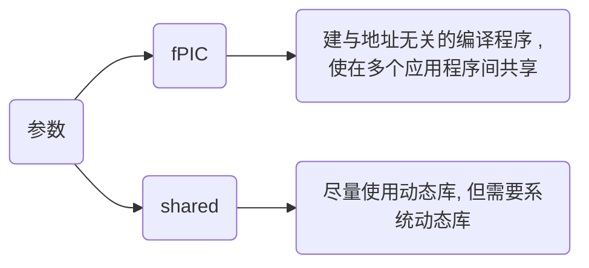

<!--
 * @Brief        : 
 * @Author       : dmjcb
 * @Date         : 2023-02-28 22:32:19
 * @LastEditors  : dmjcb@outlook.com
 * @LastEditTime : 2024-10-12 13:24:20
-->

# 动态库

Linxu下为 `.so`格式, Windows下为 `.dll`格式

## 生成

```shell
g++ [*.cpp/*.c] -fPIC -shared -o [*.so]
```



在创建动态库(Dynamic Library)时, C和C++有一些关键的差异, 主要体现在名称修饰（Name Mangling）、导出符号、以及链接方式上

### 名称修饰(Name Mangling)

C++支持函数重载, 这导致C++编译器对函数名称进行称为名称修饰特殊编码, 以区分不同的函数签名

而C语言不支持函数重载, 因此C编译器不会对函数名进行修饰

如果在C++中需要导出C风格的接口(即无名称修饰), 可用 extern "C" 来告知编译器按C语言规则导出符号

```c++
#ifdef __cplusplus
extern "C" {
#endif

// 具体函数.....

#ifdef __cplusplus
}
#endif
```

### 导出符号(Symbol Export)

在C和C++中, 为了将函数从动态库中导出, 使其能够被其他程序使用, 需要导出函数符号

- Windows

__declspec(dllexport) 和 __declspec(dllimport)

```c++
#ifdef _WIN32
    #define API_EXPORT __declspec(dllexport)
    #define API_IMPORT __declspec(dllimport)
#endif
```

- Linux/Unix

通常使用 \__attribute__((visibility("default"))) 来导出符号

```c
#define API_EXPORT __attribute__((visibility("default")))
```

### 编译链接

- Linux

```sh
g++ [*.cpp] -fPIC -shared -o [*.so]
```

若报找不到库文件错误, 移动动态库到/usr/lib目录

```sh
sudo mv [*.so] /usr/lib
```

- Windows


指令与Linux下类似, 生成动态库名称后缀为.dll

```sh
g++ [*.cpp] -fPIC -shared -o [*.dll]
```

#### 不含类

```c++
// API.hpp
#include <iostream>

#ifndef __INCLUDE_API_HPP__
#define __INCLUDE_API_HPP__

#ifdef _WIN32
    #define API_EXPORT __declspec(dllexport)
    #define API_IMPORT __declspec(dllimport)
#else
    #define API_EXPORT __attribute__((visibility("default")))
    #define API_IMPORT
#endif

#ifdef __cplusplus
extern "C" {
#endif

void Display();

int Add(int x, int y);

#ifdef __cplusplus
}
#endif

#endif
```

```c
// API.cpp
#include "API.h"

void Display() {
    std::cout << "Print API success!" << std::endl;
}

int Add(int x, int y) {
    return x + y;
}
```

#### 含类

```c++
// MyClass.hpp
class MyClass {
public:
    MyClass(value) : mValue(value) {}
    ~MyClass() = default;

    void SetValue(const int val) {
        this->mValue = val;
    }

    const int GetValue() const {
        return this->mValue;
    }

private:
    int mValue;
};
```

```c
// MyClassDLL.hpp
#ifdef _WIN32
#define DLL_EXPORT __declspec(dllexport)
#else
#define DLL_EXPORT
#endif

#ifdef __cplusplus
extern "C" {
#endif
    DLL_EXPORT void* MyClassCreate();
    DLL_EXPORT void MyClassDestroy(void* handle);
    DLL_EXPORT void MyClassSetValue(void* handle, int val);
    DLL_EXPORT int MyClassGetValue(void* handle);
#ifdef __cplusplus
}
#endif
```

```c++
// MyClassDLL.cpp

// MyClassDLL.cpp
#include "MyClass.hpp"
#include "MyClassDLL.hpp"

#ifdef __cplusplus
extern "C" {
#endif

DLL_EXPORT void* MyClassCreate() {
    return new MyClass();
}

DLL_EXPORT void MyClassDestroy(void* handle) {
    delete static_cast<MyClass*>(handle);
}

DLL_EXPORT void MyClassSetValue(void* handle, int val) {
    MyClass* obj = static_cast<MyClass*>(handle);
    obj->SetValue(val);
}

DLL_EXPORT int MyClassGetValue(void* handle) {
    MyClass* obj = static_cast<MyClass*>(handle);
    return obj->GetValue();
}

#ifdef __cplusplus
}
#endif
```

## 调用

### 头文件引用

API.h 与 API.cpp 生成的动态库, 可直接引用头文件调用

```c++
// Main.cpp
#include "API.hpp"

int main(void) {
    Display();

    std::cout << "Add = " << Add(1, 2) << std::endl;
}
```

- 分布编译链接

```sh
g++ Main.cpp -c -o Main.o

g++ Main.o libapi.so -o Main
```

- 直接编译链接

```sh
g++ Main.cpp libapi.so -o Main
```

### dlopen读取

```c
// Main.cpp
#include <stdio.h>
#include <stdlib.h>
#include <dlfcn.h>

typedef void(*VoidFunc)();

typedef int(*IntFunc)(int, int);

int main(void) {
    const char *soPath = "./libApi.so";

    void *handle = dlopen(soPath, RTLD_LAZY | RTLD_LOCAL);

    if (!handle) {
        fprintf(stderr, "[%s](%d) dlopen get error: %s\n", __FILE__, __LINE__, dlerror());
        exit(EXIT_FAILURE);
    }

    VoidFunc PrintInfo = (VoidFunc)dlsym(handle, "PrintInfo");
    PrintInfo();

    IntFunc GetResult = (IntFunc)dlsym(handle, "GetResult");
    printf("Result = %d\n", GetResult(1, 2));

    dlclose(handle);

    return 0;
}
```

编译main.cpp时，需要链接动态链接库加载器库dl

```sh
g++ -o Main Main.cpp -ldl
```

### Python 调用

```py
from ctypes import *

pdll = CDLL("./Dll.dll")

print(pdll.add(1, 3))

pdll.hello()
```


## IDE开发

### VS2022

#### 开发

建立项目DLLTest


pch.h 与 pch.cpp分别写入

```c++
#include <iostream>

#define DLLEXPORT extern "C" __declspec(dllexport)

DLLEXPORT void helloworld();

DLLEXPORT int add(int x, int y);
```

```c++
void helloworld() {
    std::cout << "Hello World" << std::endl;
}

int add(int x, int y) {
    return x + y;
}
```


#### 使用

新建项目,将生成的.dll与.lib文件拷贝到新项目目录下

建立头文件DLLTest.h

```c++
#include <iostream>

#define DLLEXPORT extern "C" __declspec(dllexport)

DLLEXPORT void helloworld();

DLLEXPORT int add(int x, int y);
```


添加.lib的路径


#### 运行

cpp文件写入

```c++
#include "DLLTest.h"

int main() {
    helloworld();

    std::cout << add(1, 2) << std::endl;
}
```


#### dll 与 lib的区别

- lib 是编译时调用, dll 是运行时调用

如果要完成源代码的编译, 只需要 lib

如果要使动态链接的程序运行起来, 只需要 dll

如果有 dll 文件, 那么 lib 一般是一些索引信息, 记录了 dll 中函数的入口和位置, dll 中是函数的具体内容

如果只有 lib 文件, 那么这个 lib 文件是静态编译出来的, 索引和实现都在其中.使用静态编译的 lib 文件, 在运行程序时不需要再挂动态库, 缺点是导致应用程序比较大, 而且失去了动态库的灵活性, 发布新版本时要发布新的应用程序才行

动态链接的情况下, 有两个文件, LIB 文件, DLL 文件

LIB 包含被 DLL 导出的函数名称和位置, DLL 包含实际的函数和数据, 应用程序使用 LIB 文件链接到 DLL 文件

在应用程序的可执行文件中, 存放的不是被调用的函数代码, 而是 DLL 中相应函数代码的地址, 从而节省了内存资源

DLL 和 LIB 文件必须随应用程序一起发行, 否则应用程序会产生错误

如果不想用 lib 文件或者没有 lib 文件, 可以用 WIN32 API 函数 LoadLibrary、GetProcAddress 装载

### Clion

建立一个 C Library 项目 hello


library.c 文件中已有默认代码


<kbd>ctrl</kbd> + <kbd>F9</kbd> 编译, 右侧生成了 libhello.dll 文件


#### 调用

另建立一个项目 Demo, 在其根目录下建立 lib 目录, 将上一步生成的 dll 文件拷入


main.cpp 内写入

```c
#include <iostream>

#ifdef __cplusplus
extern "C" {
#endif

void hello();

#ifdef __cplusplus
}
#endif

int main() {
    hello();
    return 0;
}
```

CMakeList.txt 内容改为

```sh
cmake_minimum_required(VERSION 3.17)

# 项目名
project(Demo)

set(CMAKE_CXX_STANDARD 11)

# 新增;指项目根目录下的lib目录
link_directories(lib)

add_executable(Demo main.cpp)

# 新增;指目标链接的dll文件
target_link_libraries(Demo libhello.dll)
```

编辑 Configurations, 设置 Environment variables, 值为 lib 目录的绝对路径


#### 测试

新建 C Library 项目 num

library.c 文件中写入

```c
#include"library.h"

#include<stdio.h>
#include<stdbool.h>

int add(int a, int b) {
    return a + b;
}

bool isLeapYear(unsigned int y) {
    return y % 400 == 0 || (y % 4 == 0 && y % 400 != 0);
}
```

编译, 将 libnum.dll 文件拷入 Demo 项目的 lib 目录下

修改 Demo CMakeLists.txt 文件

```sh
# 新增
target_link_libraries(Demo libnum.dll)
```

修改 main.cpp

```c++
#include <iostream>

#ifdef __cplusplus
extern "C" {
#endif

void hello();

int add(int a, int b);

bool isLeapYear(unsigned int y);

#ifdef __cplusplus
}
#endif

int main() {
    hello();
    printf("%d\n", add(3, 4));

    int y = 2004;

    if(isLeapYear(y)){
        printf("%d2004year is lead year\n", y);
    }

    return 0;
}
```

