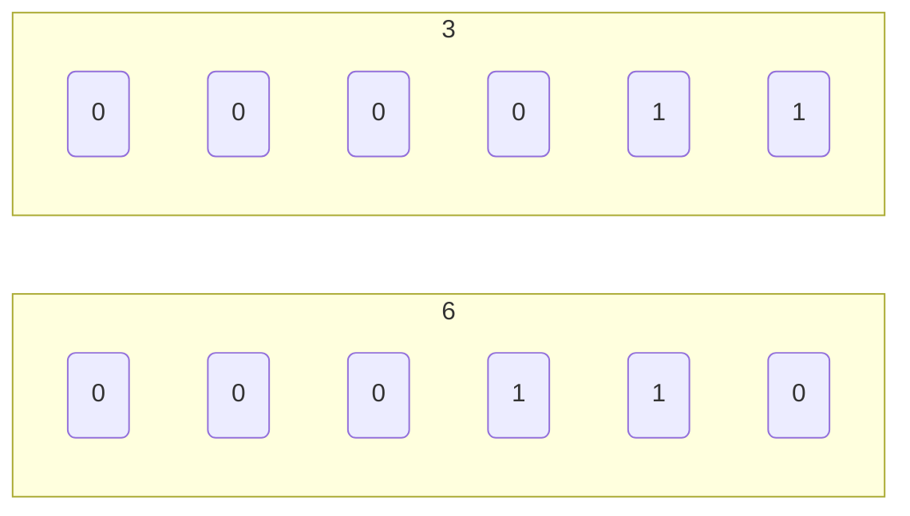
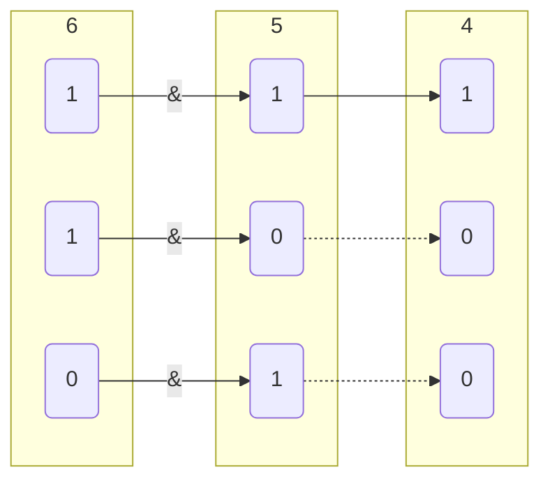
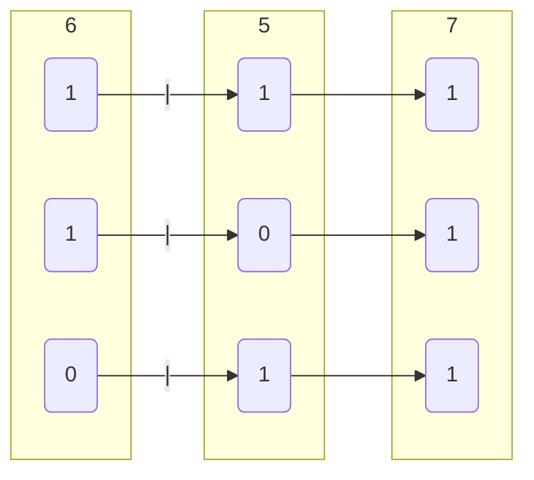
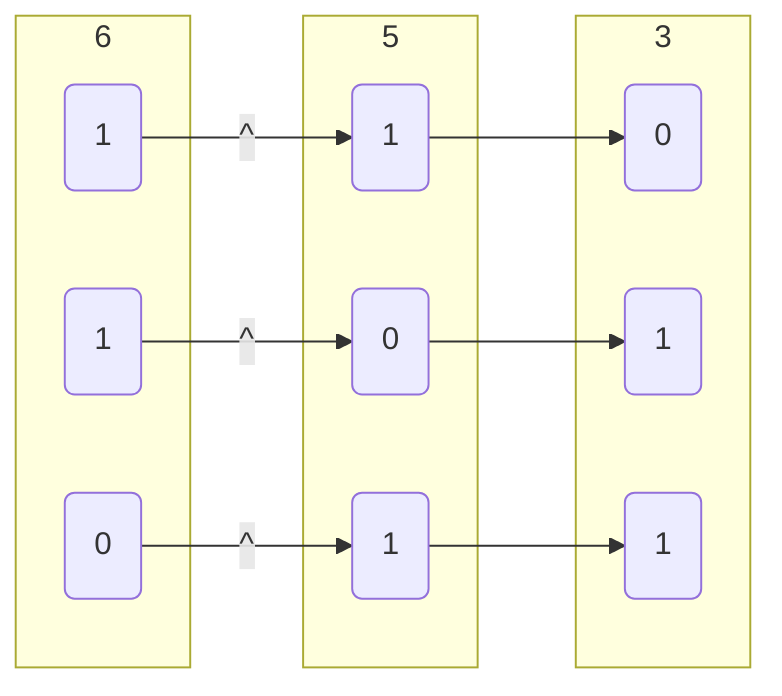

<!--
 * @Brief        : 
 * @Author       : dmjcb
 * @Date         : 2021-11-14 23:48:54
 * @LastEditors  : dmjcb@outlook.com
 * @LastEditTime : 2024-09-28 23:46:10
-->

# 位运算

## 左移

$a$左移$n$位, 相当于乘$2^{n}$

```c
a << n
```

```c
// 6
3 << 1

// 0110
00110 << 1
```



```c
// 12
3 << 2

// 1100
001100 << 2
```

## 右移

$a$右移$n$位, 相当于除$2^{n}$

```c
a >> n
```

```c
// 3
6 >> 1

// 0011
0110 >> 1
```


- 获取$x$的第$i$位值

```c
x >> (i - 1) 或 x & (1 << (i - 1))
```

## 位与

```c
a & b
```

```c
// 4
6 & 5
```



- 获取数字区间值

```c
a = 0x12345678;

// 获取数字低8位值
a & 0xFF

// 获取数字低10位值
a & 0x3FF

// 获取数字10-19位值
(a >> 10) & 0x3FF
```

## 位或

```c
a | b
```

```c
// 7
6 | 5
```



- 数字组合

```c
int r = 0;

unsigned char v[4] = {0x12, 0x34, 0x56, 0x78};

r |= (v[1] << 24);
r |= (v[2] << 16);
r |= (v[3] << 8);
r |= v[4];

// 0x12345678
printf("%x\n", r);
```

## 异或

```c
a ^ b
```

```c
// 3
6 ^ 5
```



- 交换变量值

```c
void swap(int &a, nt &b){
    a = a ^ b; 
    b = b ^ a;
    a = a ^ b;
}
```
