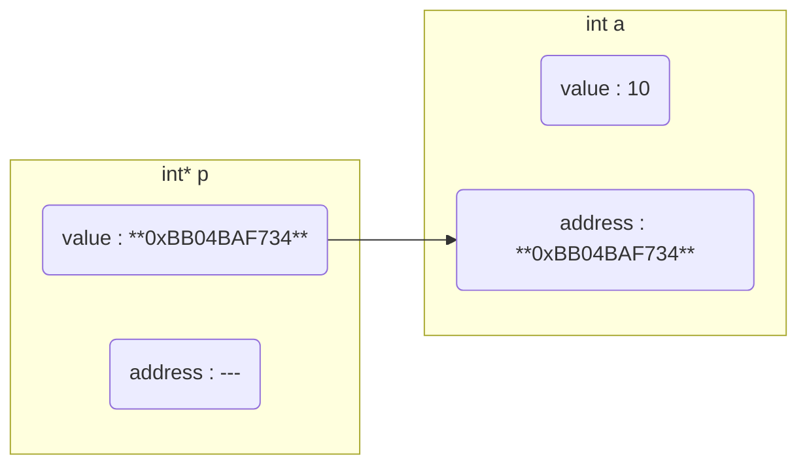
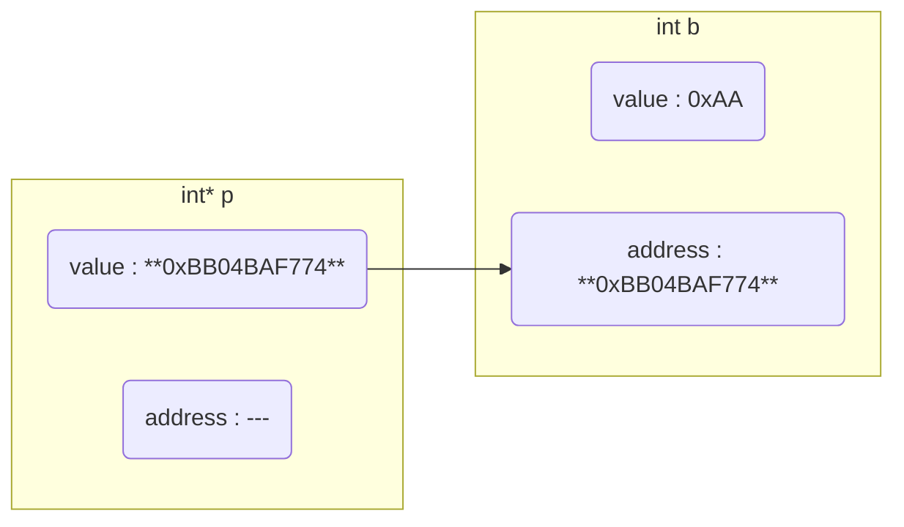
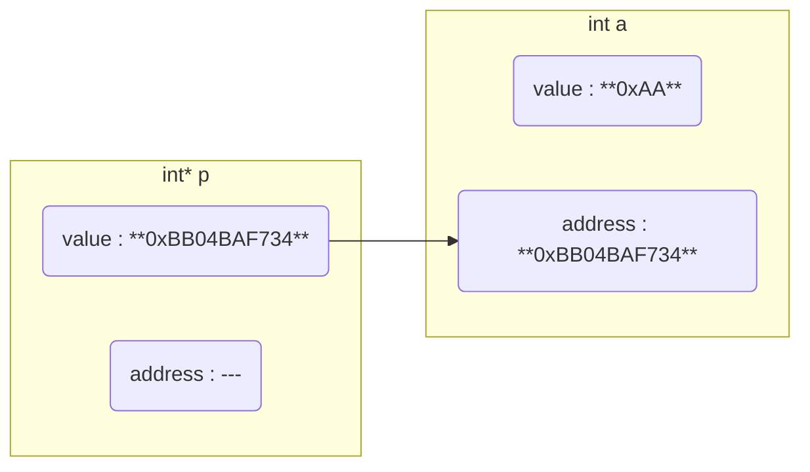

<!--
 * @Brief        : 
 * @Author       : dmjcb@outlook.com
 * @Date         : 2022-01-08 10:45:40
 * @LastEditors  : dmjcb@outlook.com
 * @LastEditTime : 2024-09-27 23:03:06
-->

# 指针

## 概念

- 指针

指针是定义, C/C++中每个变量在内存里都有唯一地址, 该地址也称为指针

- 指针变量

指针变量是具体实现, 其是变量, 用与存储其他变量的`地址`

指针变量的值是其指向变量的地址, 也称指针的指向

## 概念

### 指针的指向(指针的值)

指针的值为其指向变量的地址

```c++
#include <stdio.h>

int main() {
    int a = 10;
    // 指针变量p存储变量a地址, 即p指向a
    // 等价 int *p; p = &a;
    int *p = &a;

    // a = 10, &a = 0xBB04BAF734
    printf("a = %d, &a = %x\n", a, &a);
    // p = 0xBB04BAF734, *p = 10
    printf(" p = %p, *p = %d\n", p, *p);
    return 0;
}
```



- 改变指针指向

```c
#include <stdio.h>
int main() {
    int a = 0xFF;
    int* p = &a;
    printf("p = %p, *p = %d\n", p, *p);

    int b = 0xAA;
    p = &b;
    printf("p = %p, *p = %d\n", p, *p);
}
```




- 改变指针指向的值

```c
#include <stdio.h>
int main() {
    int a = 0xFF;
    int* p = &a;
    printf("p = %p, *p = %d\n", p, *p);

    int b = 0xAA;
    *p = b;
    printf("p = %p, *p = %d\n", p, *p);
    printf("a = %d", a);
}
```



### 指针类型

指针变量去掉`变量名`后是指针的**类型**

| 指针变量    | 指针的类型 |
| ----------- | ---------- |
| int *p1     | int *      |
| char *p2    | char *     |
| double **p3 | double **  |

指针大小只与系统位数有关, 与指针类型无关

32位系统指针大小为4字节, 64位系统指针大小位8字节

```c
#include <stdio.h>

int main() {
    int* p = NULL;
    double* p1 = NULL;

    printf("sizeof p = %d\nsizeof p1 = %d\n", sizeof(p), sizeof(p1));
}
```

### 指针指向类型

指针变量去掉`* 变量名`表示**指向的类型**

| 指针变量    | 指针指向的类型 |
| ----------- | -------------- |
| int *p1     | int            |
| char *p2    | char           |
| double **p3 | double *       |


### 指针指向区域的大小

```c
// 指针指向4字节大小区域
int a = 3;
int *p = &a;

// 指针指向1024 字节 大小区域
const int SIZE = 1024;
char *p = (char *)malloc(sizeof(char) * SIZE); 
```

## 特殊指针

### 常量指针

常量指针是**指针**, 指针`指向常量`, 指向**可变**, 指向的值**不可变**

```c
const int *p;
```

指针的类型 `int *`

指针指向的类型 `const int`

```c++
#include<stdio.h>

int main(void) {
    const int a = -1;
    const int b = 1;
    const int *p = &a;
    printf("%d\n", *p);

    // 尝试改变指针指向
    p = &b;
    printf("%d\n", *p);

    // 尝试指针指向的值, 报错
    *p = -1;
    printf("%d\n", *p);
    return 0;
}
```


### 指针常量

指针常量是常量, 指针本身是`常量`, 指向**不可变**, 指向的值**可变**

```c
int *const p;
```

指针的类型 `int *const`

指针指向的类型 `int`

```c++
#include<stdio.h>

int main(void) {
    int a = -1;
    int *const p = &a;
    printf("%d\n", *p);

    // 尝试改变指针指向的值
    *p = 1;
    printf("%d\n", *p);
    
    int b = 1;
    // 尝试改变指针指向, 报错
    p = &b;
    printf("%d\n", *p);
    return 0;
}
```


### 函数指针

所谓函数指针即定义一个指向函数的指针变量, 可间接调用函数

```c
#include <stdio.h>

int GetMax(int x, int y) {
    return x > y ? x : y;
}

int main()
{
    int (*p)(int, int) = NULL;
    p = GetMax;

    printf("%d", p(1, 2));
}
```

### 指针数组

指针数组是数组, 数组中元素为指针

```c
int *p[3];
```

- 指针的类型 `int *`

- 指针指向的类型 `int`

```c
#include <stdio.h>

int main(void) {
    int *p[3];
    int a = 1;
    int b = 2;
    int c = 3;
    
    // p[0] = 0x67a87c70  *p[0] = 1
    p[0] = &a;
    // p[1] = 0x67a87c74  *p[1] = 2
    p[1] = &b;
    // p[2] = 0x67a87c78  *p[2] = 3
    p[2] = &c;

    return 0;
}
```

### 数组指针

数组指针是指针, 指针指向数组, 指针的值是数组的地址

```c
int (*p)[3];
```

- 指针的类型 `int *`

- 指针指向的类型 `int [3]`

```c
#include <stdio.h>

int main(void) {
    int a[3] = {1, 2, 3};
    int (*p)[3] = &a;

    // &a[0] = 0xa8a0788c, a[0] = 1
    // &a[1] = 0xa8a07890, a[1] = 2
    // &a[2] = 0xa8a07894, a[2] = 3
    for (int i = 0; i < 3; i++) {
        printf("&a[%d] = 0x%x, a[%d] = %d\n", i, &a[i], i, a[i]);
    }
    
    // (*p + 0) = 0xa8a0788c, *(*p + 0) = 1
    // (*p + 1) = 0xa8a07890, *(*p + 1) = 2
    // (*p + 2) = 0xa8a07894, *(*p + 2) = 3
    for (int i = 0; i < 3; i++) {
        printf("(*p + %d) = 0x%x, *(*p + %d) = %d\n", i, (*p + i), i,*(*p + i));
    }
    return 0;
}
```
