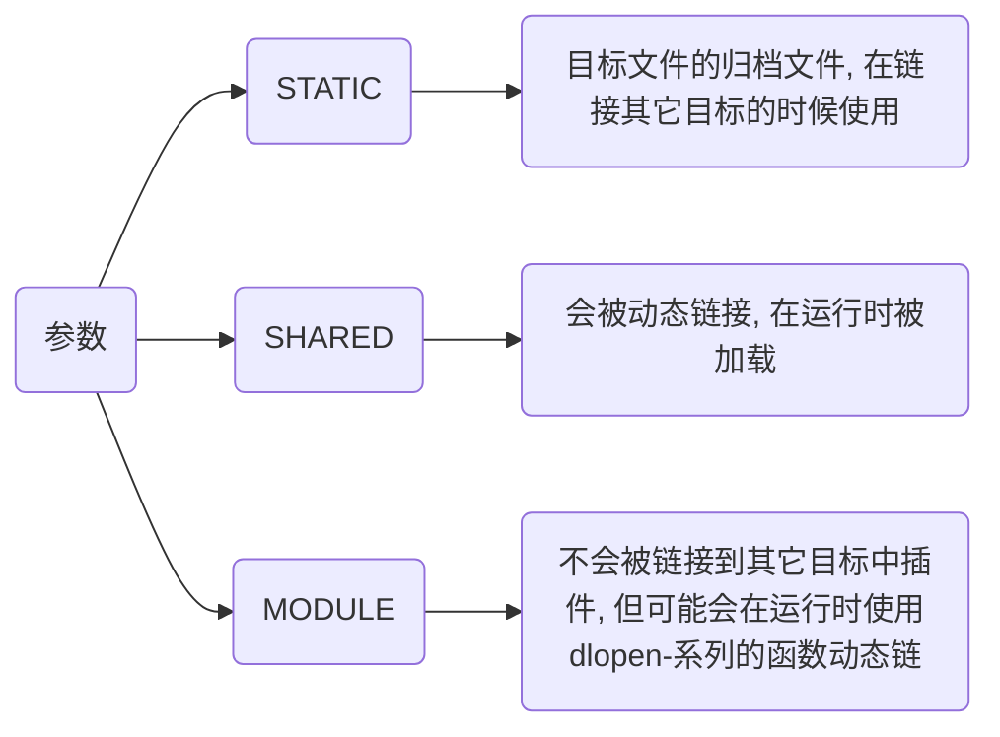

> - [CMAKE手册](https://www.zybuluo.com/khan-lau/note/254724)
> 
> - [用CMake构建工程时 cmake -G "Unix Makefiles" 的使用](https://blog.csdn.net/yangjia_cheng/article/details/111408753)

# CMake操作

## 过程


### 创建CMakeList.txt

```py
# 设置CMake的最低版本要求
cmake_minimum_required(VERSION 3.10)

# 设置项目名称
project(Hello)

# 设置C++标准(C++11)
set(CMAKE_CXX_STANDARD 11) 

set(SRC_LIST Main.cpp)

# 定义可执行文件
add_executable(Hello ${SRC_LIST})
```

### 配置

- 使用当前目录CMakeList.txt, 当目录构建

```sh
cmake build
```

- 使用当前目录CMakeList.txt, 指定Build目录构建

```sh
cmake -B Build
```

- 指定Source目录的CMakeList.txt, 指定构建目录Build

```sh
cmake -S Source -B Build
```

#### 执行分析

CMake 会读取并解析 CMakeLists.txt 文件、检查系统环境、依赖库、编译器设置等

将变量(如 CMAKE_CXX_STANDARD、CMAKE_BUILD_TYPE)等赋值

生成对应平台的构建文件, 例如在 Unix 系统上会生成 Makefile

#### 检测依赖

如果项目依赖第三方库(如 Boost、Qt 等), CMake 会在这一步检查这些库是否安装, 以及它们的位置

如果需要, CMake 会自动找到这些库并链接到工程中

### 生成

这一阶段 CMake 生成的构建系统文件将被调用, 开始实际编译和链接操作

#### 构建

- 当前目录编译

```sh
cmake --build .
```

- 在Build目录下编译

```sh
cmake --build Build
```

#### 编译源文件

构建系统会调用指定的编译器(如 g++ 或 clang++)来编译项目中的源代码文件(如 .cpp 文件)

CMake 会自动处理依赖关系, 如果某个源文件没有修改过, 那么它不会重新编译

#### 链接生成目标文件

编译器会将编译好的目标文件链接成最终的可执行文件或库文件(动态库或静态库)

链接器会根据 CMake 的配置将依赖的库文件正确地链接到目标文件中

#### 输出可执行文件或库

最终的可执行文件或库文件会出现在 CMake 配置的输出目录(通常是 build/ 目录)中


### 后处理

- 在build目录下安装

```sh
cmake --install build
```

#### 卸载

[卸载 make install 编译安装的软件](https://blog.csdn.net/reasonyuanrobot/article/details/106732047)

## 语法

### 设置

#### cmake_minimum_required

设置一个工程所需要的最低CMake版本

```cmake
cmake_minimum_required(VERSION major[.minor[.patch[.tweak]]] [FATAL_ERROR])
```

- 设置该工程最低CMake版本为3.10

```sh
cmake_minimum_required(VERSION 3.10)
```

#### project

设置项目名与版本

```sh
project(Test VERSION 1.0)
```

#### set

将一个CMAKE变量设置为给定值

```sh
set(<variable> <value> [[CACHE <type> <docstring> [FORCE]] | PARENT_SCOPE])
```

- 设置为C++版本为C++11

```sh
set(CMAKE_CXX_STANDARD 11)
```

### 添加

#### include_directories

为构建树添加包含路径

```sh
include_directories([AFTER|BEFORE] [SYSTEM] dir1 dir2 ...)
```

#### add_library

根据调用的命令里列出的源文件来创建库文件

```cmake
add_library(<name> [STATIC | SHARED | MODULE] [EXCLUDE_FROM_ALL] source1 source2 ... sourceN)
```

name 对应于逻辑目标名称, 在一个工程的全局域内必须唯一

待构建的库文件的实际文件名根据对应平台的命名约定来构造(比如lib<name>.a或者<name>.lib)



#### target_link_libraries

将库链接到可执行文件

```sh
target_link_libraries(MyExecutable PRIVATE MyLibrary)
```

#### add_subdirectory

为构建添加一个子路径

```sh
add_subdirectory(source_dir [binary_dir] [EXCLUDE_FROM_ALL])
```

source_dir选项指定了CMakeLists.txt源文件和代码文件的位置, 如果是相对路径会被解释为相对于当前的目录, 也可以是绝对路径

binary_dir选项指定了输出文件的路径, 如果是相对路径, 会被解释为相对于当前输出路径, 也可以是绝对路径. 

如果没有指定binary_dir, binary_dir的值将会是没有做任何相对路径展开的source_dir

### 生成

#### add_executable

生成可执行文件

```sh
add_executable([可执行文件名] [源文件])
```

### 安装

安装可执行文件到bin目录

```sh
install(TARGETS MyExecutable DESTINATION bin)
```

