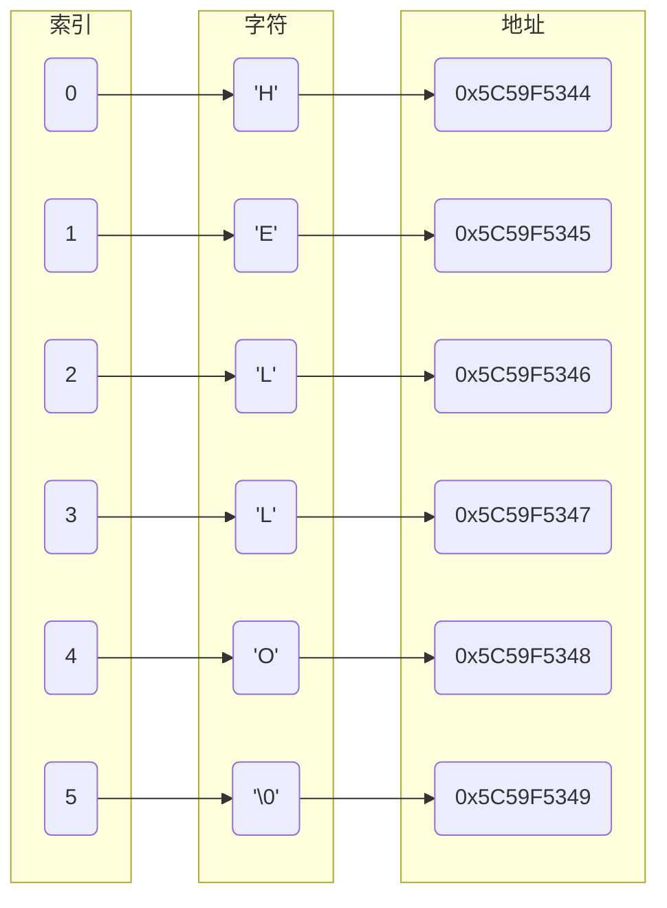
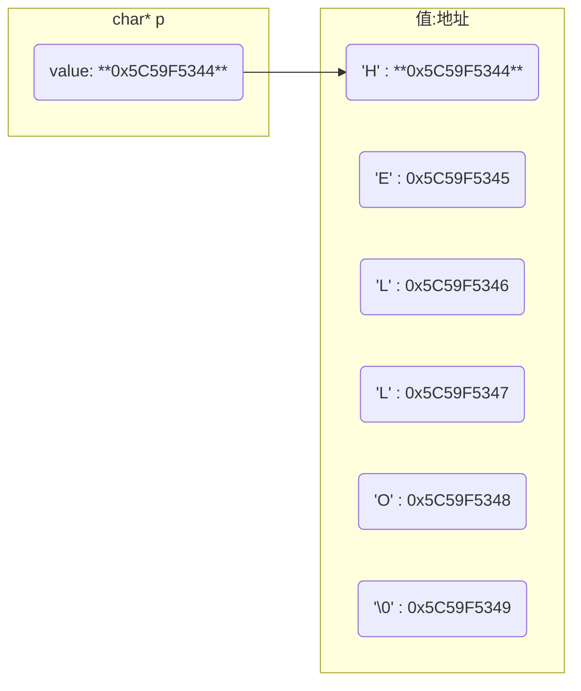
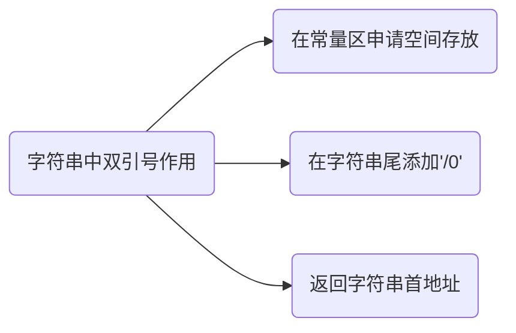

# 字符

`char` 类型实际存储整数

```c
char a = 'A';
```

变量a存储整数65, 即 'A'  ASCII 码值

## 字符数组

```c
char a[] = "HELLO";
```

字符数组用与存储字符, 通常用以表示字符串

C语言中字符串实际上是一维字符数组, 并以null 字符 `'\0'` 终止

- `'\0'`

`'\0'`是 ASCII 码表中第 0 个字符, 它不能显示也无控制功能, 唯一作用是作为字符数组结束标志

'a'为字符, 单引号只能定义一个字符

"a" 为字符串, 双引号可以定义多个字符, 由`" "`包围的字符串会自动在末尾添加`'\0'`

```c
#include <stdio.h>

int main() {
    char a[] = "HELLO";

    for (int i = 0; i < 5; i++) {
        printf("a[%d] = %c\n", i, a[i]);
    }

    return 0;
}
```



### 长度

字符数组长度是其包含字符数, 不含结束符`'\0'`, 例如 "abc" 长度是 3

$sizeof$ 获取字符数组所占内存空间大小, 包含`'\0'`

$strlen$ 获取字符数组到'\0'长度大小, 包含`'\0'`

```c
#include <stdio.h>
#include <string.h>

int main() {
    char a[] = "HELLO";

    // sizeof(a) = 6
    // strlen(a) = 5
    printf("sizeof(a) = %d\nstrlen(a) = %d\n", sizeof(a), strlen(a));
    return 0;
}
```

## char \*

字符指针是指向字符型数据变量的指针变量

其可以指向字符数组首元素, 也可以指向字符串常量

字符指针本身不分配内存用于存储字符

```c
// 将保存与常量存储区字符串首地址赋值给p
char *p = "Hello";

// 与上面代码等价, 注意此处不能理解为将字符串赋值给p
char *p;
p = "Hello";
```



将字符串"Hello"`首地址`赋给了 *p



定义字符指针后不能对其指向字符串进行下标操作, 因为指针只知道所指向内存单元地址, 而并不知道内存单元多大

```c
char *s = "hello";

// 错误
s[0] = 'a'
```

### 显示

显示时系统先输出字符指针p所指向字符串首字符, 然后会自动执行p++, 使p指向下个字符, 再次输出直至结束标志'\0'为止

输出字符指针指向的字符串时, 不可使用取值符`*`, 否则只会输出字符串首字符值

```c
char *p = "abcdef";

// a
printf("*p = %c\n", *p);

// abcdef
printf("p = %s\n", p);
```

### 输入

输入时, 字符指针必须指向一段存在地址, 否则就是野指针

若字符指针未初始化就调用, 运行时会报错 `Segmentation fault`

```c
char *p = (char *) malloc(sizeof(char) * 10);

scanf("%s", p);
```

### 修改

- 指针在栈区, 分配N个字节在堆区, 则字符串可以修改

```c
char *p = (char *) malloc(sizeof(char) * N);

scanf("%s", p);

// 可以
*(p + 2) = 'X';
```

- 指针在栈区, 字符串在常量区, 则字符串不可修改

```c
char *p = "aaaaa";

// 报错
*(p + 2) = 'X';
```

### 区别

- 与char[]

`char []`可以修改其中字符, `char *`不能修改其中字符

`char *`可以通过加减、自加减改变其值, `char []`不可以

- 与std::string

`char *`是指针, 由用户管理内存

`std::string` 是STL容器, 由系统管理内存


## 函数

```c
#include<string.h>
```

### strcmp

```c
int strcmp(const char *s1, const char *s2)
```

- 若 s1 == s2, 返回值 0

- 若 s1 < s2, 返回值小于 0

- 若 s1 > s2, 返回值大于 0

### strstr

```c
char *strstr(const char *s1, const char *s2)
```

查找 s2在s1中首次出现位置, 返回第一次出现s2位置, 若未找到则返回NULL

```c
const char haystack[20] = "RUNOOB";
const char needle[10] = "NOOB";
char *ret;

// NOOB
ret = strstr(haystack, needle);
```

### strcat

```c
char *strcat(char *dest, const char *src)
```

把 src 所指向字符串追加到 dest 所指向字符串结尾

```c
char src[50], dest[50];

strcpy(src, "AAAA");
strcpy(dest, "BBBB");

strcat(dest, src);

// BBBBAAAA
printf("%s\n", dest);
```

### strcpy

```c
char *strcpy(char *dest, const char *src)
```

把 src 所指向字符串复制到 dest

```c
char a[7] = "abcdef";
char b[4] = "ABC";

strcpy(a, b);

// ABC
printf("%s\n", a);
```

### strncpy

```c
char *strncpy(char *dest, const char *src, size_t n)
```

把 src 所指向字符串复制到 dest, 最多复制 n 个字符. 当 src 长度小于 n 时, dest 剩余部分将用空字节填充

### memset

```c
void *memset(void *str, int c, size_t n)
```

复制字符 c(一个无符号字符)到参数 str 所指向字符串前 n 个字符

| 参数 | 含义                   |
| ---- | ---------------------- |
| str  | 指向要填充的内存块     |
| c    | 要被设置值           |
| n    | 要被设置为该值的字符数 |

```c
int a[10];

// 给数组a赋值0
memest(a, 0, sizeof(a));
```

