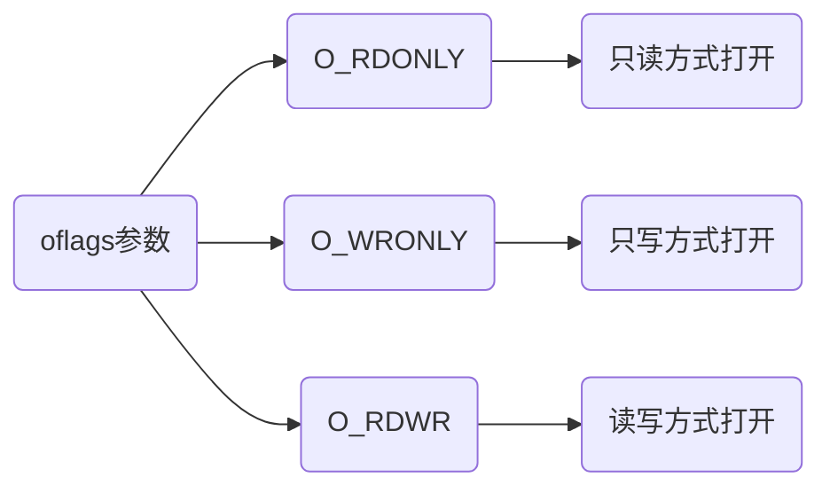

# IO系统调用

## write

write把缓冲区buf前nbytes个字节写入到与文件描述符fd关联文件中, 返回实际写入字节数

```c
size_t write(int fildes, const void *buf, size_t nbytes)
```

| 状态       | 返回值          |
| ---------- | -------------- |
| 正常写入   | 实际写入字节数   |
| 未写入数据 | 0              |
| 调用错误   | -1             |

```c
#include<stdio.h>
#include<stdlib.h>
#include<unistd.h>

int main(void) {
	const size_t WRITE_INFO_LEN = 18;
    const size_t ERR_INFO_LEN   = 46;

    const char* WEITE_INFO = "Here is some data\n";
    const char* ERR_INFO   = "A write error has occurred on file descriptor 1 \n";

    // 向fd1(屏幕)写入
    if (write(STDOUT_FILENO, WEITE_INFO, WRITE_INFO_LEN) != WRITE_INFO_LEN) {
        write(STDERR_FILENO, ERR_INFO, ERR_INFO_LEN);
    }
    return 0;
}
```

运行结果

```sh
Here is some data
```

### read

```c
#include<unistd.h>

size_t read(int fildes, void *buf, size_t nbytes)
```

从文件描述符fildes相关联的文件里读入nbytes个字节数据, 并放到数据区buf中

| 情况                       | 返回值           |
| -------------------------- | ---------------- |
| 正常写入                   | 实际读入字节数   |
| 未读入数据, 已经到达文件尾   | 0                |
| 调用错误                   | -1               |

```c
#include<stdio.h>
#include<stdlib.h>
#include<unistd.h>

int main(void) {
	const int READ_INFO_LEN      = 128;
	const int READ_ERR_INFO_LEN  = 26;
	const int WRITE_ERR_INFO_LEN = 27;

    char buffer[READ_INFO_LEN];

    // 从fd0(键盘)中读入
    int readRes = read(STDIN_FILENO, buffer, READ_INFO_LEN);
    if (readRes == -1) {
        write(STDERR_FILENO, "A read error has occurred\n", READ_ERR_INFO_LEN);
    }
    // 向fd1(屏幕)写入
    int writeRes = write(STDOUT_FILENO, buffer, readRes);
    if (writeRes != readRes) {
        write(STDERR_FILENO, "A write error has occurred\n", WRITE_ERR_INFO_LEN);
    }
    return 0;
}
```

运行结果

```sh
Hello
Hello
```

### open

```c
#include<fcntl.h>
#include<sys/types.h>
#include<sys/stat.h>

int open(const char *path, int oflags);
int open(const char *path, int oflags, mode_t mode);
```

创建新文件描述符, 调用成功后返回可以被read, write和其他系统调用那个使用的文件描述符



```c
#include<unistd.h>
#include<sys/stat.h>
#include<fcntl.h>
#include<stdlib.h>

int main(void) {
    char block[1024];
    int nread;

    int in  = open("file.in", O_RDONLY);
    int out = open("file.out", O_WRONLY|O_CREAT, S_IRUSR|S_IWUSR);
    while((nread = read(in, block, sizeof(block))) > 0) {
        write(out, block, nread);
    }
    return 0;
}
```

## FILE

```c++
#ifndef _FILE_DEFINED
struct _iobuf {
    // 文件输入下一个位置
    char *_ptr;
    // 当前缓冲区相对位置
    int _cnt;
    // 文件起始位置
    char *_base;
    // 文件标志
    int _flag;
    // 文件描述符id
    int _file;
    // 检查缓冲区状况,若无缓冲区则不读取
    int _charbuf;
    // 文件缓冲区大小
    int _bufsiz;
    // 临时文件名
    char *_tmpfname;
};

typedef struct _iobuf FILE;

#define _FILE_DEFINED
#endif
```

FILE结构是间接地操作系统文件控制块(FCB)来实现对文件操作

### 接口

#### fopen

```c
// 读文件到内存,返回文件信息结构指针
FILE *fopen(char *file, char *open_mode)
```