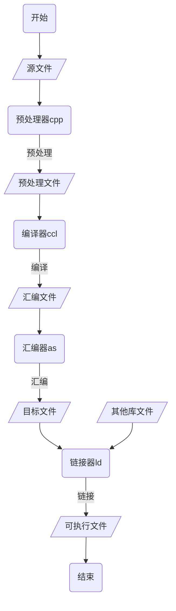
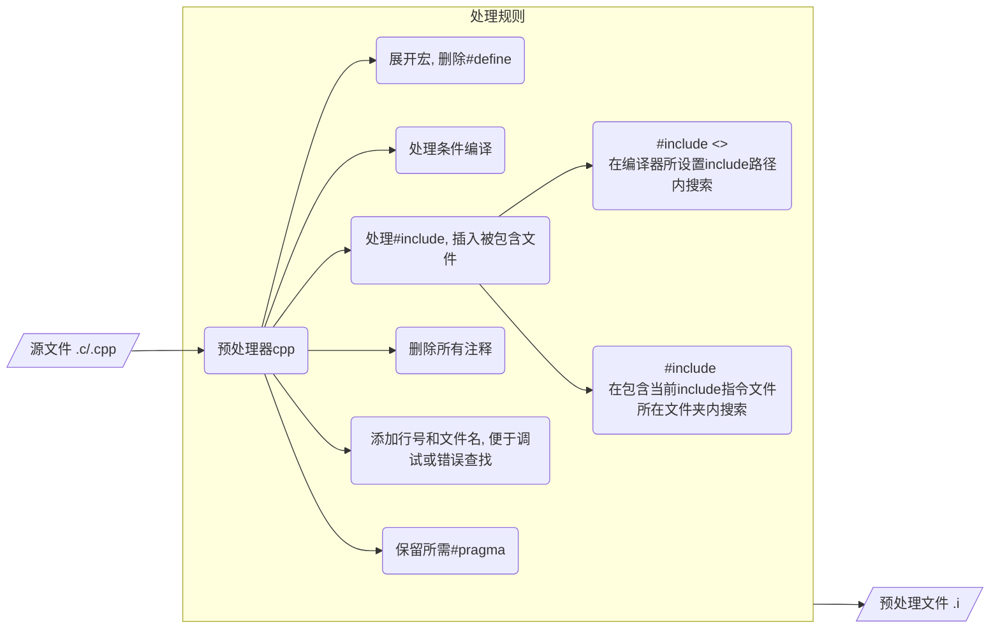
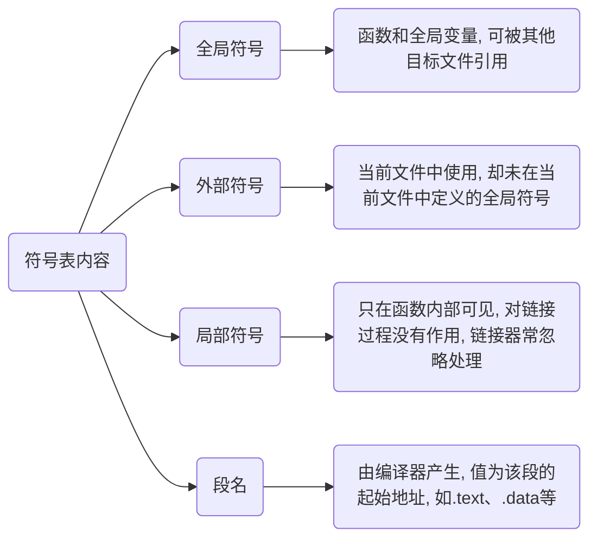
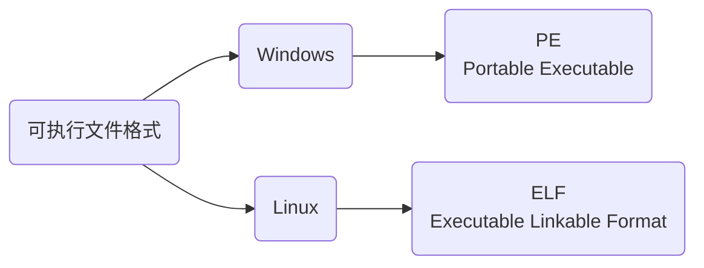
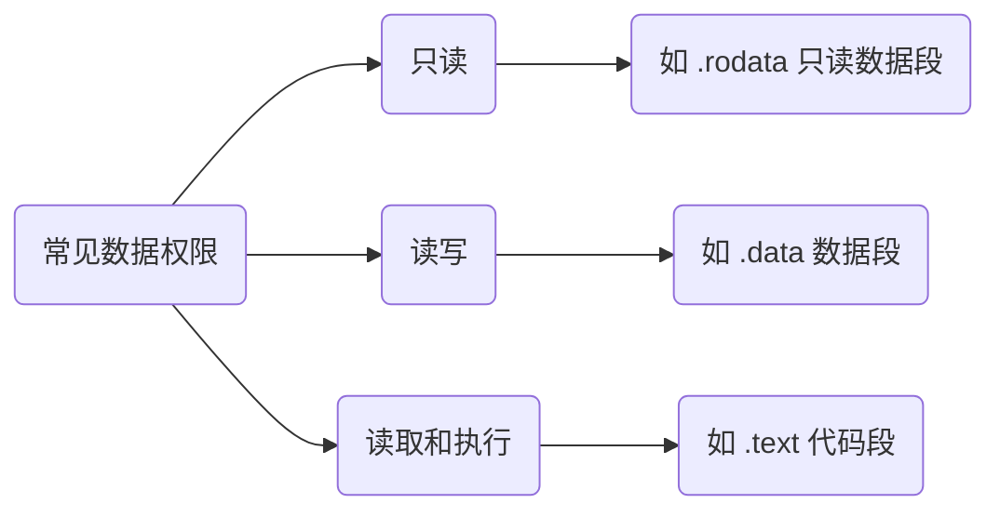

> - [强符号和弱符号](https://www.cnblogs.com/zjuhaohaoxuexi/p/16221088.html)

# 编译过程



> - [源代码路径](https://github.com/dmjcb/SelfBlog/tree/main/Resource/ExampleCode/C_C%2B%2B/CompilationProcess)

定义Hello.h, Hello.c, Main.c

```c
#include<stdio.h>

void Hello();
```

```c
#include"Hello.h"

void Hello() {
    printf("Hello World\n");
}
```

```c
#include"Hello.h"

int main() {
    Hello();

    return 0;
}
```

## 预处理 Preprocessing



预处理器`cpp`按上图中处理源文件, 生成`.i`后缀预处理文件, 处理后代码体积会增加

```sh
# -E 表示只执行到预处理
# -o 用于指定输出文件名
gcc *.c -E -o *.i
```

对Hello.c, Main.c进行预处理, 预处理后文件体积变大


## 编译 Compilation


编译器`ccl`将预处理后`.i`文件进行系列词法分析、语法分析、语义分析以及优化后生成`.s`汇编文件

```sh
# -S 表示只执行到预处理
# -o 用于指定输出文件名
gcc *.i -S -o *.s
```


Hello.s

```c
        .file   "Hello.c"
        .text
        .section        .rodata
.LC0:
        .string "Hello World"
        .text
        .globl  Hello
        .type   Hello, @function
Hello:
.LFB0:
        .cfi_startproc
        endbr64
        pushq   %rbp
        .cfi_def_cfa_offset 16
        .cfi_offset 6, -16
        movq    %rsp, %rbp
        .cfi_def_cfa_register 6
        leaq    .LC0(%rip), %rdi
        call    puts@PLT
        nop
        popq    %rbp
        .cfi_def_cfa 7, 8
        ret
        .cfi_endproc
.LFE0:
        .size   Hello, .-Hello
        .ident  "GCC: (Ubuntu 9.4.0-1ubuntu1~20.04.2) 9.4.0"
        .section        .note.GNU-stack,"",@progbits
        .section        .note.gnu.property,"a"
        .align 8
        .long    1f - 0f
        .long    4f - 1f
        .long    5
0:
        .string  "GNU"
1:
        .align 8
        .long    0xc0000002
        .long    3f - 2f
2:
        .long    0x3
3:
        .align 8
4:
```

Main.s

```c
        .file   "Main.c"
        .text
        .globl  main
        .type   main, @function
main:
.LFB0:
        .cfi_startproc
        endbr64
        pushq   %rbp
        .cfi_def_cfa_offset 16
        .cfi_offset 6, -16
        movq    %rsp, %rbp
        .cfi_def_cfa_register 6
        movl    $0, %eax
        call    Hello@PLT
        movl    $0, %eax
        popq    %rbp
        .cfi_def_cfa 7, 8
        ret
        .cfi_endproc
.LFE0:
        .size   main, .-main
        .ident  "GCC: (Ubuntu 9.4.0-1ubuntu1~20.04.2) 9.4.0"
        .section        .note.GNU-stack,"",@progbits
        .section        .note.gnu.property,"a"
        .align 8
        .long    1f - 0f
        .long    4f - 1f
        .long    5
0:
        .string  "GNU"
1:
        .align 8
        .long    0xc0000002
        .long    3f - 2f
2:
        .long    0x3
3:
        .align 8
4:
```

## 汇编 Assemble

汇编器`as`将汇编代码转换为机器语言, 生成`.o`二进制目标文件


```sh
# -c 表示只执行到汇编阶段
# -o 用于指定输出文件名
gcc *.s -c -o *.o
```


### 目标文件

经过编译器预处理、编译、汇编过程所生成能被CPU直接识别的二进制文件称为目标文件($Object$ $File$)

从文件结构上来讲, 目标文件与可执行文件组织形式非常类似, 只是有些变量和函数地址还未确定, 导致不能执行

#### 结构

目标文件将编译后机器指令代码、数据、符号表、调试信息、字符串等以 $Section$ 形式存储

目标文件在 $x86-64$ $Linux$ 和 $Unix$ 系统中使用可执行可链接格式即 (ELF), 典型 elf 可重定位目标文件格式如下


段名大都以`.`作为前缀, 表示系统保留

| 段  名              | 说  明                                                                                                |
| ------------------- | ---------------------------------------------------------------------------------------------------- |
| ELF Header          | 文件头, 描述整个目标文件属性, 包括是否可执行、属于动态/静态链接、入口地址值、目标硬件/操作系统、段表偏移等信息 |
| .text               | 代码段, 存放编译后机器指令, 即各个函数二进制代码                                                         |
| .data               | 数据段, 存放全局变量和静态变量                                                                          |
| .rodata             | 只读数据段, 存放一般常量、字符串常量等                                                                  |
| .rel.text .rel.data | 重定位段, 包含了目标文件中需要重定位全局符号以及重定位入口                                                |
| .comment            | 注释信息段, 存放编译器版本信息, 比如"GCC:(GUN) 4.2.0"                                                   |
| .debug              | 调试信息                                                                                              |
| .line               | 调试时的行号表, 即源代码行号与编译后指令对应表                                                           |  
| Section Table       | Section表, 描述 ELF 文件包含的所有Section信息, 如Section名、长度、在文件中偏移、读写权限以及其他属性        |
| .strtab             | 字符串表, 保存了 ELF 文件用到的字符串, 比如变量名、函数名、段名等                                          |
| .symtab             | 符号表, 保存了全局变量名、局部变量名、函数名等在字符串表中的偏移                                           |

ELF 文件的Section结构是由段表来决定, 编译器、链接器和装载器都是依靠Section表来定位和访问各个Section

因为字符串长度往往不定, 所以用固定结构来表示比较困难, 常见做法就是把字符串集中起来存放到字符串表中, 然后使用字符串在表中偏移来引用字符串

除了这些系统保留段名, 应用程序也可以使用其它名字定义自己Section, 应用程序自定义Section不建议使用.作为前缀, 否则容易和系统保留段发生冲突

#### 分类

- 可执行文件 (Executable File)

包含可以直接执行程序

例如 Linux下a.out, Windows下.exe

现在PC平台上流行可执行文件格式均为COFF格式变种

Windows 下为 PE (Portable Executable)

Linux 下为 ELF (Executable Linkable$ Format)

- 可重定位文件 (Relocatable File)

包含代码和数据, 可被用来链接成可执行文件或者共享目标文件

例如静态链接库, Linux下`.o`/`.a`, Windows下`.obj` 和 `.lib`

- 共享目标文件 (Shared Object File)

包含了代码和数据, 可在以下两种情况使用

(1) 链接器可用这种文件跟其他可重定位文件链接, 产生新目标文件

(2) 动态链接器可以将将共享目标文件和其他可执行文件结合, 作为进程一部分运行

例如, linxu下`.so` 以及Windows下`.dll`

- 核心转储文件 (Core Dump File)

当进程意外终止时, 系统用来存储该进程地址空间内容以及其他信息

例如, Linux 下 core dump

## 链接 Linking

链接器`ld`将多个目标文件以及所需库文件(如`.so`)组织成可执行文件(executable file)

```sh
g++ *.o  -o [可执行文件]
```


链接(Linking)通过`符号`处理各模块之间相互引用部分, 使得各模块能够正确衔接, 最终组合成独立程序

例如当Main.o 中处理符号U Hello时, 链接器会在各模块中寻找, 在Hello.o找到该符号后, 就能组合这两个目标文件

### 链接器

上述程序有两个模块 Main.c 和 Hello.c, 在 Hello.c 中定义函数 Hello(), 并在 Main.c中调用

所有模块被编译成可执行文件后, 每处 Hello() 函数调用都会被替换为一个绝对地址

#### 修正

由于各模块单独编译, 编译器在处理 Main.c 时并不知道 Hello() 地址, 需要到最后链接时再修正

- 手动修正

若无链接器, 则必须手工修正 Hello() 地址

当 Module.c 被修改并重新编译时, Hello() 地址极有可能改变, 则在 Main.c 中所有使用Func() 函数处都需重新调整地址

- 链接器修正

链接器会根据符号 Hello 自动去 Hello.c 模块查找 Hello() 地址, 然后将 Main.c 中所有使用 Hello 指令重新修正, 让其目标地址成为真正 Hello() 函数地址

#### 静态链接

在程序运行之前确定符号地址为静态链接(Static Linking)

函数代码将从其所在静态链接库中被拷贝到最终可执行程序中, 该程序被执行时这些代码将被装入到该进程虚拟地址空间中

静态链接库实际上是一个目标文件集合, 其中每个文件含有库中一个或者一组相关函数代码

#### 动态链接

等到程序运行期间再确定符号地址为动态链接(Dynamic Linking)

库文件所内符号地址是在程序运行期间确定, 所以称为动态链接库(Dynamic Linking Library)

函数代码被放到动态链接库或共享对象某个目标文件中, 链接程序此时只是在最终可执行程序中记录下共享对象名字以及其它少量登记信息

可执行文件被执行时, 动态链接库全部内容将被映射到运行时相应进程虚地址空间, 根据可执行程序中记录信息找到相应函数代码执行

### 符号

函数和变量在本质上都是地址助记符, 在链接过程中称为`符号`(Symbol)

符号信息, 包括当前符号在字符串表中偏移、符号在段中偏移、符号所占用字节数、符号类型等

#### 符号表

目标文件中符号表(Symbol Value), 段名为`.symtab`, 记录文件中用到的所有符号, 包括



#### 重定位

链接器原理是找到`符号`地址, 或者把指令中使用到地址加以修正, 此过程称为符号决议(Symbol Resolution)或者重定位(Relocation)

例如在 a.c 中有一个 int 类型全局变量 var, 在 b.c 中对它赋值 42

```c
int32_t var = 42;
```

对应汇编代码

```c
mov 0x2a, var
```

mov 用来将一份数据移动到一个存储位置, 这里表示将 0x2a 移动到 var 符号代表位置, 也就是对 var 变量赋值

当被编译成目标文件后, 得到机器指令

```c
c705  00000000  0000002a
```

由于编译时不知道变量 var 地址, 编译器将这条 mov 指令目标地址设置为 0, 等到将目标文件 a.o 和 b.o 链接时, 再由链接器修正

假设生成可执行文件后变量 var 地址为 0x1100, 则机器指令变为

```c
c705  00001100  0000002a
```

这种地址修正过程就是重定位, 每个需被修正地方叫做一个重定位入口(Relocation Entry)

重定位所做工作就是修正程序中每个绝对地址引用位置, 使它们指向正确地址

#### 符号决议(Symbol Resolution)

链接时, 链接器首先扫描所有目标文件, 获得各个段长度、属性、位置等信息, 并将目标文件中所有(符号表中)符号收集起来, 统一放到一个全局符号表

在这一步中, 链接器会将目标文件中各个段合并到可执行文件, 并计算出合并后各个段长度、位置、虚拟地址等

在目标文件符号表中, 保存了各个符号在段内偏移, 生成可执行文件后, 原来各个段(Section)起始位置虚拟地址就确定了下来, 这样使用起始地址加上偏移量就能够得到符号地址(在进程中虚拟地址)

这种计算符号地址过程被称为**符号决议**(Symbol Resolution)

重定位表.rel.text和.rel.data中保存了需要重定位全局符号以及重定位入口, 完成了符号决议, 链接器会根据重定位表调整代码中地址, 使它指向正确内存位置

至此, 可执行文件就生成

#### 全局变量和局部变量

当程序被加载到内存后, 全局变量要在数据区(全局数据区)分配内存, 局部变量要在栈上分配内存

数据区在程序运行期间一直存在, 全局变量位置不会改变, 地址也固定, 所以在链接时就能够计算出全局变量地址

而栈区内存会随着函数调用不断被分配和释放, 局部变量地址不能预先计算, 必须等到发生函数调用时才能确定, 所以链接过程会忽略局部变量

关于局部变量定位, 就是 ebp 加上偏移量, 这在编译阶段就能给出计算公式(一条简单语句), 程序运行后, 只要执行这条语句, 就能够得到局部变量地址

链接一项重要任务就是确定函数和全局变量地址, 并对每一个重定位入口进行修正

### 重定义错误

编写代码过程中经常会遇到符号重复定义(Multiple Definition)错误, 这是因为在多个源文件中定义了同名全局变量, 并都进行初始化

例如在 File1.c 中定义了全局变量 gValue

```c
int gValue = 10;
```

在 File2.c 中又对 gValue 进行了定义

```c
int gValue = 20;
```

链接时就会出现错误

```sh
b.o: multiple definition of `g_value`
a.o: first defined here
```

#### 强弱符号

- 强符号

C语言中, 编译器默认函数和已初始化全局变量为`强符号`($Strong$ $Symbol$)

因为其拥有确切数据, 即变量有值, 函数有函数体

- 弱符号

未初始化全局变量为`弱符号`(Weak Symbol), 因为还未被初始化, 没有确切数据

#### 处理规则

链接器处理被多次定义强符号和弱符号规则为

- 不允许强符号被多次定义, 即不同目标文件中不能有同名强符号

- 若有多个强符号, 那么链接器会报符号重复定义错误

- 若一个符号在某个目标文件中是强符号, 在其他文件中是弱符号, 那么选择强符号

- 若一个符号在所有目标文件中都是弱符号, 那么选择其中占用空间最大的一个

比如目标文件 a.o 定义全局变量 g_value 为 int 类型, 占用4个字节, 目标文件 b.o 定义 g_value 为 double 类型, 占用8个字节, 那么被链接后, 符号 g_value 占用8个字节

尽量不要使用多个不同类型弱符号, 否则有时候很难发现程序错误

- 例1 

GCC 中, 可以通过`__attribute__((weak))`来强制定义任何一个符号为弱符号

```c
extern int ext;

int weak1;
int strong = 100;

__attribute__((weak)) int weak2 = 2;

int main(){
    return 0;
}
```

weak1 和 weak2 是弱符号, strong 和 main 是强符号,

ext 既非强符号也非弱符号, 它是一个对外部变量引用(使用)

- 例2

```c
// main.c
#include <stdio.h>
// 弱符号
__attribute__((weak)) int a = 20;

__attribute__((weak)) void func() {
    printf("C Language\n");
}

int main(){
    printf("a = %d\n", a);
    func();
    return 0;
}
```
```c
// module.c
#include <stdio.h>

// 强符号
int a = 9999;

void func(){
    printf("www.baidu.com\n");
}
```

```c
$gcc main.c module.c
$./a.out
a = 9999
www.baidu.com
```

在 main.c 中, a 和 func 都是弱符号, 在 module.c 中, a 和 func 都是强符号, 强符号会覆盖弱符号, 所以链接器最终会使用 module.c 中符号

`__attribute__((weak))` 只对链接器有效, 对编译器不起作用, 编译器不区分强符号和弱符号, 只要在一个源文件中定义两个相同符号, 不管它们是强是弱, 都会报Multiple Definition 错误

- 例3

```c
#include <stdio.h>
__attribute__((weak)) int a = 20;

int a = 9999;

int main() {
    printf("a = %d\n", a);
    return 0;
}
```

代码在编译阶段就会报错, 编译器会认为变量 a 被定义了两次, 属于重复定义

开发库时, 可以将某些符号定义为弱符号, 这样就能够被用户定义的强符号覆盖, 从而使得程序可以使用自定义版本的函数, 增加灵活性

## 可执行文件



### 结构

可执行文件组织形式和目标文件非常类似, 也被划分成多个部分


带阴影表示可执行文件增加段, 另外删除了可重定位段(.rel.text,.rel.data)以及 Section Table

目标文件包含了10个左右段, 而可执行文件包含了将近30个左右段, 上面两张图只列出了一些关键段, 剩下段都隐藏在Other Data(其他数据)

不同颜色箭头表明了可执行文件应该被加载到地址空间何处区域, 操作系统并不是为每个段都分配一个区域, 而是将多个具有相同权限段合并在一起, 加载到同一个区域

站在文件结构角度, 可执行文件包含了众多Section [ˈseɡmənt], 每个Section都有不同作用

站在加载和执行角度, 所有段都是数据, 操作系统只关心数据权限, 只要把相同权限数据加载到同一个内存区域, 程序就能正确执行



将一块连续、具有相同权限数据称为一个 Segment, 其由多个权限相同 Section 构成

#### Segment 错误

Linux 出现过Segment fault(段错误)错误, 这种错误发生在程序执行期间, 在编译和链接时无法检测, 一般因代码权限不足导致

```c
#include <stdio.h>

char *str = "www.baidu.com";

int main() {
    str[1] = '@';
    return 0;
}
```

程序执行到 6 行时就会出现 Segment fault

因为字符串 str 保存在地址空间常量区, 只能读取不能写入, 修改字符串显然是越权操作

#### 比较

目标文件中, Section Table用来描述各个 Section 信息, 包括名字、长度、在文件中偏移、读写权限等, 通过Section Table可以详细地了解目标文件结构

可执行文件中, Section Table被删除, 以程序头表(Program Header Table)取代

程序头表用来描述各个 Segment 信息, 包括类型、偏移、在进程虚拟地址空间中起始地址、物理装载地址、长度、权限等

操作系统就是根据程序头表将可执行文件加载到内存, 并为各个 Segment 分配内存空间、确定起止地址

可执行文件不再关注具体文件结构, 而是关注程序加载和执行过程

由于可执行文件在加载时实际上是被映射虚拟地址空间, 所以可执行文件很多时候又被叫做映像文件(Image)

#### Section合并

链接(Linking)作用就是将多个目标文件合并成一个可执行文件

在链接过程中, 链接器会将多个目标文件中代码段、数据段、调试信息等合并成可执行文件中一个段

段合并仅是简单叠加过程

- 合并有用段(例如代码段、数据段等)

- 链接器还会删除多余段(例如重定位段、段表等)

- 增加其他段(例如程序头表等)
