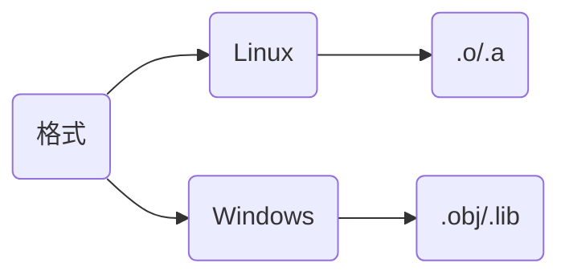
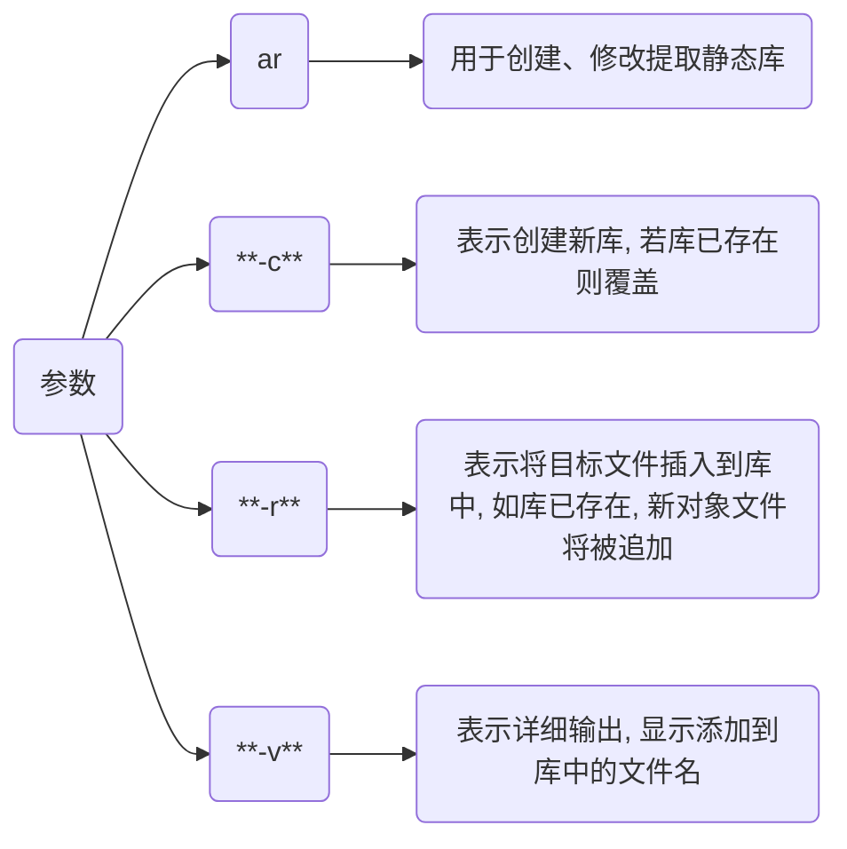

# 静态库



## 概念

TODO

## 编写

```c++
#ifndef __HELLO_HPP__
#define __HELLO_HPP__

#include <stdio.h>

void hello();

#endif
```

```c
#include "hello.h"

void hello() {
    printf("Hello World!\n");
}
```

```c
// main.c
#include "hello.h"

int main(void) {
    hello();
    return 0;
}
```

`-c` 只激活预处理, 编译, 和汇编, 仅生成.o 目标文件

```c
gcc hello.c -c -o hello.o
```

### Linux

```sh
ar hello.o -crv libhello.a 
```



### 链接

```c
gcc main.c -c -o main.o

gcc main.o libhello.a -o main
```

## 使用

TODO
