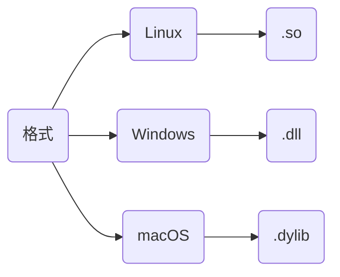
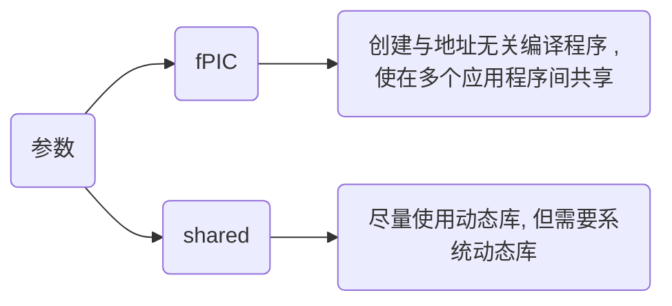

# 动态库

## 概念

动态库(Dynamic Library), 又称动态链接库(Dynamic Link Library, DLL), 是一种在程序运行时加载的库文件

它与静态库主要区别在于动态库代码并不在程序编译时直接包含, 而是在程序执行时根据需要动态加载

### 特点

- 运行时加载

动态库代码在程序运行时才被加载到内存, 而非编译时就包含在可执行文件中, 使得程序可在需要时才使用特定库功能, 从而节省内存

- 共享性

多个程序可以共享同一个动态库实例, 意味若多应用程序使用相同库, 则可共享内存中相同代码, 减少资源占用

- 版本控制

动态库可以单独更新, 不需要重新编译依赖于它的应用程序, 若功能更改, 用户只需替换库文件, 而不必重新编译所有相关程序

- 支持多语言

动态库通常可以被多种编程语言调用, 使得在不同开发环境中非常灵活



## 开发

下面是一个动态库示例示例代码, 设生成目标动态库HelloAPI.dll/so

HelloAPI.hpp

```c++
#include <iostream>

#ifndef __INCLUDE_DLL_HPP__
#define __INCLUDE_DLL_HPP__

#if defined(_WIN32)
    #define DLL_EXPORT __declspec(dllexport)
    #define DLL_IMPORT __declspec(dllimport)
#elif defined(__linux__)
    #define DLL_EXPORT __attribute__((visibility("default")))
    #define DLL_IMPORT
#endif

#ifdef __cplusplus
extern "C" {
#endif

DLL_EXPORT void Hello();

#ifdef __cplusplus
}
#endif

#endif
```

HelloAPI.cpp

```c++
#include "HelloAPI.hpp"

void Hello() {
    std::cout << "Hello World" << std::endl;
}
```

### 特性

在创建动态库时, C和C++有一些关键差异特性

#### 命名修饰(Name Mangling)

C++支持函数重载, 导致C++编译器会对函数名称进行称为名称修饰的特殊编码, 以区分不同函数签名, 而C语言不存在此种情况

若在C++中需要导出C风格接口(即无名称修饰), 需用 `extern "C"` 告知编译器按C语言规则导出

```c++
#ifdef __cplusplus
extern "C" {
#endif

// ...

#ifdef __cplusplus
}
#endif
```

#### 导出符号(Symbol Export)

为将函数从动态库中导出被其他程序使用, 需在函数前添加导出语句出函数符号

```c++
#ifdef _WIN32
    #define DLL_EXPORT __declspec(dllexport)
    #define DLL_IMPORT __declspec(dllimport)
#elif defined(__linux__)
    #define DLL_EXPORT __attribute__((visibility("default")))
    #define DLL_IMPORT
#endif

// 此时库中Hello函数才能被其他程序调用
DLL_EXPORT void Hello();
```

### 编译

> [完整代码路径](https://github.com/dmjcb/SelfBlog/tree/main/Resource/Code/Example/C_C%2B%2B/LibraryDemo/HelloAPI)

#### 命令行



```sh
g++ [*.cpp] -fPIC -shared -o [*.so/*.dll]
```

将HelloAPI.hpp与HelloAPI.cpp生成HelloAPI动态库


#### CMake

CMakeLists.txt

```cmake
cmake_minimum_required(VERSION 3.16)
 
project(HelloAPI)

# 添加动态库
add_library(${PROJECT_NAME} SHARED "")

# 添加库文件
target_sources(${PROJECT_NAME} PUBLIC ${CMAKE_SOURCE_DIR}/HelloAPI.cpp)
```


#### xmake

xmake.lua

```lua
add_rules("mode.debug", "mode.release")

target("HelloAPI")
    set_kind("shared")
    add_files("HelloAPI.cpp")
```


### 分类

#### 源文件不含类

不含类时生成动态库可直接调用

例如上面HelloAPI.hpp与HelloAPI.cpp所生成动态库

#### 源文件含类

> [完整代码路径](https://github.com/dmjcb/SelfBlog/tree/main/Resource/Code/Example/C_C%2B%2B/LibraryDemo/MyClassDLL)

MyClass.hpp

```c++ 
#include <iostream>

class MyClass {
public:
    MyClass() = default;
    ~MyClass() = default;
    void SetValue(const int val);
    void Print() const;
private:
    int mValue;
};
```

MyClass.cpp

```c++ 
#include "MyClass.hpp"

void MyClass::SetValue(const int val) {
    this->mValue = val;
}
void MyClass::Print() const {
    std::cout << "mValue = " << mValue << std::endl;
}
```

- 类调用

以类调用时, 需增加导出符号, 修改MyClass.hpp如下

```c++
#include <iostream>

#ifdef _WIN32
    #define DLL_EXPORT __declspec(dllexport)
    #define DLL_IMPORT __declspec(dllimport)
#else
    #define DLL_EXPORT __attribute__((visibility("default")))
    #define DLL_IMPORT
#endif

class DLL_EXPORT MyClass {
public:
    MyClass() = default;
    ~MyClass() = default;
    void SetValue(const int val);
    void Print() const;
private:
    int mValue;
};
```

- 测试

Main.cpp

```c++
#include "MyClass.hpp"
int main() {
    MyClass myClass;
    myClass.SetValue(0xFFFF);
    myClass.Print();
    return 0;
}
```

CMakeLists.txt

```cmake
cmake_minimum_required(VERSION 3.16)
 
project(MyClassAPI)

add_library(${PROJECT_NAME} SHARED "")

target_sources(${PROJECT_NAME} PUBLIC${CMAKE_SOURCE_DIR}/MyClass.cpp)

add_executable(Main Main.cpp)

target_link_libraries(Main ${PROJECT_NAME})
```


- 函数式调用

若通过函数调用, 则需于类外再封装一层调用

MyClassDLL.hpp

```c
#include "MyClass.hpp"

#ifdef _WIN32
    #define DLL_EXPORT __declspec(dllexport)
    #define DLL_IMPORT __declspec(dllimport)
#else
    #define DLL_EXPORT __attribute__((visibility("default")))
    #define DLL_IMPORT
#endif

#ifdef __cplusplus
extern "C" {
#endif
    DLL_EXPORT void* MyClassCreate();
    DLL_EXPORT void  MyClassDestroy(void* handle);
    DLL_EXPORT void  MyClassSetValue(void* handle, int val);
    DLL_EXPORT void  MyClassPrint(void* handle);    
#ifdef __cplusplus
}
#endif
```

MyClassDLL.cpp

```c++
#include "MyClassDLL.hpp"

DLL_EXPORT void* MyClassCreate() {
    return new MyClass();
}
DLL_EXPORT void MyClassDestroy(void* handle) {
    delete static_cast<MyClass*>(handle);
}
DLL_EXPORT void MyClassSetValue(void* handle, int val) {
    MyClass* obj = static_cast<MyClass*>(handle);
    obj->SetValue(val);
}
DLL_EXPORT void MyClassPrint(void* handle) {
    MyClass* obj = static_cast<MyClass*>(handle);
    obj->Print();
}
```

测试

Main.cpp

```c++
#include "MyClassDLL.hpp"
int main() {
    void* handle = MyClassCreate();
    MyClassSetValue(handle, 0xFFFF);
    MyClassPrint(handle);
    MyClassDestroy(handle);
    return 0;
}
```

CMakeLists.txt

```cmake
cmake_minimum_required(VERSION 3.16)
 
project(MyClassDLLAPI)

add_library(${PROJECT_NAME} SHARED "")

target_sources(${PROJECT_NAME} PUBLIC
    ${CMAKE_SOURCE_DIR}/MyClass.cpp
    ${CMAKE_SOURCE_DIR}/MyClassDLL.cpp
)

add_executable(Main Main.cpp)

target_link_libraries(Main ${PROJECT_NAME})
```


#### 模板

> [完整代码路径](https://github.com/dmjcb/SelfBlog/tree/main/Resource/Code/Example/C_C%2B%2B/LibraryDemo/TemplateDLL)

TemplateDLL.hpp

```c++
#ifndef __INCLUDE_TEMPLATE_DLL_HPP__
#define __INCLUDE_TEMPLATE_DLL_HPP__

#include <iostream>

#ifdef _WIN32
    #define DLL_EXPORT __declspec(dllexport)
    #define DLL_IMPORT __declspec(dllimport)
#else
    #define DLL_EXPORT __attribute__((visibility("default")))
    #define DLL_IMPORT
#endif

// 模板函数
template<typename T>
T Sub(T x, T y);

// 模板类
template<typename T>
class TemplateDLL {
public:
    TemplateDLL() = default;
    ~TemplateDLL() = default;

    static T Add(T x, T y);
};

#endif
```

TemplateDLL.cpp

```c++
#include "TemplateDLL.hpp"

// 模板实例化
template DLL_EXPORT int Sub<int>(int, int);
template DLL_EXPORT double Sub<double>(double, double);

template class DLL_EXPORT TemplateDLL<int>;
template class DLL_EXPORT TemplateDLL<double>;
template class DLL_EXPORT TemplateDLL<std::string>;

template<typename T>
T Sub(T x, T y) {
    return T(x - y);
}

template<typename T>
T TemplateDLL<T>::Add(T x, T y) {
    return T(x + y);
}
```

- 测试

Main.cpp

```c++
#include "TemplateDLL.hpp"

int main() {
    std::cout << Sub<int>(0xA, 0xB) << std::endl;
    std::cout << Sub<double>(1.234, 9.876) << std::endl;

    std::cout << TemplateDLL<int>::Add(0xA, 0xB) << std::endl;
    std::cout << TemplateDLL<double>::Add(1.234, 9.876) << std::endl;
    std::cout << TemplateDLL<std::string>::Add("Hello", "World") << std::endl;
    return 0;
}
```

CMakeLists.txt

```cmake
cmake_minimum_required(VERSION 3.16)
 
project(TemplateDLL)

add_library(${PROJECT_NAME} SHARED "")

target_sources(${PROJECT_NAME} PUBLIC ${CMAKE_SOURCE_DIR}/TemplateDLL.cpp)

add_executable(Main Main.cpp)

target_link_libraries(Main ${PROJECT_NAME})
```


## 使用

### 链接

若有生成动态库的.h/.hpp文件, 可直接链接库文件

调用上面HelloAPI动态库

```c++
// Main.cpp
#include "HelloAPI.hpp"

int main(void) {
    Hello();
    return 0;
}
```

#### 命令行

```sh
g++ [源文件] [库文件] -o [可执行文件]
```


若报找不到库文件错误, 移动库文件到`/usr/lib`目录即可

#### CMake

CMakeLists.txt

```cmake
cmake_minimum_required(VERSION 3.16)
 
project(Main)

add_library(HelloAPI SHARED "")

target_sources(HelloAPI PUBLIC ${CMAKE_SOURCE_DIR}/HelloAPI.cpp)

add_executable(${PROJECT_NAME} "")

target_sources(${PROJECT_NAME} PRIVATE ${CMAKE_SOURCE_DIR}/Main.cpp)

target_link_libraries(${PROJECT_NAME} HelloAPI)
```


### 系统函数

读取动态库仍为HelloAPI, 设当前无头文件, 且知悉待调用库中函数名称, 则可通过系统函数进行库调用

```c++
// Main.cpp
#include<iostream>

#if defined (_WIN32) | defined (_WIN64)
    #include<windows.h>
#elif defined (__linux__)
    #include <dlfcn.h>
#endif

typedef void(*VoidFunc)();

int main() {
    // 加载
#if defined (_WIN32) | defined (_WIN64)
	HMODULE handle = LoadLibrary("HelloAPI.dll");
    if (!handle) {
        std::cerr << "无法加载动态库: " << GetLastError() << std::endl;
    }

    VoidFunc helloFunc = (VoidFunc)GetProcAddress(handle, "Hello");
    if (helloFunc == nullptr) {
        std::cerr << "无法找到函数: " << GetLastError() << std::endl;
		FreeLibrary(handle);
    }

#elif defined (__linux__)
	void* handle = dlopen("HelloAPI.so", RTLD_LAZY | RTLD_LOCAL);
    if (!handle) {
        std::cerr << "无法加载动态库: " << dlerror() << std::endl;
    }

    VoidFunc helloFunc = (VoidFunc)dlsym(handle, "Hello");
    if (helloFunc == nullptr) {
        std::cerr << "无法找到函数: " << dlerror() << std::endl;
        dlclose(handle);
    }
#endif

    // 调用
    helloFunc();

    // 卸载
#if defined (_WIN32) | defined (_WIN64)
    FreeLibrary(handle);
#elif defined (__linux__)
    dlclose(handle);
#endif
    return 0;
}
```

Linux编译时需链接动态链接库的加载器库`dl`, Windows则不需要

#### 命令行

```sh
g++ Main.cpp -o Main (-ldl)
```


#### CMake

CMakeLists.txt

```cmake
cmake_minimum_required(VERSION 3.16)
 
project(Main)

add_executable(${PROJECT_NAME} "")

target_sources(${PROJECT_NAME} PRIVATE ${CMAKE_SOURCE_DIR}/Main.cpp)

if(CMAKE_HOST_SYSTEM_NAME MATCHES "Linux")
    target_link_libraries(${PROJECT_NAME} dl)
endif()
```


#### xmake

xmake.lua

```lua
add_rules("mode.debug", "mode.release")

target("Main")
    set_kind("binary")
    add_files("Main.cpp")

    add_links("HelloAPI")
    add_linkdirs(".")
    if is_os("linux") then
        add_syslinks("dl")
    end
```


### IDE调用

#### VS2022

创建解决方案Project与动态链接库项目DllTest, 在Project项目中调用DllTest中生成的动态库


- 编写

DllTest/pch.h 

```c++
#include <iostream>

#define DLLEXPORT __declspec(dllexport)

#ifdef __cplusplus
extern "C" {
#endif
    DLLEXPORT void PrintInfo();
    DLLEXPORT int Add(int x, int y);
#ifdef __cplusplus
}
#endif
```

DllTest/pch.cpp

```c++
void PrintInfo() {
    std::cout << "Hello World" << std::endl;
}
int Add(int x, int y) {
    return x + y;
}
```


此时生成动态库DllTest.dll与动态库的导入库DllTest.lib


- 使用

将pch.h 与生成的DllTest.dll、DllTest.liub拷贝到Project项目中


新建Main.cpp

```c++
#include "pch.h"

int main() {
    PrintInfo();
    std::cout << Add(1, 2) << std::endl;
}
```


添加DllTest.lib路径, 用于导入动态库


运行结果


## 查看

### 查看依赖库

```sh
ldd [可执行文件]
```