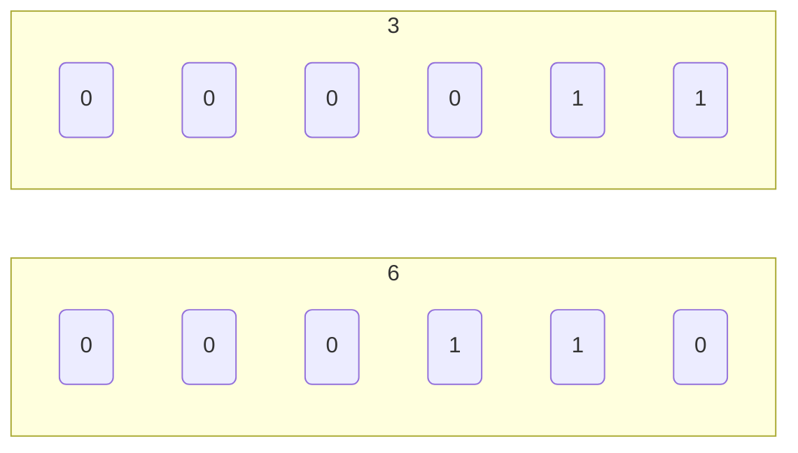
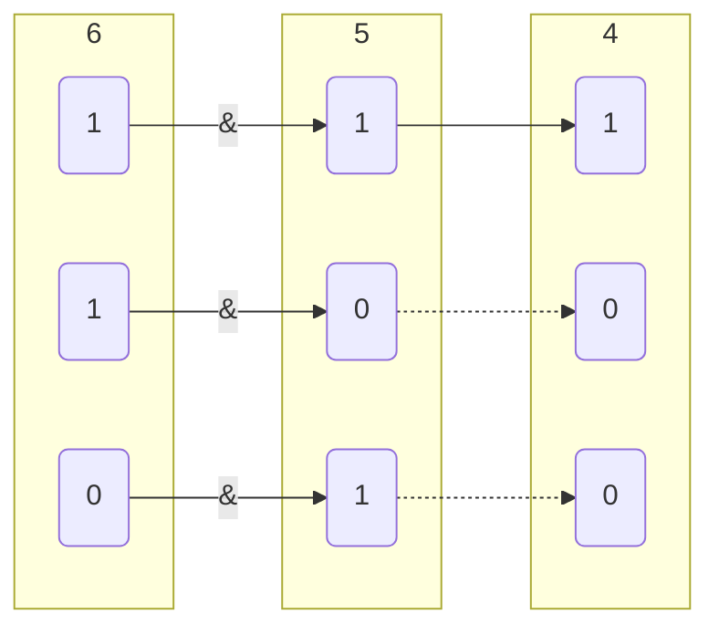
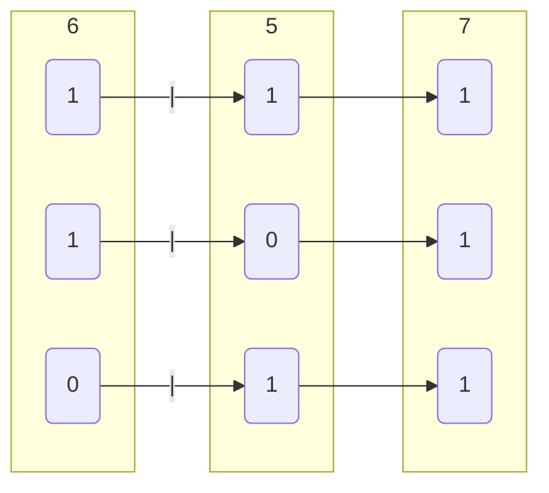
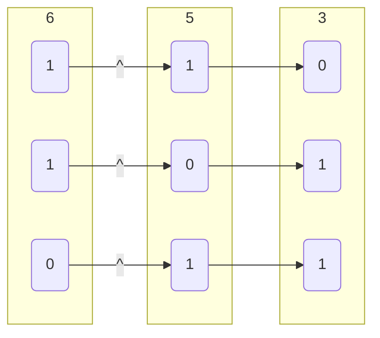
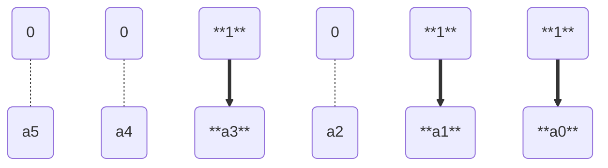

# 位运算

## 位移

### 左移

$a$左移$n$位, 相当于乘$2^{n}$

```c
a << n
```

```c
// 6
3 << 1

// 0110
00110 << 1
```



```c
// 12
3 << 2

// 1100
001100 << 2
```

### 右移

$a$右移$n$位, 相当于除$2^{n}$

```c
a >> n
```

```c
// 3
6 >> 1

// 0011
0110 >> 1
```


- 获取$x$的第$i$位值

```c
x >> (i - 1) 或 x & (1 << (i - 1))
```

### 位与

```c
a & b
```

```c
// 4
6 & 5
```



- 获取数字区间值

```c
a = 0x12345678;

// 获取数字低8位值
a & 0xFF

// 获取数字低10位值
a & 0x3FF

// 获取数字10-19位值
(a >> 10) & 0x3FF
```

### 位或

```c
a | b
```

```c
// 7
6 | 5
```



- 数字组合

```c
int r = 0;

unsigned char v[4] = {0x12, 0x34, 0x56, 0x78};

r |= (v[1] << 24);
r |= (v[2] << 16);
r |= (v[3] << 8);
r |= v[4];

// 0x12345678
printf("%x\n", r);
```

### 异或

```c
a ^ b
```

```c
// 3
6 ^ 5
```



- 交换变量值

```c
void swap(int &a, nt &b){
    a = a ^ b; 
    b = b ^ a;
    a = a ^ b;
}
```

## 二进制枚举

含$n$个元素($a_1$, $a_2$ $\cdots$ $a_n$)集合$a_n$, 其子集个数为$2^n - 1$

对于集合 $a_n$ 第 $i$ 个子集, 可用$i$ 二进制值每一位值表示子集包含情况, 如下表 

| 子集序号  | 序号二进制值                     | 子集大小 | 包含元素               |
| -------- | ------------------------------- | -------- | --------------------- |
| $1$      | $\underbrace{00 \cdots 0001}_n$ | $1$      | $a_1$                 |
| $2$      | $\underbrace{00 \cdots 0010}_n$ | $1$      | $a_2$                 |
| $3$      | $\underbrace{00 \cdots 0011}_n$ | $2$      | $a_1, a_2$            |
| $4$      | $\underbrace{00 \cdots 0100}_n$ | $1$      | $a_3$                 |
| $5$      | $\underbrace{00 \cdots 0101}_n$ | $2$      | $a_1, a_3$            |
| $6$      | $\underbrace{00 \cdots 0110}_n$ | $2$      | $a_2, a_3$            |
| $7$      | $\underbrace{00 \cdots 0111}_n$ | $3$      | $a_1, a_2, a_3$       |
| $\cdots$ | $\cdots$                        | $\cdots$ | $\cdots$              |
| $2^n$    | $\underbrace{11 \cdots 1111}_n$ | $n$      | $a_1, a_2 \cdots a_n$ |

对于子集 $i$, 若 $i$ 二进制值第 $x$ 位为 $1$, 则子集包含$a_x$元素, 若为 $0$则子集不包含$a_x$元素

因此 $i$ 二进制值中含1数量即为子集大小

### 子集内容

集合$a_n$, 根据 $i$($1$~$2^n$ ($\underbrace{0000 \cdots 0001}_n$ ～ $\underbrace{1111 \cdots 1111}_n$))二进制值中`1`位置, 可确定子集包含元素

对于含 $5$ 个元素集合$a_n$, 其第 $11$ 个子集因$(11)_2 =  01011$, 第$0, 1, 3$位为$1$, 因此包含$a_0, a_1, a_3$三个元素



### 子集大小

集合$a_n$第$i$个子集, $i$二进制中含`1`数量为子集大小

对于含 $5$ 个元素集合$a_n$, 其 $11$ 个子集, 因为11二进制中含三个1, 则子集大小为$3$

- C

```c++
// 元素数量
const int n = 5;

int a(5) = {1, 2, 3, 4, 5};

for(int i = 1; i <= (1 << n); i++){
    for(int j = 0; j < n; j++){
        // 若子集i中第j位为1, 则子集i包含a(j)
        if ((i >> j) & 1){
            // 选择a(j)
        }
    }
}
```

- Python

```py
n = 3

a = [...]

for i in range(1, 1 << n):
    for j in range(n):
        if (i >> j) & 1:
            ...
```
