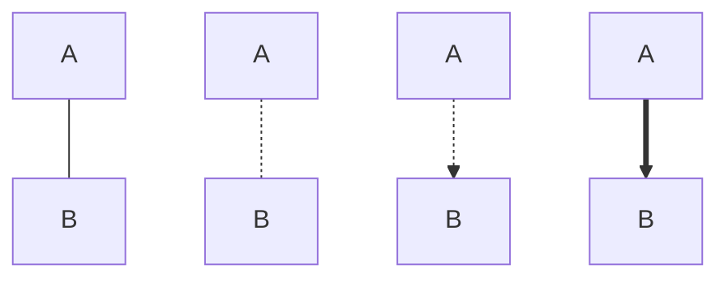
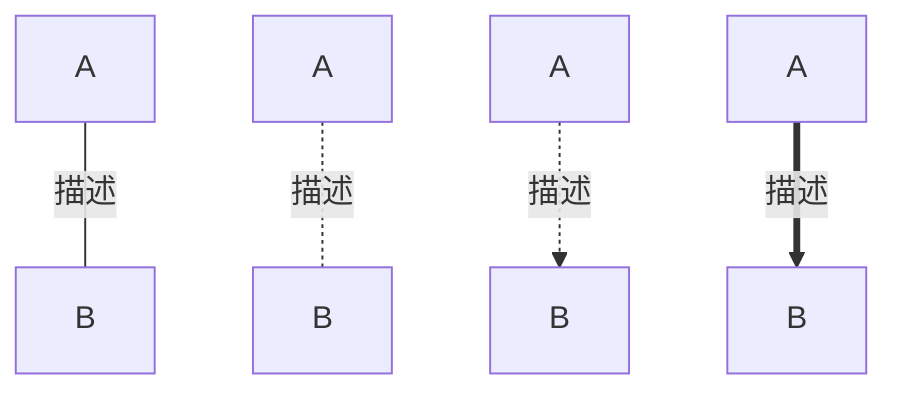
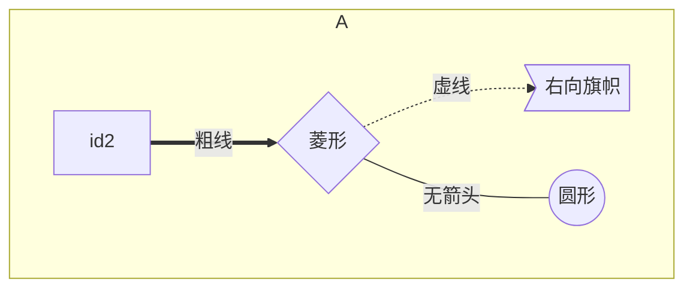

# Markdown基本语法

## 表格

使用\begin{array}{列样式}…\end{array} 创建表格

列样式可以是clr 表示居中, 左, 右对齐, 还可以使用| 表示一条竖线

表格中各行使用\\ 分隔, 各列使用& 分隔, 使用\hline 在本行前加入一条直线

$$
\begin{array}{c|lcr}
n & \text{Left} & \text{Center} & \text{Right} \\
\hline
1 & 0.24 & 1 & 125 \\
2 & -1 & 189 & -8 \\
3 & -20 & 2000 & 1+10i \\
\end{array}
$$

```sh
$$
\begin{array}{c|lcr}
n & \text{Left} & \text{Center} & \text{Right} \\
\hline
1 & 0.24 & 1 & 125 \\
2 & -1 & 189 & -8 \\
3 & -20 & 2000 & 1+10i \\
\end{array}
$$
```

## 图片

### 本地图片

```sh

```

### Base64格式

base64编码长, 影响文档排版

```sh
![图片名, 可选][Base64_ID]

...
[Babse64_ID]:data:image/png;base64.....
```

### 图床

需在有网络条件下浏览

```sh

```

## 流程图

代码块标签`mermaid`

### 方向

| 方向     | 代码 |
| -------- | ---- |
| 从上到下 | TB   |
| 从下到上 | BT   |
| 从左到右 | LR   |
| 从右到左 | RL   |

### 形状

节点图像由节点ID, 描述文字组成


```sh
graph TB
    A[方形]
    B(圆角形)
    C((圆形))
    D>旗形]
    E{菱形}
```

### 连接

| 指令                        | 连接方式         |
| --------------------------- | -------------- |
| A -- B<br>A -- 描述 -- B    | A不带箭头指向B   |
| A -.- B<br>A -. 描述 .- B   | A虚线指向B       |
| A -.-> B<br>A -. 描述 .-> B | A带箭头虚线指向B |
| A ==> B<br>A == 描述 ==> B  | A加粗箭头指向B   |





### 流程图

```mermaid
graph LR
```

```sh
graph LR
```

#### 子图



```sh
graph TB
  subgraph A
   id2==粗线==>id3{菱形}
   id3-.虚线.->id4>右向旗帜]
   id3--无箭头---id5((圆形))
  end
```