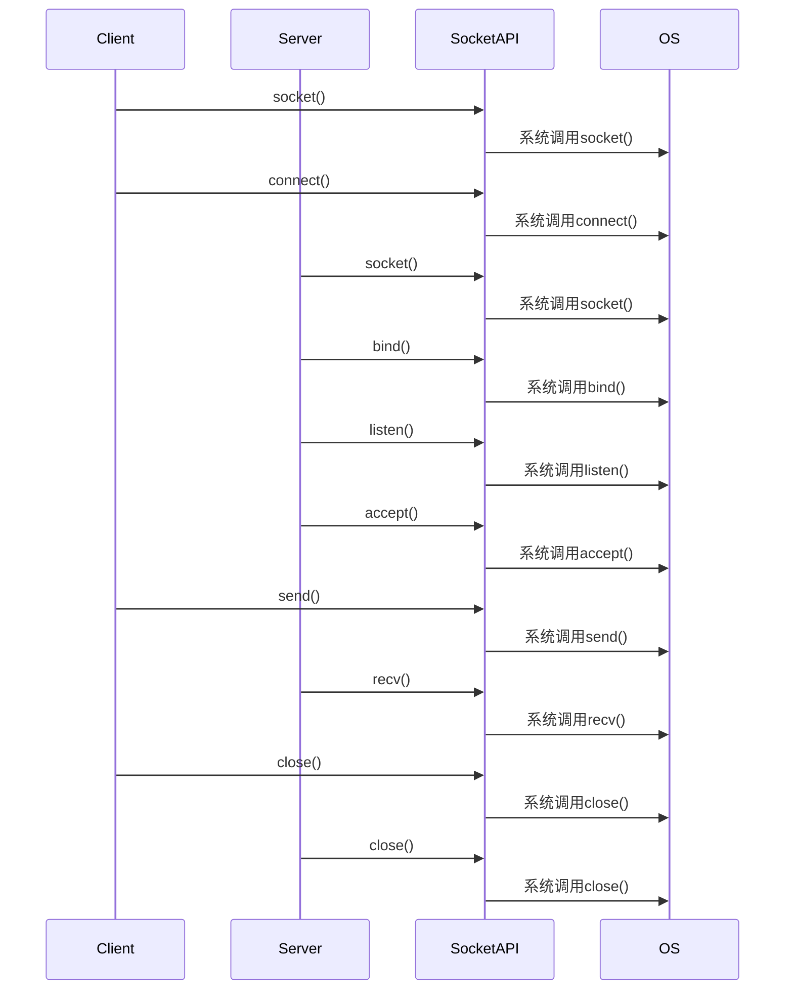

# Socket

## 流程图

```mermaid
sequenceDiagram
    participant Client
    participant Server
    participant SocketAPI
    participant OS

    Client->>SocketAPI: socket()
    SocketAPI->>OS: 系统调用socket()
    Client->>SocketAPI: connect()
    SocketAPI->>OS: 系统调用connect()

    Server->>SocketAPI: socket()
    SocketAPI->>OS: 系统调用socket()
    Server->>SocketAPI: bind()
    SocketAPI->>OS: 系统调用bind()
    Server->>SocketAPI: listen()
    SocketAPI->>OS: 系统调用listen()
    Server->>SocketAPI: accept()
    SocketAPI->>OS: 系统调用accept()

    Client->>SocketAPI: send()
    SocketAPI->>OS: 系统调用send()
    Server->>SocketAPI: recv()
    SocketAPI->>OS: 系统调用recv()

    Client->>SocketAPI: close()
    SocketAPI->>OS: 系统调用close()
    Server->>SocketAPI: close()
    SocketAPI->>OS: 系统调用close()
```