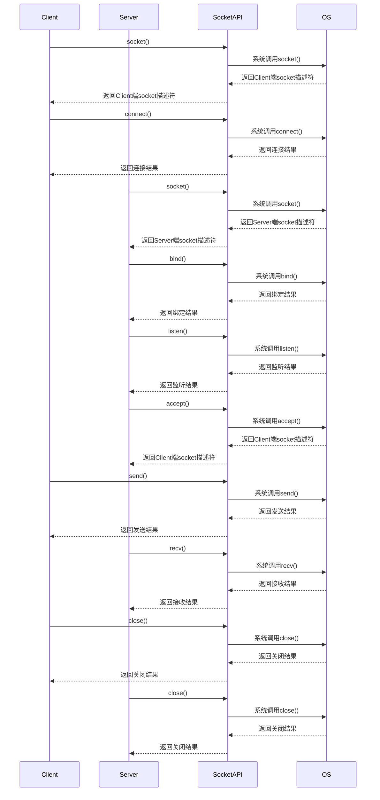

<!--
 * @Description: 
 * @Version: 1.0
 * @Author: 
 * @Email: 
 * @Date: 2023-11-21 23:22:12
 * @LastEditors: dmjcb
 * @LastEditTime: 2023-11-21 23:55:46
-->
# Socket

## 流程图

```mermaid
sequenceDiagram
    participant Client
    participant Server
    participant SocketAPI
    participant OS

    Client->>SocketAPI: socket()
    SocketAPI->>OS: 系统调用socket()
    OS-->>SocketAPI: 返回Client端socket描述符
    SocketAPI-->>Client: 返回Client端socket描述符
    Client->>SocketAPI: connect()
    SocketAPI->>OS: 系统调用connect()
    OS-->>SocketAPI: 返回连接结果
    SocketAPI-->>Client: 返回连接结果

    Server->>SocketAPI: socket()
    SocketAPI->>OS: 系统调用socket()
    OS-->>SocketAPI: 返回Server端socket描述符
    SocketAPI-->>Server: 返回Server端socket描述符
    Server->>SocketAPI: bind()
    SocketAPI->>OS: 系统调用bind()
    OS-->>SocketAPI: 返回绑定结果
    SocketAPI-->>Server: 返回绑定结果
    Server->>SocketAPI: listen()
    SocketAPI->>OS: 系统调用listen()
    OS-->>SocketAPI: 返回监听结果
    SocketAPI-->>Server: 返回监听结果
    Server->>SocketAPI: accept()
    SocketAPI->>OS: 系统调用accept()
    OS-->>SocketAPI: 返回Client端socket描述符
    SocketAPI-->>Server: 返回Client端socket描述符

    Client->>SocketAPI: send()
    SocketAPI->>OS: 系统调用send()
    OS-->>SocketAPI: 返回发送结果
    SocketAPI-->>Client: 返回发送结果
    Server->>SocketAPI: recv()
    SocketAPI->>OS: 系统调用recv()
    OS-->>SocketAPI: 返回接收结果
    SocketAPI-->>Server: 返回接收结果

    Client->>SocketAPI: close()
    SocketAPI->>OS: 系统调用close()
    OS-->>SocketAPI: 返回关闭结果
    SocketAPI-->>Client: 返回关闭结果
    Server->>SocketAPI: close()
    SocketAPI->>OS: 系统调用close()
    OS-->>SocketAPI: 返回关闭结果
    SocketAPI-->>Server: 返回关闭结果
```