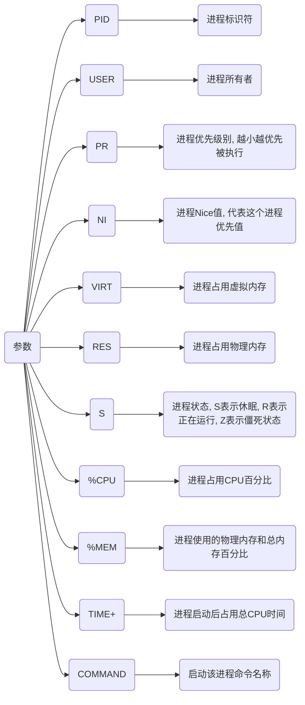
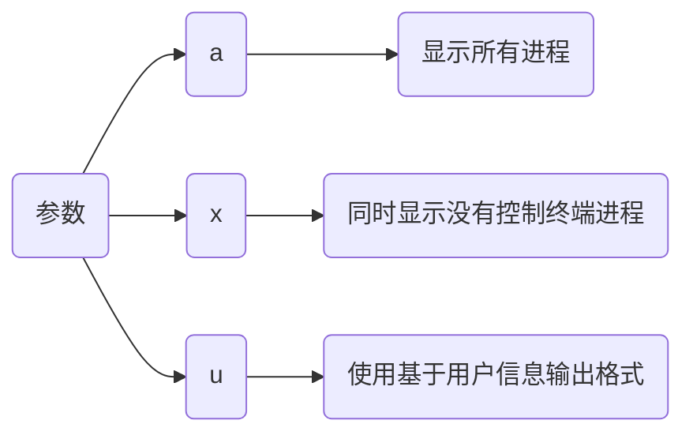
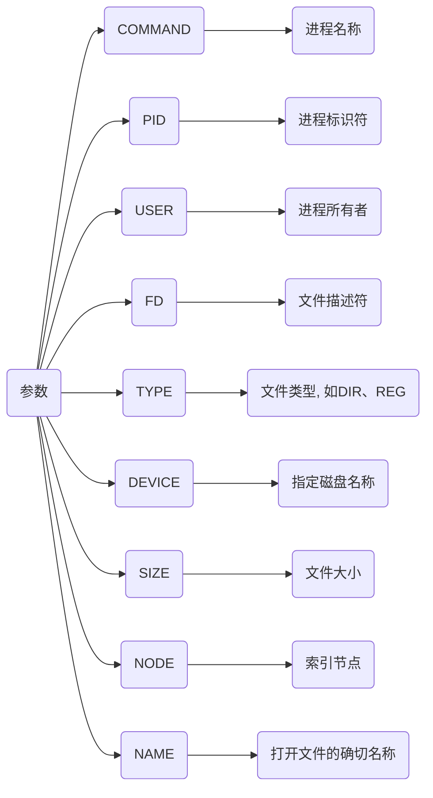

# 系统指令

## 内存指令

## top

```sh
dmjcb@Casper:~$ top
top - 21:28:09 up 40 days, 11:35,  2 users,  load average: 0,06, 0,05, 0,01
任务: 383 total,   1 running, 382 sleeping,   0 stopped,   0 zombie
%Cpu(s):  0,0 us,  0,1 sy,  0,0 ni, 99,9 id,  0,0 wa,  0,0 hi,  0,0 si,  0,0 st
MiB Mem :  27741,4 total,  16843,6 free,   2096,8 used,   8801,1 buff/cache
MiB Swap:   2048,0 total,   2048,0 free,      0,0 used.  25137,8 avail Mem

 进程号 USER      PR  NI    VIRT    RES    SHR    %CPU  %MEM     TIME+ COMMAND
    843 root      20   0 2761484  51444  33728 S   0,7   0,2 328:37.90 containerd
 297491 root      20   0       0      0      0 D   0,7   0,0   0:04.13 kworker/u32:1+mt76
    671 root      20   0       0      0      0 S   0,3   0,0  26:40.35 napi/phy0-8193
 277920 dmjcb     20   0  921336  82276  55988 S   0,3   0,3  17:55.69 gnome-system-mo
 297791 root      20   0       0      0      0 I   0,3   0,0   0:01.20 kworker/14:0-events
 298432 dmjcb     20   0   17788   4464   3672 R   0,3   0,0   0:00.05 top
      1 root      20   0  169804  13320   8484 S   0,0   0,0   1:26.01 systemd
      2 root      20   0       0      0      0 S   0,0   0,0   0:00.59 kthreadd
      3 root       0 -20       0      0      0 I   0,0   0,0   0:00.00 rcu_gp
      4 root       0 -20       0      0      0 I   0,0   0,0   0:00.00 rcu_par_gp
      5 root       0 -20       0      0      0 I   0,0   0,0   0:00.00 slub_flushwq
      6 root       0 -20       0      0      0 I   0,0   0,0   0:00.00 netns
      8 root       0 -20       0      0      0 I   0,0   0,0   0:00.00 kworker/0:0H-events_highpri
     10 root       0 -20       0      0      0 I   0,0   0,0   0:00.00 mm_percpu_wq
     11 root      20   0       0      0      0 S   0,0   0,0   0:00.00 rcu_tasks_rude_
...
```



### free

```sh
free [参数]
```

| 参数 | 含义               |
| ---- | ------------------ |
| 空   | 用KB为单位展示数据 |
| -m   | 用MB为单位展示数据 |
| -g   | 用GB为单位展示数据 |

```sh
dmjcb@Casper:~$ free -m
              总计         已用        空闲      共享    缓冲/缓存    可用
内存:       27741        2127       16459       79       9154       25106
交换:        2047           0        2047
```

| 结果       | 含义                |
| ---------- | ------------------ |
| total      | 总计物理内存大小     |
| used       | 已使用内存大小       |
| free       | 可用内存大小         |
| shared     | 多个进程共享内存总额  |
| buff/cache | 磁盘缓存大小          |
| available  | 可用内存大小          |

#### 清理内存

```sh
sudo sh -c "echo [参数] > /proc/sys/vm/drop_caches"

# sudo sh -c "echo 3 > /proc/sys/vm/drop_caches"
```

| 参数 | 含义                                   |
| ---- | ------------------------------------- |
| 0    | 系统默认值, 表示不释放内存, 由OS自动管理 |
| 1    | 释放页缓存                             |
| 2    | 释放dentries和inodes                   |
| 3    | 释放所有缓存                           |

## 进程指令

### ps

```sh
ps -aux
```



```sh
dmjcb@Casper:~$ ps -aux
USER         PID %CPU %MEM    VSZ   RSS TTY      STAT START   TIME COMMAND
root           1  0.0  0.0 169804 13320 ?        Ss   Қыр22   1:24 /sbin/init splash
root           2  0.0  0.0      0     0 ?        S    Қыр22   0:00 [kthreadd]
root           3  0.0  0.0      0     0 ?        I<   Қыр22   0:00 [rcu_gp]
root           4  0.0  0.0      0     0 ?        I<   Қыр22   0:00 [rcu_par_gp]
root           5  0.0  0.0      0     0 ?        I<   Қыр22   0:00 [slub_flushwq]
root           6  0.0  0.0      0     0 ?        I<   Қыр22   0:00 [netns]
root           8  0.0  0.0      0     0 ?        I<   Қыр22   0:00 [kworker/0:0H-events_highpri]
root          10  0.0  0.0      0     0 ?        I<   Қыр22   0:00 [mm_percpu_wq]
...
```

- 查看指定进程pid

```sh
ps -aux | grep 进程名
```

其中带中括号命令(如 [kthreadd])并不是真正命令而是内核线程

- 查看指定端口

```sh
ps -ef | grep 端口号
```

### lsof

```sh
lsof -i:[端口号]
```

```sh
dmjcb@Casper:~$ lsof -i:8000
COMMAND    PID  USER   FD   TYPE  DEVICE SIZE/OFF NODE NAME
python3 290967 dmjcb    3u  IPv4 4194431      0t0  TCP *:8000 (LISTEN)
```



```sh
netstat -tunlp | grep [端口号]
```

```sh
dmjcb@Casper:~$ netstat -tunlp | grep 8000
(并非所有进程都能被检测到，所有非本用户的进程信息将不会显示，如果想看到所有信息，则必须切换到 root 用户)
tcp        0      0 0.0.0.0:8000            0.0.0.0:*               LISTEN      290967/python3
```

### nohup

no hang up(不挂起), 用于在系统后台不挂断地运行命令, 退出终端不会影响程序运行

默认情况(非重定向)时, 会输出nohup.out到当前目录, 若当前目录nohup.out文件不可写, 则输出重定向到${HOME}/nohup.out文件

```sh
nohup command [arg...] &
```

| 参数    | 含义                         |
| ------- | --------------------------- |
| command | 要执行命令                 |
| arg     | 一些参数, 可以指定输出文件    |
| &       | 让命令在后台或终端退出后仍执行 |

后台运行python

```sh
dmjcb@Casper:~$ nohup python3 -m http.server &
[1] 298532
dmjcb@Casper:~$ nohup: 忽略输入并把输出追加到'nohup.out'
^C
dmjcb@Casper:~$ jobs
[1]+  运行中               nohup python3 -m http.server &
dmjcb@Casper:~$ fg %1
nohup python3 -m http.server
```

### 前后台进程

- 前台进程

交互式进程, 由某个终端会话创建和控制, 需要用户控制, 不能作为系统服务自动启动

- 后台进程

非交互式进程, 不和终端绑定的进程, 不等待用户输入

| 指令        | 效果                                                 |
| ----------- | --------------------------------------------------- |
| 命令后加`&` | 后台执行命令, 可通过 jobs 查看当前任务                 |
| fg %n       | 将后台执行的第n个进程调到前台执行                      |
| ctrl + Z    | 将一个正在前台执行的命令放到后台, 并处于暂停状态不可执行 |
| bg          | 让前台程序后台继续执行                                |

后台运行Python进程

```sh
dmjcb@Casper:~$ python3 -m http.server &
[1] 298523
dmjcb@Casper:~$ Serving HTTP on 0.0.0.0 port 8000 (http://0.0.0.0:8000/) ...
^C
dmjcb@Casper:~$ jobs
[1]+  运行中               python3 -m http.server &
dmjcb@Casper:~$ fg %1
python3 -m http.server
^Z
[1]+  已停止               python3 -m http.server
dmjcb@Casper:~$ bg
[1]+ python3 -m http.server &
```

## 网络命令

### 查看

```sh
ifconfig
```

### 启动

```sh
ip link set [网卡名] up
```

### 关闭

```sh
ip link set [网卡名] down
```

### 获取IP

```sh
dhclient
```

## 用户指令

### 查看用户

```sh
cat /etc/passwd
```

- 输出登录、未关闭用户信息

```sh
cat /etc/passwd | grep -v nologin | grep -v halt | grep -v shutdown | awk -F":" '{ print $1"|"$3"|"$4 }'|more
```

```sh
dmjcb@Casper:~$ cat /etc/passwd | grep -v nologin | grep -v halt | grep -v shutdown | awk -F":" '{ print $1"|"$3"|"$4 }'|more
root|0|0
sync|4|65534
tss|106|111
speech-dispatcher|114|29
hplip|119|7
whoopsie|120|125
gnome-initial-setup|125|65534
gdm|126|131
dmjcb|1000|1000
```

### 查看组

```sh
cat /etc/group
```

### 新建用户

```sh
sudo adduser 用户名

sudo passwd 用户名
```

### 修改主机名

```sh
# 编辑/etc/hostname文件
新主机名
```

重启
