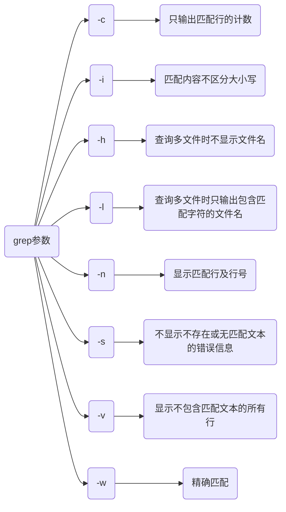
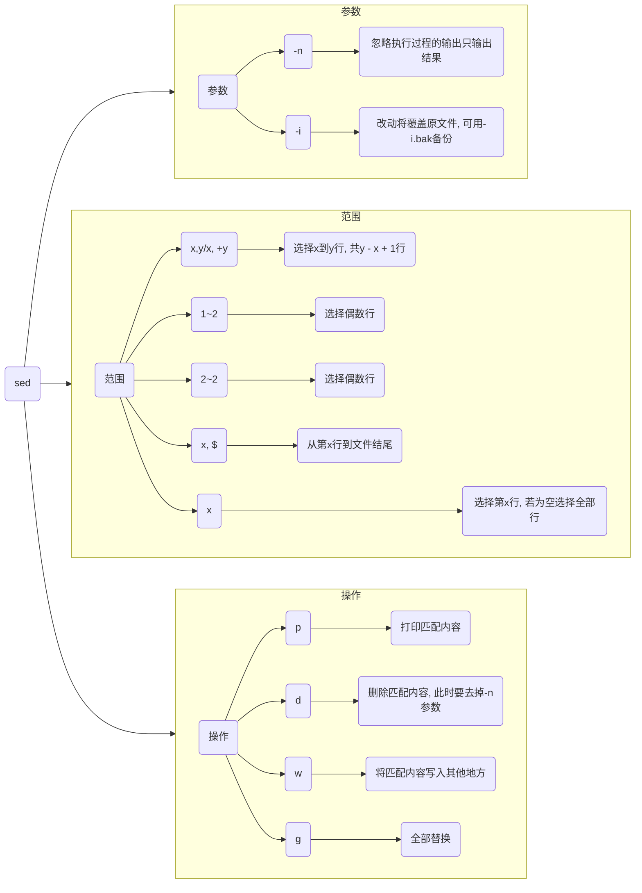

# 文件文本指令

## 文本指令

### awk

将文件逐行读入, 以空格为默认分隔符将每行切片, 再对切开部分进行各种分析处理

```sh
awk [参数] '{pattern action}' {文件名}
```

| 参数    | 含义                                 |
| ------- | ----------------------------------- |
| pattern | awk 在数据中查找的内容               |
| action  | 在找到匹配内容时执行的命令            |
| {}      | 用于根据特定模式对一系列指令进行分组 |

- 查看登录用户名

```sh
last -n 5 | awk '{print $1}'
```

```sh
dmjcb@Casper:~$ last -n 5 | awk '{print $1}'
dmjcb
dmjcb
dmjcb
dmjcb
dmjcb

wtmp
```

### grep

```sh
grep -[参数] 匹配项
```



#### 单查询

- 模糊匹配

含有匹配项的字段都会匹配

```sh
grep (模式) [匹配项]
```

```sh
# 匹配结果为abc abcd abcdef
grep "abc"
```

- 精确匹配

```sh
grep -w [匹配项]
```

```sh
# 结果为abc
grep -w "abc"
```

#### 与查询

在前一个查询结果中继续查询

```sh
grep '模式1' [匹配项] | grep '模式2'
```

- 查询3月10日16点30时间段内ssh登录成功情况

```sh
grep 'Mar 10 16:3' /var/log/secure | grep Accepted
```

#### 或查询

```sh
grep '模式1|模式2' [匹配项] 或 

grep -E '模式1|模式2' [匹配项]
```

#### 非查询

去除包含模式1进程行, 避免影响最终数据正确性

```sh
grep -v 模式1 [匹配项]
```

- 查询python进程信息时排除grep本身影响
  
```sh
ps -aux | grep python | grep -v grep
```

```sh
dmjcb@Casper:~$ ps -aux | grep python | grep -v grep
root         737  0.0  0.0  45288 20636 ?        Ss   Қыр22   0:00 /usr/bin/python3 /usr/bin/networkd-dispatcher --run-startup-triggers
root         963  0.0  0.0 123656 22608 ?        Ssl  Қыр22   0:00 /usr/bin/python3 /usr/share/unattended-upgrades/unattended-upgrade-shutdown --wait-for-signal
root      179633  0.0  0.0  39452 23984 ?        Ss   Қаз27   1:24 /usr/bin/python3 /usr/bin/supervisord -n -c /etc/supervisor/supervisord.conf
dmjcb     278659  0.0  0.6 1186580 194000 ?      SNl  Қаз30   0:04 /usr/bin/python3 /usr/bin/update-manager --no-update --no-focus-on-map
dmjcb     283323  0.0  0.2 734148 72372 ?        Ssl  Қаз30   0:00 /usr/bin/python3 /usr/lib/ubuntu-release-upgrader/check-new-release-gtk
dmjcb     290967  0.0  0.0  32392 16612 pts/1    T    21:26   0:00 python3 -m http.server
```

#### 正则

- 查看以pattern开头行

```sh
grep ^pattern
```

- 查找以pattern结尾行

```sh
grep pattern$
```

- 查找UniversalDeclarationOfHumanRights.txt文件中含有human句子

```sh
grep human UniversalDeclarationOfHumanRights.txt
```


- 查找UniversalDeclarationOfHumanRights.txt文件中以The开头句子

```sh
grep ^The UniversalDeclarationOfHumanRights.txt
```


### sed

```sh
sed -参数 '起始范围, 结束范围 操作' 路径
```



#### 打印

若字符串中带有路径符号 `/`, 可以用 `#` 分隔

- 打印file.txt 1-5行
  
```sh
sed -n '1, 5 p' file.txt
```

#### 添加

- 第一行前添加

```sh
sed -i '1i内容' 路径
```

- 最后一行行前添加

```sh
sed -i '$i内容' 路径
```

- 最后一行行后添加

```sh
sed -i '$a内容' 路径
```

#### 替换

- Ubuntu换源, 修改/etc/apt/sources.list

```sh
sed -i 's#security.ubuntu.com#mirrors.aliyun.com#g' /etc/apt/sources.list
sed -i 's#cn.archive.ubuntu.com#mirrors.aliyun.com#g' /etc/apt/sources.list
```

### xargs

管道符 `|` 是将前个命令标准输出作为后个命令标准输入

`xargs` 将前面命令标准输出作为后个命令参数, 可单独使用, 也可与管道符、重定位符等与其他命令配合使用, 默认动作是echo, 默认分隔符为空白字符(空格, TAB, 换行符)

真正执行命令在xargs后面, 接受xargs传参

```sh
xargs 命令
```

- 二次显示

```sh
echo "hello world" | xargs echo
```

- 根据进程ID杀手进程

```sh
ps -aux | grep vlc | grep -v grep | awk '{print $2}' | sudo xargs kill -9
```

## tail

```sh
# 查看日志尾部若干行
tail -n 行数 日志名

# 查看指定行数后日志
tail -n +行数 日志名
```

### head

```sh
# 查看日志头部若干行
head -n 行数 日志名
```

## 文件指令

### 修改

#### 追加

- 单行追加

```sh
echo [内容] >> [文件路径]
```

- 多行追加

```sh
sudo bash -c cat >> [文件路径] <<EOF
....
EOF
```

#### 覆盖

```sh
cat > [文件路径] <<EOF
....
EOF
```

#### 复制

- 复制/DIR1/DIR2到当前工作目录

```sh
cp -a /DIR1/DIR2 .
```

- 复制DIR目录下所有文件到当前目录

```sh
cp DIR/* .
```

### 搜索

#### 指定目录

- 从 / 开始进入根文件系统搜索文件和目录

```sh
find / -name 文件
```

#### 指定后缀

- 在目录 /home/user1 中搜索.bin结尾文件

```sh
find /home/user1 -name *.bin
```

#### 指定时间

- 搜索在过去100天内未被使用过的执行文件

```sh 
find /usr/bin -type f -atime +100
```

#### 二进制文件

- 显示一个二进制文件、源码或man位置

```sh
whereis halt
```

- 显示一个二进制文件或可执行文件完整路径

```sh
which halt
```

### 拷贝

`dd`用指定大小块拷贝一个文件, 并在拷贝同时进行指定转换

| 参数         | 含义                                      |
| ------------ | ----------------------------------------- |
| if=file      | 输入文件名, 缺省为标准输入                  |
| of=file      | 输出文件名, 缺省为标准输出                  |
| ibs=bytes    | 一次读入bytes个字节(即一个块)               |
| obs=bytes    | 一次写 bytes 个字节(即一个块)              |
| bs=bytes     | 同时设置读写块的大小为bytes, 可代替ibs和obs |
| cbs=bytes    | 一次转换bytes个字节, 即转换缓冲区大小       |
| skip=blocks  | 从输入文件开头跳过 blocks个块后再开始复制   |
| seek=blocks  | 从输出文件开头跳过 blocks个块后再开始复制   |
| count=blocks | 仅拷贝blocks个块, 块大小为ibs指定的字节数   |

### 打包压缩

打包是将众多文件或目录变成一个总文件

压缩是将大文件通过压缩算法变成小文件

tar 是用来建立, 还原备份文件的工具程序, 它可以加入, 解开备份文件内文件

- 解压

```sh
tar -xzvf 文件
```

### 链接

| 软链接                  | 硬链接                        |
| ---------------------- | ----------------------------- |
| 以路径形式存在(快捷方式) | 以文件副本形式存在, 不占实际空间 |
| 可以对目录进行链接      | 不允许给目录创建链接            |
| 可跨文件系统            | 不可以跨文件系统               |

#### 软链接

```sh
ln -s [源文件] [链接文件] 
```

#### 硬链接

```sh
ln 源文件 链接文件 
```

### 信息

- 查看信息

```sh
stat [文件]
```

```sh
dmjcb@Casper:~$ stat InitProxy.sh
  文件：InitProxy.sh
  大小：545             块：8          IO 块：4096   普通文件
设备：10302h/66306d     Inode：18219400    硬链接：1
权限：(0755/-rwxr-xr-x)  Uid：(    0/    root)   Gid：(    0/    root)
最近访问：2024-10-30 18:53:29.829058975 +0500
最近更改：2024-10-15 16:58:37.131683067 +0500
最近改动：2024-10-15 16:58:37.131683067 +0500
创建时间：-
```

- 查看目录下一级目录大小

```sh
du -h --max-depth=1 [目录]
```

```sh
dmjcb@Casper:~$ du -h --max-depth=1
92M     ./dmjcb.github.io
40M     ./.mozilla
76K     ./.pki
176K    ./.dotnet
...
```

- 浏览大文件

```sh
cat 文件 | more
```