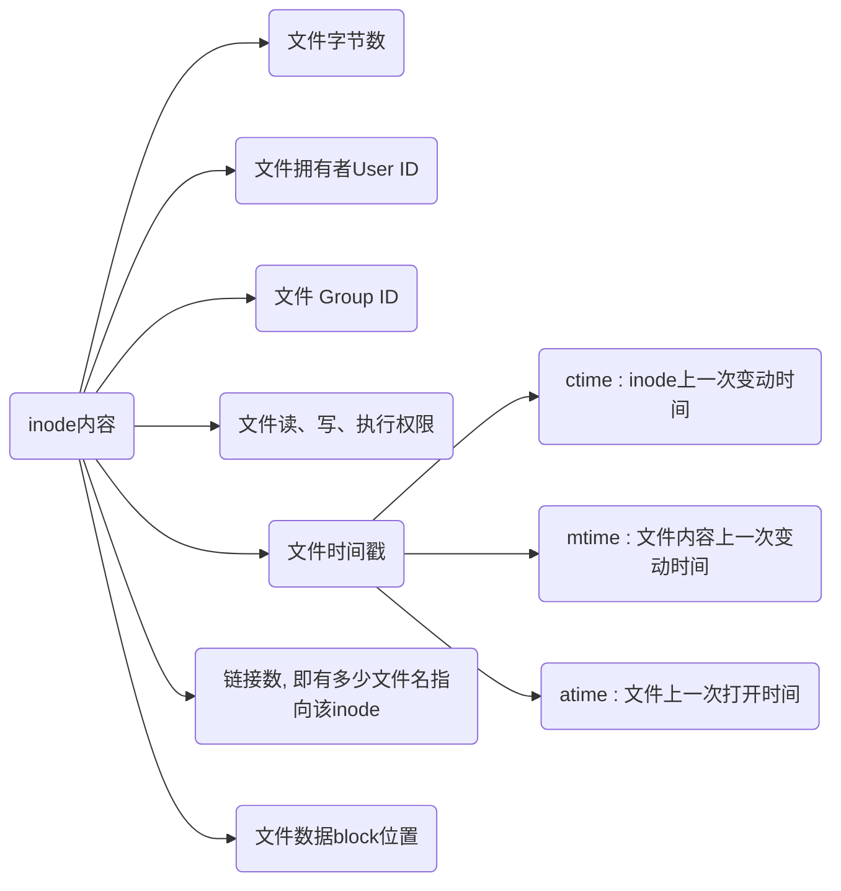

# inode

扇区($sector$)是硬盘最小存储单位, 每个扇区储存$512$字节(0.5KB), 操作系统读取硬盘时为提高效率会一次连续读取多个扇区

块($block$)由多个扇区组成, 是文件存取最小单位, 大小常见为$4KB$, 即连续八个扇区组成

## 定义

文件数据与文件创建者, 文件创建日期, 文件大小等文件元信息都储存在块中

储存文件元信息区域就是$inode$(索引节点)



## inode区

硬盘格式化时候OS自动将硬盘分为,

- 数据区, 存放文件数据

- $inode$区($inode$ $table$), 存放inode所包含信息

每个$inode$节点大小一般是128字节或256字节, 硬盘格式化时就会给定$inode$节点总数, 一般是每1KB或2KB设置一个$inode$

如1GB硬盘中, 每个$inode$节点大小为128字节, 每1KB就设置一个$inode$, 那么$inode$ $table$大小为128MB, 占硬盘空间12.8\%

## 作用

- 删除文件

当文件名包含特殊字符无法正常删除时, 可直接删除inode节点, 即可删除文件

- 移动/重命名文件

只会改变文件名, 不影响inode号码

- 文件操作

打开文件后, 系统就以inode号码来识别它, 而不再考虑文件名

更新文件时, 新版文件以同样文件名, 生成一个新inode, 不会影响到运行中文件, 

下次运行软件时, 文件名就自动指向新版文件, 旧版文件inode则被回收

## 命令

### 信息

- 查看分区inode信息
  
```sh
df -i
```


- 查看文件inode信息
  
```sh
stat [文件]
```


- 查看文件inode号码
  
```sh
ls -il
```


### inode号码

- 硬链接

```sh
ln [源文件] [链接文件]
```

inode号码与源文件相同, 例如下面a.txt 与 a

- 软链接

```sh
ln -s [源文件] [链接文件]
```

inode号码不同, 但是inode号码指向源文件名, 例如下面a.txt 与 a

### 删除

```sh
find [搜索路径] -inum [文件inode号码] -delete
```
